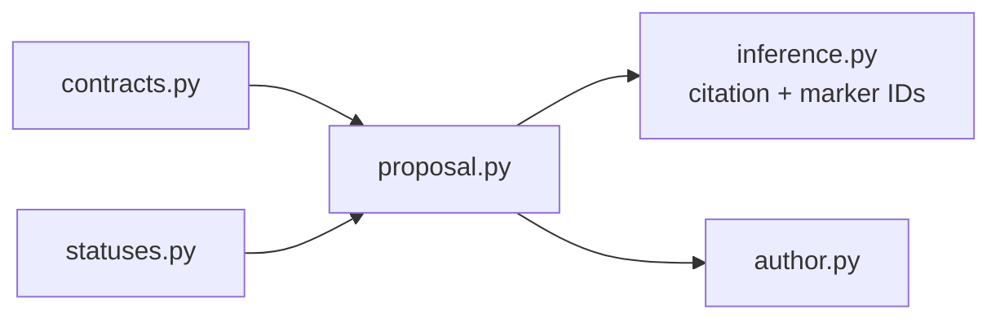

# `proposal` implementation

Each record is frozen, slotted, and content-identified. Fully keyed and
citation-gap-ready results contain a proposal and inference-response identity. A gap
result contains exact `ProposedEvidenceMarker` records plus the canonical
`CITATION_GAPS_REQUIRE_INSPECTION` issue; failed results contain no proposal. Every
path remains explicitly `HumanAcceptanceStatus.NOT_EVALUATED`.
