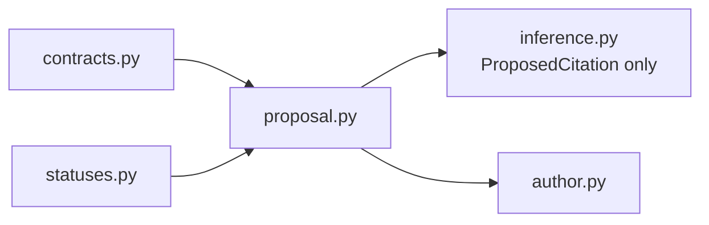

# `proposal` implementation

Each record is frozen, slotted, and content-identified. A proposal-ready result alone
contains a proposal and inference-response identity; every failed result contains a
canonical nonempty issue tuple and no proposal. Both result paths remain explicitly
`HumanAcceptanceStatus.NOT_EVALUATED`.
