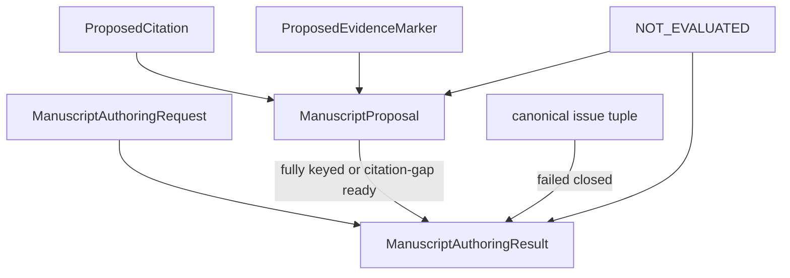

# `proposal` schematic

```mermaid
flowchart TD
    Citation["ProposedCitation"] --> Proposal["ManuscriptProposal"]
    Marker["ProposedEvidenceMarker"] --> Proposal
    Request["ManuscriptAuthoringRequest"] --> Result["ManuscriptAuthoringResult"]
    Proposal -->|fully keyed or citation-gap ready| Result
    Failure["canonical issue tuple"] -->|failed closed| Result
    Acceptance["NOT_EVALUATED"] --> Proposal
    Acceptance --> Result
```
