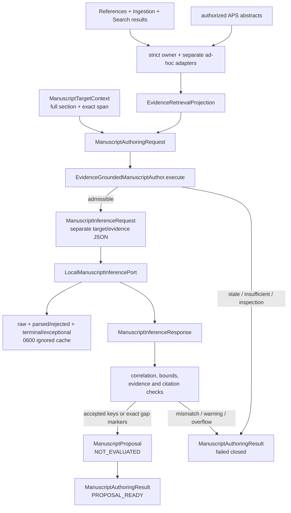

# `authoring` schematic

```mermaid
flowchart TD
    Target["ManuscriptTargetContext<br/>full section + exact span"]
    Owners["References + Ingestion + Search results"]
    Abstracts["authorized APS abstracts"]
    Adapters["strict owner + separate ad-hoc adapters"]
    Retrieval["EvidenceRetrievalProjection"]
    Request["ManuscriptAuthoringRequest"]
    Author["EvidenceGroundedManuscriptAuthor.execute"]
    Prompt["ManuscriptInferenceRequest<br/>separate target/evidence JSON"]
    Port["LocalManuscriptInferencePort"]
    Cache["raw + parsed/rejected + terminal/exceptional<br/>0600 ignored cache"]
    Response["ManuscriptInferenceResponse"]
    Checks["correlation, bounds,<br/>evidence and citation checks"]
    Proposal["ManuscriptProposal<br/>NOT_EVALUATED"]
    Failure["ManuscriptAuthoringResult<br/>failed closed"]

    Target --> Request
    Owners --> Adapters
    Abstracts --> Adapters
    Adapters --> Retrieval
    Retrieval --> Request
    Request --> Author
    Author -->|admissible| Prompt
    Author -->|stale / insufficient / inspection| Failure
    Prompt --> Port
    Port --> Cache
    Port --> Response
    Response --> Checks
    Checks -->|accepted keys or exact gap markers| Proposal
    Checks -->|mismatch / warning / overflow| Failure
    Proposal --> Result["ManuscriptAuthoringResult<br/>PROPOSAL_READY"]
```

No arrow writes the target or bibliography. Retrieval is already complete before this
flow begins.
