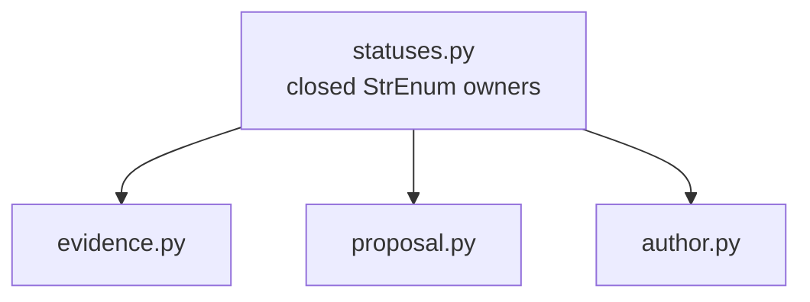

# `statuses` implementation

The ingestion and citation values mirror only the fields needed by this package; the
module does not import either owner. `HumanAcceptanceStatus` contains only
`NOT_EVALUATED`. Any evaluated state belongs to a later owner-approved
human-acceptance contract and review boundary.
