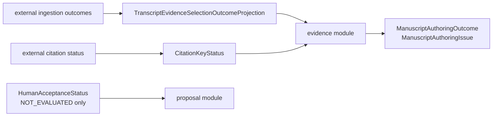

# `statuses` schematic

```mermaid
flowchart LR
    Ingestion["external ingestion outcomes"] --> Selection["TranscriptEvidenceSelectionOutcomeProjection"]
    References["external citation status"] --> Citation["CitationKeyStatus"]
    Selection --> Evidence["evidence module"]
    Citation --> Evidence
    Evidence --> Outcome["ManuscriptAuthoringOutcome<br/>ManuscriptAuthoringIssue"]
    Acceptance["HumanAcceptanceStatus<br/>NOT_EVALUATED only"] --> Proposal["proposal module"]
```

The arrows are structural projections and imports, not external dependency edges.
