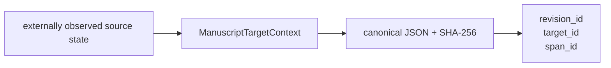

# `target` implementation

`ManuscriptTargetContext` is frozen, slotted, and keyword-only. Construction validates
bounded root-relative identity fields and requires the selected text to occur exactly
once in the complete section context. It performs no file or Git access.
