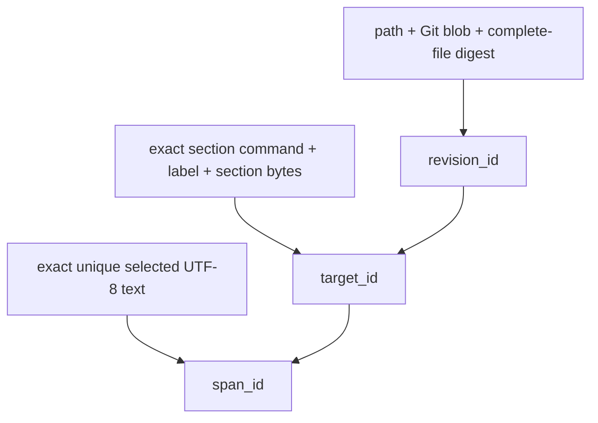

# `target` schematic

```mermaid
flowchart TD
    File["path + Git blob + complete-file digest"] --> Revision["revision_id"]
    Section["exact section command + label + section bytes"] --> Target["target_id"]
    Revision --> Target
    Span["exact unique selected UTF-8 text"] --> SpanId["span_id"]
    Target --> SpanId
```

Line numbers do not participate in any identity.
