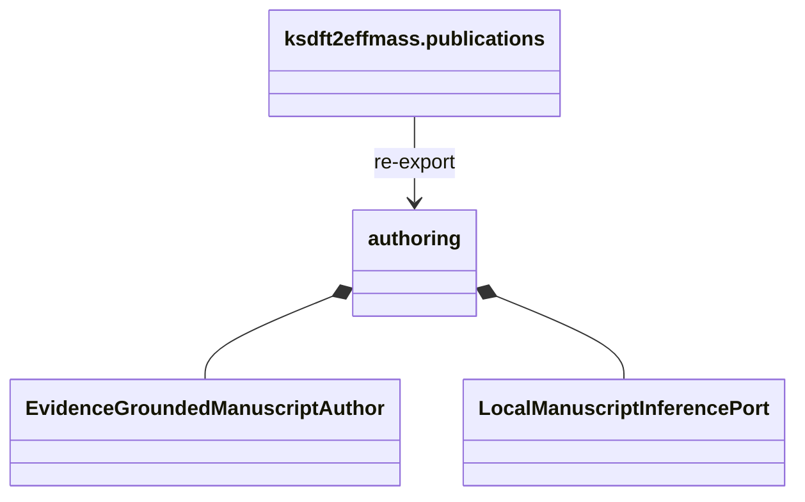

# `ksdft2effmass.publications` implementation

The package initializer re-exports the closed class inventory documented by the
[`authoring` package](authoring/index.md). It contains no behavior beyond import
adaptation.

The authoring adapters import only the pinned Project Koios Ingestion, Search, and
References owner boundaries documented under
[`authoring/adapters`](authoring/adapters/index.md). Model-runtime, persistence,
filesystem, shell, database, browser, networking, and publication capabilities remain
absent. The package defines no wire format or compatibility alias.
