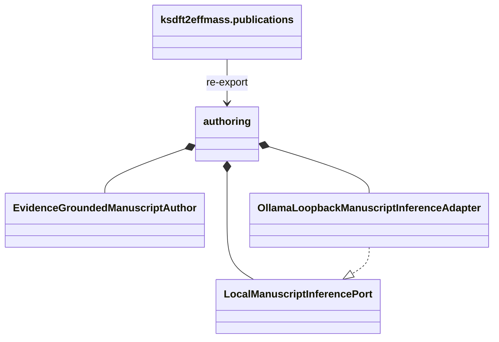

# `ksdft2effmass.publications` implementation

The package initializer re-exports the closed class inventory documented by the
[`authoring` package](authoring/index.md). It contains no behavior beyond import
adaptation.

The strict authoring adapters import only the pinned Project Koios Ingestion, Search,
and References owner boundaries documented under
[`authoring/adapters`](authoring/adapters/index.md). A separate package-owned adapter
projects only the three authorized APS publisher abstracts with explicit ad-hoc and
abstract-only statuses; it does not alter strict owner projections. The concrete
inference adapter adds only bounded HTTP to literal IPv4 loopback for one fixed model
and exposes no tool, proxy, redirect, or remote fallback. Its retention owner adds only
bounded atomic mode-`0600` ignored-cache response observability. General persistence,
shell, database, browser, manuscript-writing, bibliography-writing, and publication
capabilities remain absent. The package defines no supported interchange wire format
or compatibility alias.
