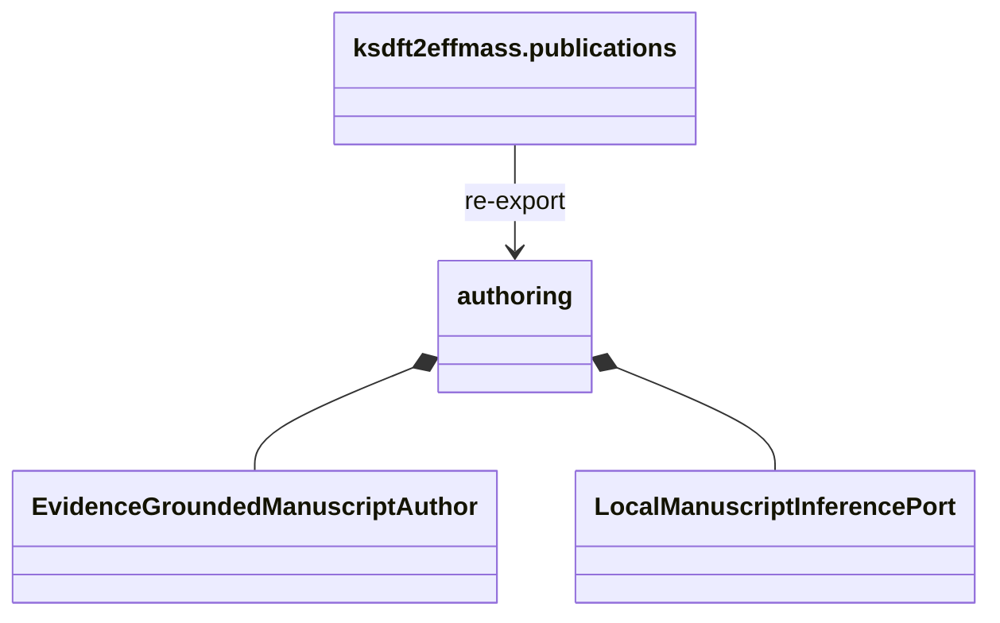

# `ksdft2effmass.publications` implementation

The package initializer re-exports the closed class inventory documented by the
[`authoring` package](authoring/index.md). It contains no behavior beyond import
adaptation.

Only Python standard-library modules are imported. Ingestion, Search, References,
model-runtime, persistence, filesystem, shell, database, browser, networking, and
publication dependencies are absent. The package defines no wire format or
compatibility alias.
