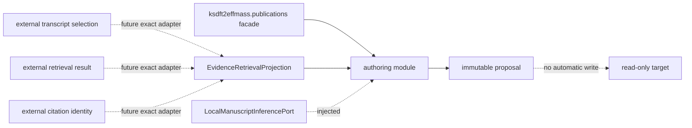

# `ksdft2effmass.publications` schematic

The package facade preserves defining-module class identities. External retrieval and
local inference are collaborators, not package-owned implementations.
