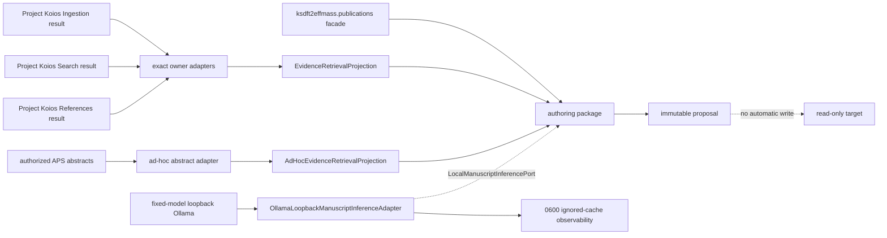

# `ksdft2effmass.publications` schematic

The package facade preserves defining-module class identities. External retrieval is
a collaborator; the package-owned inference adapter is injected through the neutral
port and has only bounded literal-loopback transport.
