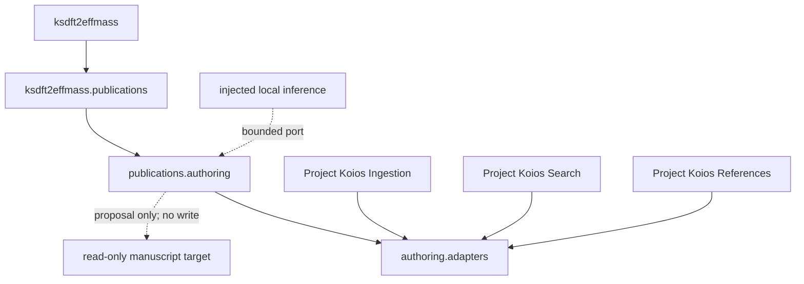

# `ksdft2effmass` implementation schematic

Solid arrows include documented Python ownership and direct typed adapter imports.
The dotted arrows are injected composition boundaries rather than package-owned
effects.
