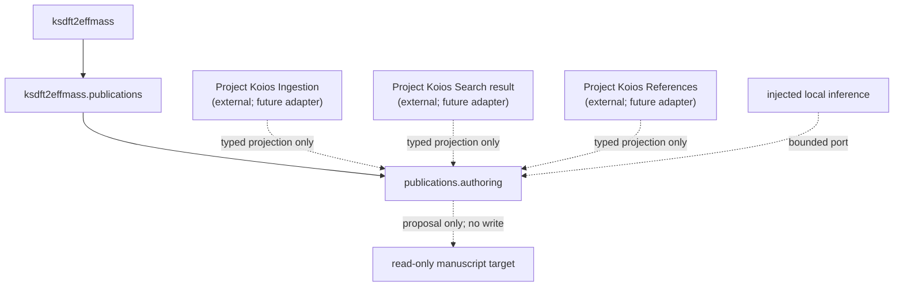

# `ksdft2effmass` implementation schematic

```mermaid
flowchart TB
    Root["ksdft2effmass"] --> Publications["ksdft2effmass.publications"]
    Publications --> Authoring["publications.authoring"]
    Ingestion["Project Koios Ingestion<br/>(external; future adapter)"] -. "typed projection only" .-> Authoring
    Search["Project Koios Search result<br/>(external; future adapter)"] -. "typed projection only" .-> Authoring
    References["Project Koios References<br/>(external; future adapter)"] -. "typed projection only" .-> Authoring
    LocalInference["injected local inference"] -. "bounded port" .-> Authoring
    Authoring -. "proposal only; no write" .-> Manuscript["read-only manuscript target"]
```

Solid arrows show documented Python ownership. Dotted arrows show composition
boundaries rather than imports or effects.
