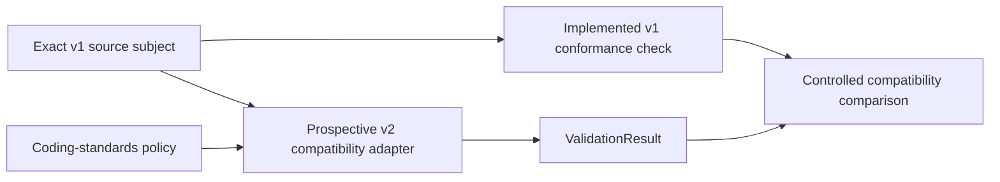

# Coding-standards conformance migration

This page maps implemented v1 Python evidence-conformance behavior to the
prospective v2 [coding-standards conformance boundary](../../v2/ksdft2effmass/harness/conformance.md). The Python implementation now occupies the v2-aligned `conformance.python` package while behavior remains v1, and the former Python `harness.pi.evidence` facade is retired. Repository evidence artifacts retain their existing paths and meaning. The project-local validation result now names this check `python_conformance`; the former `python_evidence` value is retired without an alias. This page does not authorize further implementation, dependency change, script retirement, or promotion-policy change.

## Implemented v1 sources

| V1 surface | Implemented responsibility | V2 disposition |
|---|---|---|
| `python/src/cli/validate_python_conformance.py` and `ksdft2effmass.harness.pi.conformance.python.PythonConformanceValidator` | Static Python maintained-evidence source, ownership, naming, documentation, helper, marker, parameterization, and evidence-identifier checks | Retain behavior through an explicit coding-standards adapter |
| `python/src/cli/validate_evidence_repository_conformance.py` | Repository evidence source/inventory/collection agreement and claim-boundary reporting | Retain only the coding-standards and maintained-evidence agreement portion through an explicit adapter |
| `HarnessValidator` `python_conformance` check | Project-local composition of the Python conformance owner | Crosswalk to coding-standards conformance without importing unrelated harness checks |
| `HarnessValidator` resource, Task graph, checkpoint, skill, and control-state checks | Structural development-control validation outside Python coding standards | Exclude from coding-standards conformance; retain with their existing domain owners |
| Controlled fixtures and regression tests under `harness/pi/fixtures/evidence/python-conformance/` and `harness/pi/validation/` | Accepted/rejected grammar cases and command/API agreement evidence | Retain as compatibility evidence; tests are not runtime adapters or policy authority |

A private project-local conformance-input resolver now selects the canonical test
modules, profile, and migration map independently of projection construction. The
projector composes that same selection, so the migration retains one source-selection
implementation without making projection an authority for conformance.

Ruff, mypy, pytest execution, documentation builds, Task completion, and promotion
checks may remain caller-owned gates. Their historical co-occurrence with evidence
scripts does not make them part of the coding-standards conformance owner unless a
coding-standards policy separately selects a demonstrated adapter contract.

## Target mapping

The v2 policy owns requirement meaning. The profile binds applicable requirement
identities to explicit compatible adapters and configuration; it creates no new
policy. The adapter preserves v1 observations while mapping them into the shared
v2 `ValidationResult` contract.

## Compatibility conditions

Before a v1 coding-standards path is replaced or retired:

1. identify its exact command and underlying behavior owner;
2. classify every rule as retained, intentionally changed by separately accepted
   policy, or excluded as another domain's responsibility;
3. run the same controlled valid and invalid fixtures through v1 and candidate
   v2 paths;
4. compare acceptance, finding meaning, subject attribution, deterministic
   ordering, exit/result status, nonmutation, and claim boundary;
5. retain an explicit compatibility result and unresolved differences; and
6. cut over only after the applicable software and human acceptance gates pass.

A compatibility pass establishes structural software agreement only. It does not
establish runtime behavior, numerical verification, scientific validation,
uncertainty quantification, Task completion, promotion eligibility, or human
acceptance.

## Migration exclusions

This migration does not move resource, Task graph, checkpoint, skill, control
projection, authorization, promotion, behavioral-test, numerical, or scientific
responsibilities into coding-standards conformance. It introduces no ProjectKoios
dependency and no new third-party coding tool.
