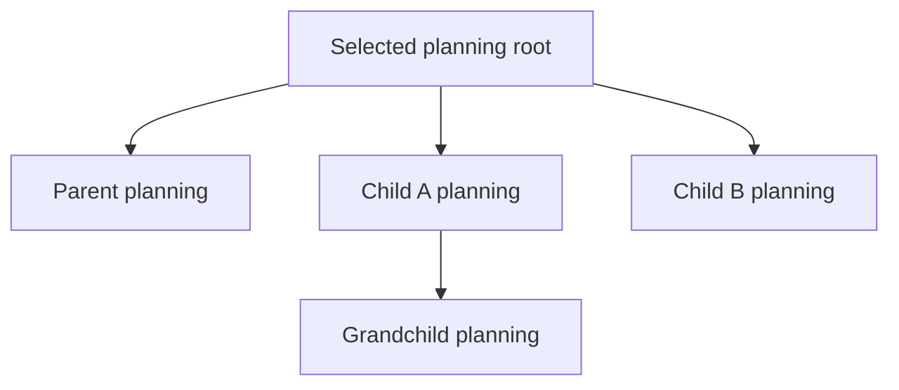

# V2 migration implementation planning

## Status and purpose

**Status: planning in progress.** The current working tree contains canonical
planning-state `HarnessTask` records under `harness/tasks/` for the mapped v2
packages, modules, submodules, architecture enhancements, and the resolved
operator-ownership branch. The human selected Option A for represented-operator
ownership: the cohesive, narrowly bounded `ksdft2effmass.operators` kernel is
retained, while higher-level scientific analysis remains outside it. The resolved
decision is recorded by [the operator-ownership plan](operator-ownership.md) and its
checkpoint. The selected [operator-record retention plan](operator-records-disposition.md)
records a provisional no-change baseline for the current source, public imports,
schema-version-1 wire, fixtures, and exact compatibility behavior. It does not freeze
the final exercise-informed scientific API. The analysis
disposition successor remains unselected. The human-accepted
`migration.v2.identity-contracts` foundational implementation is closed under Option
B. It stabilizes the structural semantic contract while deliberately introducing no
shared runtime package, source module, schema, fixture, or dependency. The `migration.v2.harness.task-model` implementation is human-accepted and closed.
The human-authorized minimal Harness cutover is also closed: canonical Task, registry,
selection, and decision owners replace live development-chain authority; the former
public chain model and its dependent compatibility surfaces are retired; and archived
chain JSON remains non-operational history. Compiler, validation, persistence,
projection redesign, subagent redesign, reporting, planning automation, and
machine-derived closeout remain deferred until demonstrated need rather than serving
as administrative cutover prerequisites.
The `migration.v2.harness.decisions-authority` bounded implementation is verified and
its administrative closeout is complete: it provides the exact DevelopmentDecision
wire and legacy adaptation plus default-unsigned, explicitly per-Task opt-in Ed25519
authority verification. Human-authorized administrative closeout constitutes final
acceptance of this bounded result. No successor was activated, and the current managed
selection was cleared. Complete HarnessState
compiler/validator integration remains with its separately declared Tasks. The
`migration.v2.harness.prerequisite-resolution` implementation is verified and its
administrative closeout is complete under accepted Option A: consumer-scoped,
exact-Task-bound sidecar contracts and pure matching of explicit owner-retained result
observations. Human-authorized administrative closeout constitutes final acceptance of
this bounded result. It does not infer prerequisite results from lifecycle status or
grant operation authority. No successor is selected.
The `migration.v2.harness.configuration` implementation is
human-accepted and administratively closed: it provides immutable subsystem-owned
configuration, exact-source fail-closed resolution, canonical JSON, source and snapshot
identities, and root-confined maintained projection checking without placing
configuration inside `HarnessState` or granting authority. No successor is selected.
The `migration.v2.persistence.store` implementation is software-verified and its
administrative closeout is complete: it provides immutable opaque revision,
read-request, commit, failure, and closed-result values plus the structural
`AtomicRevisionStore` protocol. Human-authorized administrative closeout constitutes
final acceptance of this bounded result. Concrete SQLite persistence and domain
repositories remain with their separate Tasks. The `migration.v2.workflows.model`
implementation is likewise human-accepted through its authorized administrative
closeout; it provides the bounded immutable Task, Workflow, ResultObject, input,
context, gate, activation, and composition contracts while leaving invocation,
WorkflowRun, adapters, persistence, and effects to separate Tasks. Scientific or
protected execution, signing, and automatic succession remain unauthorized.
The `migration.v2.ksdft.contract-verification` bounded implementation is
human-accepted and administratively closed under the explicitly narrow Option 1
disposition. The accepted result preserves the current non-spin-polarized
bulk-QEXSD schema-version-1 Kohn--Sham observation behavior; it does not freeze a
project-wide or final v2 Kohn--Sham contract. Spin-polarized P:Si, noncollinear
spinor/SOC B:Si, available energy-reference or alignment semantics, and a
standalone neutral wire remain outside this result. Automatic successor activation
remains disabled, and no successor is active.
The human selected explicit-mapping Option B for
`migration.v2.workflows.cpn-adapter`; its completed implementation is human-accepted
and administratively closed. The effect-free adapter consumes immutable Workflow-owned
mapping and result-token correlation records, delegates exact enablement and selection
to `petrinet.colored`, supports direct, deterministic `any_of`, and compatible combined
`all_of` activation, and returns a closed content-identified result. It performs no Task invocation, generic firing, marking
mutation, persistence, external effect, protected execution, or scientific
acceptance. ResultObject-to-generic-value derivation and public wire formats remain
deferred. The separately authorized CPN legacy-retirement cutover is human-accepted
and administratively closed: the former 49-name `workflows.cpn` source and import are
removed without aliases after consumer audit, while versioned v1 specifications,
Architecture v1 documentation, retained historical evidence, and Git history remain
non-operational audit records. Automatic successor activation remains disabled.

The implementation plan uses the [package and module
crosswalk](../package-module-crosswalk.md) as planning input. Canonical
`HarnessTask` records own containment and declared dependencies. Actual retained
results, receipts, decisions, and external prerequisite events determine whether
a declared dependency has occurred; narrative documentation is not a second
Task graph.

## Documentation layers

Each maintained surface has one role:

| Layer | Location | Owns | Does not own |
|---|---|---|---|
| Normative v2 architecture | `docs/architecture/v2/` | Target package/module responsibilities, contracts, dependency direction, invariants, prohibitions, and deferred decisions | Task status, assignments, implementation logs, or migration progress |
| Cross-version mapping | `docs/architecture/migration/v1-to-v2/` | V1 source-to-v2 owner mapping, disposition, compatibility boundaries, and cutover order | Public contract definitions already owned by v2 pages |
| Implementation planning | This subtree | Module decomposition, planning conclusions, concrete implementation approach, prerequisite-event contracts, verification, cutover, and rollback | Mutable Task state or duplicate Task JSON |
| Managed work | `harness/tasks/*.json` and `harness/task-selection.json` | Exact Task definitions, parent references, prerequisites, lifecycle status, scope, criteria, exclusions, and current managed selection | Architecture or scientific authority |
| Implemented public behavior | Source docstrings, `docs/api/`, `docs/concepts/`, `docs/user-guide/`, `docs/development/`, and `docs/computational/` | Actual supported behavior under the applicable owner | Migration coordination state |
| Verification and evidence | Tests, `docs/verification/`, applicable `.pi/evidence/`, and calculation records | Exact declared software, numerical, scientific, or UQ evidence | Authority or acceptance beyond the declared claim |

Implementation pages reference architecture and Task records rather than copying
their complete content. Mutable status remains in canonical Task state and its
generated projections, not in narrative prose.

## Planning unit

Every accepted v2 package, module, or submodule selected for independent
implementation is represented by one ordinary `HarnessTask`. Parent-child
relationships express separation-of-concern containment:

```text
package or module HarnessTask
├── submodule HarnessTask
├── submodule HarnessTask
└── submodule HarnessTask
```

Every Task, including every parent and descendant, follows the same lifecycle:

```text
planning
→ optional human decision
→ implementation planning
→ optional human decision
→ implementation
→ optional human decision
→ administrative closeout
```

The lifecycle phases are not separate child Tasks. Otherwise each phase Task
would recursively require another copy of the lifecycle. Parent relationships
organize scope only; they do not imply prerequisite satisfaction, authority,
activation, completion, or acceptance.

A documentation topic page becomes a Task unit only when the applicable v2
architecture has selected a corresponding source responsibility. Topic-page
filenames are not treated as approved Python modules merely because they exist.

## Development-chain replacement

Canonical `HarnessTask` records replace independent development-chain topology;
`harness/task-graph.json` is their derived projection. `DevelopmentTaskSelection`
replaces chain-owned active-Task and explicit-selection fields. Development
decisions, prerequisite results, findings, and historical evidence remain under
their respective owners rather than becoming graph state.

The replacement does not turn the Task graph into an execution-chain language.
Pi `workflowScript` remains the public child-orchestration boundary. Retained v1
development-chain records become compatibility history outside executable Pi
chain discovery after every reader and field has an exact migration or retention
disposition. The canonical replacement and cutover are owned by
`migration.v2.harness.task-model` and
`migration.v2.harness.chain-replacement`. Under the conditionally accepted minimal
cutover, chain replacement depends only on the accepted Task model and development
decision/authority foundations. Complete `HarnessState` compilation, validation,
persistence, projection redesign, and subagent redesign remain deferred until a
selected consumer demonstrates need; they are not administrative prerequisites for
retiring independent chain authority.

## Planning cascade

Selecting one parent for a planning operation may cover its exact descendant set
without activating each descendant separately and without waiting for child or
sibling completion events.



The cascade has these rules:

- the exact parent and descendant Task revisions are fixed before the operation;
- containment determines which Tasks are in the planning scope but grants no
  authority;
- the applicable authorization explicitly covers the planning operation and
  permitted paths for that scope;
- planning may proceed top-down or in bounded parallel where path ownership
  permits;
- implementation prerequisites do not block planning;
- parent planning need not complete before child planning starts;
- one Task's critical decision blocks only the affected Task, descendants, or
  transition identified by that decision; and
- automatic successor activation remains disabled.

The same approach may be used for implementation planning after each affected
Task has a planning result and any required planning decision is resolved.

## Phase eligibility

| Phase | Required facts | Facts that do not automatically block it |
|---|---|---|
| Planning | Task belongs to the exact authorized planning subtree | Implementation dependencies, sibling progress, and descendant completion |
| Implementation planning | That Task's planning result exists and any critical planning decision is resolved | External implementation prerequisites that can be planned around |
| Implementation | That Task's implementation plan exists; applicable critical decisions are resolved; actual Task and external prerequisite results exist; the operation is separately authorized | Parent status by itself |
| Administrative closeout | That Task's implementation and required checks are complete; applicable decisions are resolved; child results required by the parent's exact aggregate claim exist | Mere elapsed time, reviewer agreement, or successful process exit |

Planning is primarily containment-based. Implementation is controlled by the
actual prerequisite-result DAG. Closeout is generally bottom-up only where a
parent's declared completion claim depends on exact child results.

## Actual prerequisite events

`task_prerequisite_ids` and `external_prerequisite_ids` declare what a Task
requires; their serialized presence is not proof that the requirement occurred.
Eligibility must resolve each declaration to an actual retained fact such as:

- a closed Task operation result or commit receipt;
- an accepted compatibility or verification result;
- an exact resolved human decision when a human-owned choice was required;
- an identified artifact or contract revision; or
- an external prerequisite event emitted by its owning boundary.

A parent Task's status is never substituted for one of these facts merely
because the producer is in another containment tree. Cross-module prerequisites
attach to the exact consuming Task and may refer outside that Task's separation
of concern without transferring mutation ownership.

For example:

```text
petrinet.colored verified implementation receipt
    → workflows CPN-adapter implementation eligible

persistence.store verified implementation receipt
    → workflows.persistence implementation eligible
```

Planning and implementation planning for the consumers may occur before those
receipts exist. Only implementation waits for them.

A prerequisite event, decision, validation result, or review result grants no
operation authority. Protected authority remains in its independent owner.

## Conditional human review

The implemented `ksdft2effmass.harness.pi.human_review` boundary is reused. No
new review Task or review object model is introduced. Its public objects are:

- `HumanReviewTarget`;
- `HumanReviewObservation`;
- `HumanReviewFinding`;
- `HumanReviewPacket`;
- `HumanReviewPreparer`;
- `HumanReviewDecision`;
- `HumanReviewDecisionRecorder`.

A phase prepares a review packet only when all of the following hold:

1. at least two materially different defensible choices remain;
2. the choice affects architecture, a public contract, a dependency, scientific
   meaning, protected execution, or another human-owned boundary; and
3. existing authority does not already determine the answer.

Routine confirmation, passing checks, expected development failures, formatting,
mechanical synchronization, and administrative closeout do not create a human review.
Explicit human authorization of administrative closeout constitutes final human
acceptance of that bounded result; deterministic closeout without such authorization
does not.

The review objects deterministically prepare a bounded subject and represent a
decision already supplied by a human. They do not interpret natural language,
authenticate authority, persist state, resolve checkpoints, authorize work, or
activate successors. A durable critical architecture choice remains recorded
through the applicable checkpoint or prospective `DevelopmentDecision`; the
review packet supplies its exact subject and evidence but does not replace it.

Unaffected planning or implementation branches continue while one branch awaits
a human decision.

## Parent and child responsibilities

A parent Task follows the same lifecycle as its children but owns only its
aggregate concern:

| Phase | Parent responsibility | Child responsibility |
|---|---|---|
| Planning | Define package/module concern, decomposition, boundaries, and shared constraints | Plan the exact submodule or bounded responsibility |
| Implementation planning | Reconcile child interfaces and package-level dependency direction | Define exact paths, operations, checks, and local compatibility behavior |
| Implementation | Perform package-level integration genuinely owned by the parent | Implement and verify the child concern |
| Administrative closeout | Establish only the declared aggregate module claim from exact child and parent results | Reconcile the child's own implementation facts and limitations |

A parent does not edit child-owned paths merely because it is the parent. A
consumer migration belongs to the consumer's Task tree. A producer Task emits or
retains the result that satisfies the consumer's prerequisite.

## Module implementation-page contract

Create a page in this subtree only when a module needs maintained planning prose.
Each page uses the following structure:

1. **Status and identity** — `proposed work`, exact v2 owner, applicable parent
   Task identity when created, and explicit non-authorization statement.
2. **V1 source responsibilities** — exact packages, modules, paths, public
   imports, wire formats, fixtures, and consumers represented by the crosswalk.
3. **Target concern and exclusions** — accepted v2 responsibility, dependency
   direction, and behavior that belongs elsewhere.
4. **Containment decomposition** — proposed child Task boundaries without
   storing a second authoritative child list.
5. **Planning cascade** — exact subtree and permitted planning concurrency.
6. **Implementation approach** — bounded source, test, documentation, and
   compatibility slices without duplicating Task JSON.
7. **Prerequisite results** — actual receipts, decisions, contracts, artifacts,
   or external events required for implementation.
8. **Conditional human decisions** — only unresolved critical choices and their
   durable decision identities when created.
9. **Verification** — applicable software and numerical verification separated
   from scientific validation and UQ.
10. **Cutover, retirement, and rollback** — exact consumer migration and
    compatibility gates.
11. **Residual limitations** — missing evidence and deferred work.

Pages do not reproduce mutable status, assignments, complete acceptance prose,
or generated evidence tables from their owning surfaces.

## Implemented-behavior documentation

When implementation changes behavior, documentation moves to its operational
owner:

| Subject | Owning documentation |
|---|---|
| Public Python object or function | Complete source docstring and applicable `docs/api/` page |
| Public concept or serialization contract | `docs/concepts/`, applicable schema, fixture, and API page |
| Accepted package-architecture change | Applicable v2 package page and this migration plan only where cutover changes |
| User operation | `docs/user-guide/` |
| Developer procedure | `docs/development/` |
| Computational dependency or execution procedure | `docs/computational/` |
| Mathematical or scientific contract | `specification/` |

Implementation details do not remain exclusively in migration planning pages.
Architecture pages change only when a human-accepted architectural decision
changes the target contract, not merely because implementation progressed.

## Verification and evidence

The implementation owner normally owns proportionate source, tests, and
documentation for one bounded Task. Add separate test ownership, maintained
evidence, independent review, or a formal handoff only when risk, concurrent
writers, a managed Task, or a current human instruction requires it.

Evidence claims remain separate:

- software verification establishes documented software behavior;
- numerical verification establishes agreement with stated mathematics;
- scientific validation requires independent scientific reference evidence; and
- uncertainty quantification requires declared uncertainty sources and
  propagation.

Successful execution, test passage, reviewer agreement, parent completion, or
migration cutover does not imply scientific validation or human acceptance.

## Administrative closeout

Closeout performs deterministic reconciliation only:

1. verify the Task's completion criteria against actual results;
2. preserve required result, decision, artifact, and verification identities;
3. update canonical Task lifecycle state;
4. update `harness/task-selection.json` only when selection actually changes;
5. synchronize generated control projections when applicable;
6. update the migration index's implemented-progress statement only for accepted
   repository state;
7. record compatibility or retirement disposition on the module page when it
   materially changes; and
8. identify successors without activating them.

Do not create a standalone closeout report, mandatory final review, correction
cycle, or acceptance checkpoint unless it owns a distinct required claim or
human decision.

## Repository-wide planning wave

Planning begins across the complete migration Task tree rather than waiting for
one producer/consumer pilot to finish. The current canonical planning records
cover these top-level concerns:

```text
migration.v2
├── identity-contracts
├── persistence
├── harness
├── petrinet.colored
├── workflows
├── periodic
├── ksdft
├── calculators
├── integration.quantumespresso
├── campaigns
├── analysis
├── application
├── pi.agents
└── operators-ownership
```

Every descendant can perform planning before implementation prerequisites are
satisfied. The graph already declares implementation dependencies such as
`persistence.store → workflows.persistence`,
`petrinet.colored.contract-verification → workflows.cpn-adapter`, and
`application.verification → pi.agents.adapter`. Actual closed results, not the
serialized producer or parent status, satisfy those dependencies.

The [`identity-contracts`](identity-contracts.md) page records the resolved Option B
runtime-ownership decision and human-accepted foundational implementation. The
[`periodic contract verification`](periodic-contract-verification.md) page records
the retained backend-neutral geometry contract, direct software-verification scope,
dependency direction, and deferred standalone-wire decision. The
[`Kohn--Sham contract verification`](ksdft-contract-verification.md) page records the
retained neutral observation contract and ActionObject-owned aggregate compatibility.
The [`plane-wave record disposition`](ksdft-plane-wave-disposition.md) page assigns
every schema-v1 field to its retained compatibility role and prospective v2 owner
without selecting a new wire or neutral plane-wave contract. The
[`operator-record retention plan`](operator-records-disposition.md) provisionally
retains the current record DataObjects, supported package imports, schema-version-1
serializer, public specification and fixtures, and exact compatibility audit without
a facade or source move. Later exercise-informed contract changes require separate
authorization. The
[`QEXSD parsing migration`](qexsd-parsing-migration.md) page records canonical
integration ownership, the target-first parser name, native-record validation, and
identity-preserving legacy forwarding. The
[`Harness Task-model`](harness/task-model.md) page records the human-accepted and
closed implementation of canonical Task, registry, descendant-query,
lifecycle-applicability, selection, and one-way compatibility boundaries. The
[`development decisions and authority`](harness/decisions-authority.md) page records
the accepted contracts and administratively closed verified bounded implementation of
DevelopmentDecision and optional signed authority verification; shared HarnessState
compiler/validator integration remains deferred to its declared Tasks. The
[`petrinet.colored`](petrinet/colored.md) page retains the first detailed module
rationale and compatibility analysis. Other modules need dedicated planning prose
only when the Task fields and normative v2 pages are insufficient to explain a
material implementation or cutover choice. The Task graph remains
the complete module migration plan.

## Plan-construction order

1. Use the crosswalk to identify accepted package/module responsibilities and
   unresolved ownership gaps.
2. Create canonical parent and descendant `HarnessTask` records for all mapped
   concerns in planning status, with no active selection.
3. Validate exact containment, declared prerequisite references, cycles, scope,
   exclusions, and absence of automatic activation using existing Harness
   contracts.
4. Plan every Task and descendant without waiting for implementation
   prerequisites or sibling completion.
5. Resolve only critical human-owned decisions actually exposed by planning.
6. Produce per-Task implementation plans and refine declared dependencies to
   exact result-producing Tasks or external events.
7. Derive implementation frontiers and unweighted dependency paths from the
   canonical graph; do not describe them as schedule critical paths or maintain
   a second planning registry.
8. Implement only separately selected and authorized Tasks whose actual
   prerequisite results exist.
9. Stop at unresolved package ownership until the applicable human decision
   exists. The represented-operator ownership stop is resolved as Option A and
   its records disposition is complete; the analysis disposition Task still
   requires separate selection and activation.

## Deferred details

The following remain deferred until repository-wide planning or a selected
implementation Task requires them:

- the exact closed lifecycle vocabulary and representation of phase results;
- whether a parent planning authorization names descendants directly or binds an
  exact derived subtree identity;
- machine-readable closeout claims and aggregate parent-claim rules;
- which v2 topic boundaries become independent source modules and Tasks;
- whether multiple non-overlapping planning cascades may run concurrently; and
- the exact boundary between fixed-representation operator operations and
  higher-level `ksdft2effmass.analysis` operations.

A deferred detail blocks only the operation that needs it. Existing architecture,
Task, review, decision, authority, and protected-action boundaries remain in
force.
