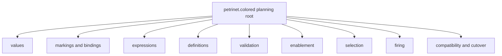
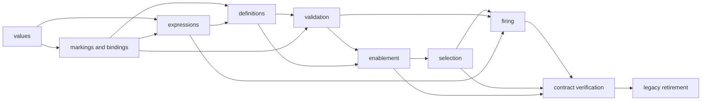

# `petrinet.colored` migration implementation plan

## Status and identity

**Status: planning result.** Canonical planning-state `HarnessTask` records for
this parent and its descendants are present in the current working tree under
`harness/tasks/migration.v2.petrinet.colored*.json`. No Task is selected or
active. This page does not authorize source implementation or a public API
change, retire the v1 package, add a dependency, or establish acceptance.

The normative target remains [`ksdft2effmass.petrinet.colored`](../../../../v2/ksdft2effmass/petrinet/colored/index.md).
The as-built source remains [`ksdft2effmass.workflows.cpn`](../../../../v1/ksdft2effmass/workflows/cpn/index.md).
The package-level responsibility transfer is owned by the [package and module
crosswalk](../../package-module-crosswalk.md).

## V1 source responsibilities

The implemented source is rooted at:

```text
python/src/ksdft2effmass/workflows/cpn/
├── __init__.py
├── errors.py
├── execution.py
├── expressions.py
├── markings.py
├── model.py
├── tokens.py
└── validation.py
```

| V1 module | Implemented responsibility | Principal predecessor modules |
|---|---|---|
| `tokens` | Closed contract values, routing tokens, outcomes, scope, status, and terminality | None |
| `markings` | Immutable place multisets, token bindings, and transition bindings | `tokens` |
| `expressions` | Closed value expressions, guards, templates, assignments, and evaluation | `tokens`, `markings` |
| `model` | Colors, places, transitions, arcs, inscriptions, and `CpnNetDefinition` | `expressions`, `markings` |
| `validation` | Definition and marking validation with structured findings | `expressions`, `markings`, `model` |
| `execution` | Deterministic enablement and firing | All applicable value, model, validation, expression, and error owners |
| `errors` | Structured contract, definition, marking, binding, guard, enablement, and firing failures | None |
| `__init__` | Supported 49-name public export surface | All public owners |

The v1 contract also includes:

- JSON Schema draft 2020-12 contracts and synthetic valid/invalid fixtures under
  `specification/workflow-cpn/v1/`;
- focused software-verification tests under
  `python/tests/software_verification/ksdft2effmass/workflows/cpn/`;
- integration tests for the public API, wire fixtures, import direction, and
  SNAKES/deferred-engine isolation;
- the maintained API page `docs/api/workflows-cpn.md`; and
- the maintained concept page `docs/concepts/cpn-contract.md`.

A bounded current-source inspection found no production Python package outside
`ksdft2effmass.workflows.cpn` importing that subpackage. Current consumers are
its public initializer, specifications, tests, and maintained documentation.
This is a repository observation for planning, not a guarantee that external
users do not import the accepted v1 API.

## Accepted V2 concern

`ksdft2effmass.petrinet.colored` owns only generic colored-Petri-net values and
pure operations:

- colors, places, transitions, arcs, inscriptions, and pure guards;
- color-qualified immutable token values;
- markings as semantic multisets;
- ordered immutable transition bindings;
- complete deterministic enablement results;
- deterministic binding selection with an optional permitted directive;
- identity-closed firing inputs;
- pure firing and complete firing audit facts; and
- structured failure results with no successor on failure.

The public v2 vocabulary uses full `ColoredPetriNet*` names. The v1 abbreviated
`Cpn*` names remain the implemented v1 public API and are not a second
prospective v2 spelling.

### Exclusions

The target package owns no:

- scientific `Task`, `Workflow`, `WorkflowRun`, or ResultObject meaning;
- calculator, simulation, dispatch, artifact, analysis, or scientific policy;
- external effect or process execution;
- development or scientific authority;
- persistence, publication, or repository mutation;
- fairness guarantee beyond the accepted deterministic selection rule;
- ambient choice, clock, randomness, network, filesystem, or environment input;
- SNAKES runtime object in its public contract; or
- reverse import of `ksdft2effmass.workflows`.

The required dependency direction is:

```text
ksdft2effmass.workflows → ksdft2effmass.petrinet.colored
```

The reverse edge is forbidden.

## HarnessTask containment

The canonical planning records define the following ordinary `HarnessTask`
containment.

```text
migration.v2.petrinet.colored
├── migration.v2.petrinet.colored.values
├── migration.v2.petrinet.colored.markings-bindings
├── migration.v2.petrinet.colored.expressions
├── migration.v2.petrinet.colored.definitions
├── migration.v2.petrinet.colored.validation
├── migration.v2.petrinet.colored.enablement
├── migration.v2.petrinet.colored.selection
├── migration.v2.petrinet.colored.firing
├── migration.v2.petrinet.colored.contract-verification
└── migration.v2.petrinet.colored.legacy-retirement
```

These are responsibility slices, not an assertion that v2 must expose
same-named Python modules. Exact private source-file placement remains an
implementation detail unless a later public import or wire contract makes it
architectural.

Every Task follows the common lifecycle:

```text
planning
→ optional human decision
→ implementation planning
→ optional human decision
→ implementation
→ optional human decision
→ administrative closeout
```

No phase is represented by another child Task.

## Planning cascade

Selecting `migration.v2.petrinet.colored` as one planning root may include the
exact revisions of all canonical descendants. Planning for every descendant may
start without waiting for parent planning completion, sibling completion, or
implementation prerequisites.



Planning outputs must identify exact inputs, outputs, invariants, public names,
paths, checks, and stop conditions for their slice. The cascade determines
planning scope only. It grants no implementation authority and does not bypass
path ownership.

## Proposed responsibility slices

### Values

Own the target color-qualified immutable value and token contracts, canonical
value representation, identity or represented multiplicity, and exact scalar
acceptance behavior selected for v2. Inventory the v1 `ContractValue`,
`CpnToken`, token fields, and outcome metadata field by field rather than copying
workflow-oriented routing semantics into the generic package automatically.

### Markings and bindings

Own semantic token multisets by place, immutable transition bindings, canonical
ordering keys, equality, and representation-order independence. Preserve the
distinction between semantic multiplicity and incidental tuple ordering.

### Expressions

Own generic value expressions, token patterns, inscriptions, pure guards,
templates, and evaluation behavior required by the accepted definition and
firing contracts. The v2 architecture defers whether expression evaluators are
public ActionObjects or private strategies; the first implementation plan must
keep that choice private unless demonstrated public need requires a human-owned
contract decision.

### Definitions

Own the identified net definition, colors, places, transitions, arcs,
inscriptions, pure guards, and definition-owned total transition priority. It
contains no Workflow or external-effect definitions.

### Validation

Own structural validation of definitions and markings with deterministic
ordered findings. Validation establishes only the declared software contract
and never enables a transition or authorizes firing.

### Enablement

Own complete deterministic enabled transition/binding enumeration from one
exact definition and marking. The result binds definition, marking, expression,
and ordering-policy identities.

### Selection

Own deterministic binding selection from one exact enablement result. Without a
directive it applies definition-owned total priority, canonical transition
identity, and canonical binding order. A directive is accepted only where the
exact versioned definition permits it.

V1 combines enablement with downstream caller choice and has no separately
named public binding-selector boundary. This slice is therefore an introduced
v2 responsibility rather than a mechanical rename.

### Firing

Own identity-closed firing input validation, input/read/inhibitor semantics,
explicit generic external-output-value bindings, output evaluation, produced-
token validation, successor construction, and immutable audit facts. Firing is
pure and performs no external effect.

### Contract verification and legacy retirement

`contract-verification` owns cross-version software comparison, the full-name
target API, dependency-direction checks, and a consumer-ready result.
`legacy-retirement` separately owns consumer accounting, public-import
retirement, documentation synchronization, and rollback after the actual
`v1_cpn_consumer_migration_complete` external prerequisite occurs. Neither owns
the `workflows` adapter implementation; that belongs to the consumer's Task
tree.

## Implementation dependency DAG

Planning and implementation planning may proceed across all slices in parallel.
Implementation eligibility follows actual retained results rather than the
parent's serialized status.



Each edge means that the consumer implementation requires the producer's actual
closed implementation/verification result or receipt. The Task identifier or
parent relationship alone does not satisfy the edge.

The final implementation plan may collapse adjacent slices into one writer's
bounded change where that reduces ceremony without merging concerns. It may not
split a single invariant or operation across competing owners merely to preserve
the canonical concern decomposition.

## Implementation approach

### Contract inventory

Before source creation, produce an exact cross-version inventory covering:

- all 49 v1 public exports and their v2 retain/rename/replace/retire disposition;
- every v1 DataObject, ResultObject, ActionObject, enum, and structured error;
- every schema field, enum spelling, version, numeric boundary, ordering rule,
  and relational invariant;
- valid and invalid fixture coverage;
- exception versus closed-result behavior;
- revision and integer overflow behavior;
- output-token identity and collision behavior;
- read, consume, and inhibitor semantics; and
- all direct and documented consumers.

No v1 field is silently dropped because its current name appears workflow-
specific. Its represented meaning must either map to a generic owner, move to
`workflows`, remain v1-only, or receive an explicit unresolved disposition.

### Source introduction

Create `ksdft2effmass.petrinet.colored` only under a separately selected and
authorized implementation Task. Prefer immutable concrete records and stateless
ActionObjects. Do not make the v2 package an alias facade over
`workflows.cpn`, and do not make new source import the old namespace.

Private source modules may initially follow the responsibility slices above.
Public import and wire surfaces require synchronized contract, typing,
documentation, fixtures, and tests.

### Consumer migration

The later `workflows` consumer imports the accepted full-name v2 API. Any private
abbreviated local aliases remain private. The consumer migration cannot create a
reverse `petrinet.colored → workflows` import.

External users of the v1 package are not assumed absent merely because the
repository has no production import. The accepted v1 API remains available until
its explicit compatibility and release policy permits retirement.

## Prerequisite results

### Planning

Planning requires only the accepted v1 snapshot, current source inventory,
accepted v2 package boundary, package/module crosswalk, and implementation-
planning procedure. No source implementation prerequisite is required.

### Implementation planning

Each slice requires its own completed planning result and any critical decision
that planning actually exposes. Exact v2 wire formats are excluded from the
first source slice while they remain deferred; their absence does not block
planning pure in-memory behavior.

### Implementation

Each implementation slice requires:

- its completed implementation plan;
- actual closed results for predecessor slices in the dependency DAG;
- an exact authorized source/path scope;
- applicable accepted public-contract identities; and
- no unresolved critical decision affecting that slice.

### Results exported to consumers

The later `workflows` implementation may require actual retained results
establishing:

1. the v2 package and full-name public import surface exist;
2. definition, marking, enablement, selection, and firing contracts pass their
   declared software-verification gates;
3. v1/v2 compatibility findings have an accepted disposition for the behavior
   consumed by `workflows`; and
4. dependency-direction checks show no reverse Workflow import.

These facts are prerequisites for consumer implementation, not authority to
activate it.

## Conditional human decisions

No human review is required merely to choose private file placement or combine
adjacent implementation slices under one writer. The accepted architecture
already determines the package owner, public full-name direction, generic
purity, and forbidden reverse dependency.

Prepare a bounded human review only if planning leaves multiple defensible
choices at a human-owned boundary, including:

- changing a v1 public semantic rather than preserving or explicitly versioning
  it;
- selecting a new public v2 wire contract;
- retiring or aliasing the accepted v1 API;
- changing scalar, overflow, ordering, multiset, or failure meaning;
- adding or replacing a dependency; or
- widening the generic package to include Workflow or effect behavior.

The existing `HumanReviewPreparer` and `HumanReviewDecisionRecorder` represent
the bounded review packet and supplied decision. A durable critical architecture
choice remains recorded through the applicable checkpoint or prospective
`DevelopmentDecision` and still grants no implementation authority.

## Verification strategy

### Software verification

The migration requires focused evidence for:

- immutable values and intrinsic invariants;
- canonical marking, binding, token, transition, and finding order;
- valid and invalid definitions and markings;
- read, consume, and inhibitor arc semantics;
- complete enablement enumeration;
- deterministic default and directed selection;
- stale or mismatched enablement/selection rejection;
- explicit external-output-value binding validation;
- output-token validation and identity collision behavior;
- revision and scalar overflow behavior where retained;
- pure deterministic firing and unchanged inputs;
- complete structured failures with no successor;
- full-name v2 public exports;
- v1 public API preservation during compatibility;
- v1/v2 shared expected results for behavior declared equivalent;
- strict wire/schema behavior only after a v2 wire contract is accepted;
- package dependency direction; and
- absence of calculator, Workflow, persistence, authority, and SNAKES runtime
  coupling.

Use the existing v1 synthetic fixtures as retained inputs only where their exact
meaning is applicable. A shared fixture does not establish equivalence without an
explicit comparison oracle and disposition.

### Evidence classification

These checks are software verification of generic control-flow contracts. They
do not establish numerical verification of a physical model, scientific
validation, uncertainty quantification, calculator correctness, or suitability
for a scientific campaign.

### Documentation checks

Synchronize applicable source docstrings, API pages, concept pages,
architecture pages, specifications, fixtures, and migration pages. Run the full
Sphinx build with warnings as errors and retain no generated output.

## Cutover and rollback

Cutover is incremental:

1. introduce the v2 package without changing v1 imports;
2. verify v2 behavior independently;
3. compare behavior explicitly declared compatible;
4. migrate repository consumers under their own Task trees;
5. preserve the v1 package while any accepted consumer or compatibility promise
   requires it;
6. retire v1 routes only through a separately accepted compatibility decision;
   and
7. update the migration index only after accepted repository state changes.

Rollback before consumer migration removes or disables only the unaccepted v2
candidate while leaving v1 unchanged. Rollback after consumer migration returns
consumers and package composition to the last accepted compatible revision. It
does not rewrite retained results, silently restore deprecated aliases, or
discard unresolved candidate work.

## Parent administrative closeout

The parent closeout may claim only that the bounded generic CPN responsibility
has migrated when:

- required child implementations and checks have closed results;
- the full target package contract is internally coherent;
- cross-slice identity and ordering rules agree;
- compatibility findings have explicit dispositions;
- required consumers have migrated or are explicitly retained on v1;
- dependency-direction gates pass;
- documentation and public surfaces agree;
- rollback remains identified; and
- residual limitations are recorded.

Child closeout occurs independently for each slice. Parent closeout is generally
bottom-up because its aggregate claim depends on child results, not because
containment automatically establishes prerequisites.

## Residual limitations

- Exact v2 internal source modules remain unselected.
- Exact v2 definition, marking, expression, token-value, result, and error wire
  formats remain deferred.
- Canonical lexical identity forms remain deferred.
- Public versus private expression-evaluator placement remains deferred.
- The compatibility lifetime and retirement policy for the accepted v1 public
  API remain undecided.
- The canonical planning-state Task records create no active selection or
  implementation authority.
- No v2 source, consumer migration, or scientific Workflow behavior is
  implemented by this planning page.
