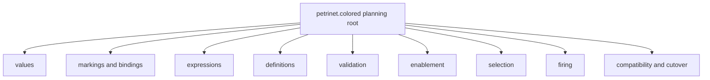
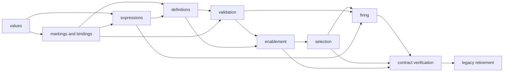

# `petrinet.colored` migration implementation plan

## Status and identity

**Status: generic migration completed; contract verification, Workflow adapter,
and legacy retirement human-accepted and closed.** The values/token,
markings/bindings, expression, definition, validation, enablement, selection, firing,
contract-verification, Workflow-adapter, and legacy-retirement slices are completed. The human accepted marking-owned
multiplicity: generic tokens have no multiplicity field, while markings represent
counts of equal anonymous tokens. The former v1 public source and tests are retired
without aliases after a bounded consumer audit found no production package or
example imports. Versioned v1 specifications,
Architecture v1 documentation, retained evidence records, and Git history remain for
audit. This state does not authorize protected execution, select a v2 wire, or
establish scientific acceptance or release status.

The normative and live target is [`ksdft2effmass.petrinet.colored`](../../../../v2/ksdft2effmass/petrinet/colored/index.md).
The historical as-built source remains documented by [`ksdft2effmass.workflows.cpn`](../../../../v1/ksdft2effmass/workflows/cpn/index.md).
The package-level responsibility transfer is owned by the [package and module
crosswalk](../../package-module-crosswalk.md).

## V1 source responsibilities

The implemented source is rooted at:

```text
python/src/ksdft2effmass/workflows/cpn/
├── __init__.py
├── errors.py
├── execution.py
├── expressions.py
├── markings.py
├── model.py
├── tokens.py
└── validation.py
```

| V1 module | Implemented responsibility | Principal predecessor modules |
|---|---|---|
| `tokens` | Closed contract values, routing tokens, outcomes, scope, status, and terminality | None |
| `markings` | Immutable place multisets, token bindings, and transition bindings | `tokens` |
| `expressions` | Closed value expressions, guards, templates, assignments, and evaluation | `tokens`, `markings` |
| `model` | Colors, places, transitions, arcs, inscriptions, and `CpnNetDefinition` | `expressions`, `markings` |
| `validation` | Definition and marking validation with structured findings | `expressions`, `markings`, `model` |
| `execution` | Deterministic enablement and firing | All applicable value, model, validation, expression, and error owners |
| `errors` | Structured contract, definition, marking, binding, guard, enablement, and firing failures | None |
| `__init__` | Supported 49-name public export surface | All public owners |

Retained v1 history includes the JSON Schema draft 2020-12 contracts and synthetic
valid/invalid fixtures under `specification/workflow-cpn/v1/`, Architecture v1 pages,
retained evidence records, and Git history. The former focused runtime tests,
integration tests, and API page were retired with the source. The maintained concept
and user pages now document the sole live full-name generic API and identify the v1
specification as historical.

The retirement audit found no production Python package or example importing the old
subpackage. The implemented Workflow adapter consumes the full-name generic API, and
the exact former 49-name inventory is prohibited from the live Workflow root. This
repository observation cannot guarantee that an external checkout never used the old
API; explicit human authorization owns the backward-incompatible retirement.

## Accepted V2 concern

`ksdft2effmass.petrinet.colored` owns only generic colored-Petri-net values and
pure operations:

- colors, places, transitions, arcs, inscriptions, and pure guards;
- color-qualified immutable token values;
- markings as semantic multisets;
- ordered immutable transition bindings;
- complete deterministic enablement results;
- deterministic binding selection with an optional permitted directive;
- identity-closed firing inputs;
- pure firing and complete firing audit facts; and
- structured failure results with no successor on failure.

The public v2 vocabulary uses full `ColoredPetriNet*` names. The v1 abbreviated
`Cpn*` names remain the implemented v1 public API and are not a second
prospective v2 spelling.

### Exclusions

The target package owns no:

- scientific `Task`, `Workflow`, `WorkflowRun`, or ResultObject meaning;
- calculator, simulation, dispatch, artifact, analysis, or scientific policy;
- external effect or process execution;
- development or scientific authority;
- persistence, publication, or repository mutation;
- fairness guarantee beyond the accepted deterministic selection rule;
- ambient choice, clock, randomness, network, filesystem, or environment input;
- SNAKES runtime object in its public contract; or
- reverse import of `ksdft2effmass.workflows`.

The required dependency direction is:

```text
ksdft2effmass.workflows → ksdft2effmass.petrinet.colored
```

The reverse edge is forbidden.

## HarnessTask containment

The canonical planning records define the following ordinary `HarnessTask`
containment.

```text
migration.v2.petrinet.colored
├── migration.v2.petrinet.colored.values
├── migration.v2.petrinet.colored.markings-bindings
├── migration.v2.petrinet.colored.expressions
├── migration.v2.petrinet.colored.definitions
├── migration.v2.petrinet.colored.validation
├── migration.v2.petrinet.colored.enablement
├── migration.v2.petrinet.colored.selection
├── migration.v2.petrinet.colored.firing
├── migration.v2.petrinet.colored.contract-verification
└── migration.v2.petrinet.colored.legacy-retirement
```

These are responsibility slices, not an assertion that v2 must expose
same-named Python modules. Exact private source-file placement remains an
implementation detail unless a later public import or wire contract makes it
architectural.

Every Task follows the common lifecycle:

```text
planning
→ optional human decision
→ implementation planning
→ optional human decision
→ implementation
→ optional human decision
→ administrative closeout
```

No phase is represented by another child Task.

## Planning cascade

Selecting `migration.v2.petrinet.colored` as one planning root may include the
exact revisions of all canonical descendants. Planning for every descendant may
start without waiting for parent planning completion, sibling completion, or
implementation prerequisites.



Planning outputs must identify exact inputs, outputs, invariants, public names,
paths, checks, and stop conditions for their slice. The cascade determines
planning scope only. It grants no implementation authority and does not bypass
path ownership.

## Proposed responsibility slices

### Values

The implemented target owns `ColoredPetriNetValueKind`,
`ColoredPetriNetValue`, nominal `ColoredPetriNetColorIdentity` and
`ColoredPetriNetTokenIdentity`, and `ColoredPetriNetToken`. The tagged value
retains the applicable v1 finite scalar behavior: exact built-in semantic types,
signed-i64 integers, finite binary64 reals, and ordered nonempty-string tuples.
No v2 wire or canonical lexical identity encoding is selected.

The accepted multiplicity disposition is marking-owned. A token contains one
nominal color identity, one tagged value, and an optional nominal token identity;
it has no count. Equal anonymous occurrences will be counted only by the later
`ColoredPetriNetMarking` owner. Individually correlated tokens remain distinct.

The v1 field dispositions are:

| V1 surface | V2 values-slice disposition |
|---|---|
| `ContractValueKind`, `ContractValue` | Retain generic meaning under the full-name value classes; no alias |
| `CpnToken.token_id`, `.color_id` | Transform into nominal optional token identity and required color identity |
| Payload type/id/schema fields | Replace the generic payload reference with the explicit tagged value |
| Workflow/run/parent-run/attempt/retry/iteration fields | Move to Workflow activation, run, and attempt owners; absent from generic tokens |
| Provenance, parent-token, correlation, and authorization fields | Move to their Workflow/result/authority owners; absent from generic tokens |
| `TokenField` | Retired with the v1 routing envelope after generic value/binding and Workflow-owned correlations replaced live use |
| `TokenOutcome` and its status/scope/terminality enums | Retired as v1-only routing state; not generic token state |

The former v1 `ksdft2effmass.workflows.cpn` imports and records are retired without
compatibility aliases. New Workflow code imports the full-name generic namespace, and
the generic package does not import `ksdft2effmass.workflows`.

### Markings and bindings

The implemented slice owns nominal definition, marking, place, transition, and
binding-variable identities; `ColoredPetriNetPlaceMarking`,
`ColoredPetriNetMarking`, `ColoredPetriNetBindingAssignment`, and
`ColoredPetriNetBinding`. A place marking stores a canonical tuple-backed
multiset: repeated equal anonymous tokens retain multiplicity, while a nominally
identified token occurs at most once across a complete marking. Places are unique
and canonically ordered. Definition completeness remains later cross-object
validation.

Bindings now associate definition-owned nominal variables with tagged generic
values. Assignment order is preserved as the definition-declared order rather
than rewritten lexically by the DataObject; variable identities must be unique.
The v1 `TokenBinding` token-reference shape and lexical reordering remain v1-only
because they combine routing-token identity with policy that does not belong to
the generic v2 binding value. V1 marking schema version, model ID, and revision
fields likewise remain on the accepted v1 wire; v2 in-memory markings instead
bind nominal marking and exact definition identities, while wire and revision
contracts remain deferred.

### Expressions

The implemented slice owns closed literal and nominal bound-variable expressions,
pure Boolean/comparison guards, token patterns, consume/read/inhibitor input
inscriptions, output token templates, and output inscriptions. Workflow-oriented
v1 token-field and bound-token-ID expressions are not copied into the generic
package: Workflow correlation remains with Workflow owners, while generic
bindings expose tagged values directly.

The human selected a public `ColoredPetriNetExpressionEvaluator` after clarifying
that it evaluates only declarative Petri-net values and guards, not scientific
Tasks. This stateless ActionObject is an explicit dependency for later enablement,
firing, inspection, and replay. It has a closed expression language, carries no
subclass-injected domain policy, performs no firing or effect, and grants no
execution authority. Concrete Tasks satisfy their Workflow protocol and are
adapted through explicit composition rather than evaluator inheritance.

| V1 expression surface | V2 expression-slice disposition |
|---|---|
| `ValueExpressionKind.LITERAL` and `.literal` | Retain as full-name literal expression over `ColoredPetriNetValue` |
| `TOKEN_FIELD`, `.variable`, and `.field` | Split: generic bound-variable lookup remains; Workflow routing-field access moves to Workflow adapters |
| `BOUND_TOKEN_IDS` and `.variables` | Retire from the generic language; token/result correlation remains explicitly Workflow-owned |
| `GuardOperator`, `GuardExpression` | Retain under full names with strict equal-kind comparison |
| `TokenFieldAssignment` and `TokenTemplate.assignments` | Replace with one value expression and optional string-valued token-identity expression on the generic template |
| `TokenTemplate.outcome_*` | Move to Workflow-owned closed invocation/result outcomes; absent from generic output templates |
| `TokenPattern` | Split into binding consume/read patterns and nonbinding inhibitor patterns |
| `InputInscription`, `OutputInscription` | Retain ordered generic demand/templates and add explicit inhibitor mode |
| `GuardEvaluationResult` | Retain as the full-name exact Boolean ResultObject |
| `CpnExpressionEvaluator` marking argument and token lookup | Remove: v2 bindings carry generic values directly; marking/token selection belongs to enablement and firing |

### Definitions

The implemented slice owns `ColoredPetriNetArcIdentity`, full-name color, place,
transition, and arc definitions, and `ColoredPetriNetDefinition`. Colors declare
nonempty admitted generic value-kind sets rather than Workflow payload types.
Transitions preserve explicit unique binding-variable declaration order and one
pure guard. Arc direction is derived from exactly one input/output inscription.
The aggregate canonicalizes unique components and requires total transition
priority to be an exact permutation. Cross-references and definition/marking
compatibility remain validator behavior.

| V1 definition field | V2 definition-slice disposition |
|---|---|
| Color/place/transition/arc lexical IDs | Replace with owner-local nominal identities |
| `description` fields | Remain v1/documentation-only; no machine semantics enter the minimal generic model |
| `allowed_payload_type_ids` | Replace nonempty Workflow payload IDs through the later Workflow value adapter; the valid v1 empty/no-payload state maps exactly to the single admitted generic `NONE` kind |
| `allowed_color_ids` | Retain as canonical nominal admitted-color identities |
| transition `guard` | Retain as the closed full-name pure guard |
| implicit binding-variable discovery | Replace with explicit definition-declared variable order |
| arc `direction` | Replace with mutually exclusive input/output inscription variants |
| arc inscriptions | Retain under full names, including nonbinding inhibitor patterns |
| net `schema_version` | Remain v1-wire-only; no v2 wire is selected |
| net `model_id` | Replace with `ColoredPetriNetDefinitionIdentity` |
| component collections | Retain as canonical unique immutable tuples |
| `initial_marking` | Remove from definitions; exact markings are independent enablement/firing inputs |
| total transition priority | Introduce as an exact permutation of transition identities |

The definitions contain no Workflow policy, payload identity, initial marking,
persistence, wire, effect, or external authority.

### Validation

The implemented public validation surface is
`ColoredPetriNetValidationIssueCode`, `ColoredPetriNetValidationIssue`,
`ColoredPetriNetValidationResult`, `ColoredPetriNetDefinitionValidator`, and
`ColoredPetriNetMarkingValidator`. Findings are canonicalized globally by
`(path, code, related identities, message)`. Empty findings mean only that no
declared structural defect was found; validation never enables or fires a
transition, invokes a Task, grants authority, or establishes scientific or human
acceptance.

The human accepted separate ordered `input_variable_identities` and
`external_output_variable_identities` on transition definitions. The collections
are disjoint. Consume/read patterns bind input variables, inhibitor patterns bind
none, guards may reference input variables only, and output templates may
reference input or external-output variables.

The v2 issue vocabulary retains or transforms applicable v1 meanings:
`UNKNOWN_COLOR`, `UNKNOWN_PLACE`, `UNKNOWN_TRANSITION`, `COLOR_NOT_ALLOWED`,
`VALUE_KIND_NOT_ALLOWED`, `UNDECLARED_BINDING_VARIABLE`,
`UNBOUND_BINDING_VARIABLE`, `DUPLICATE_BINDING_VARIABLE`,
`EXTERNAL_OUTPUT_VARIABLE_IN_GUARD`, `DEFINITION_IDENTITY_MISMATCH`, and
`PLACE_SET_MISMATCH`. V1 duplicate-identifier/token and multiple-place findings
retire from cross-object validation because v2 constructors make those states
unrepresentable. `TOKEN_COLOR_MISMATCH` merges into `COLOR_NOT_ALLOWED`,
`PAYLOAD_TYPE_NOT_ALLOWED` becomes `VALUE_KIND_NOT_ALLOWED`, model identity
becomes definition identity, and embedded-initial-marking validation retires.

### Enablement

The implemented enabler owns complete deterministic transition/binding
enumeration from one exact definition and marking. Its closed result binds an
enabler-produced, domain-separated SHA-256 identity and exact definition,
marking, library-owned expression-evaluator, enabler, and ordering-policy
identities. The identity preimage includes the complete success binding set or
failure state without selecting the deferred public result wire. Success contains
every distinct enabled value binding; failure contains no bindings and preserves
structural-validator findings where applicable.

Private canonical occurrence coordinates enforce marking multiplicity. Consume
demands at one place reserve distinct consume occurrences, read demands reserve
distinct read occurrences, and the same occurrence may satisfy one read and one
consume because reading does not remove it. Inhibitors are nonbinding absence
constraints. Occurrence-distinct enumerations that project to equal public value
bindings are deduplicated. Final ordering follows transition priority and then
definition-declared assignment order with tagged in-memory value keys.

The v1 complete-enumeration and guard-filtering intent is retained, but v1 token-ID
bindings, terminal-token Workflow policy, and one-transition result shape are not
compatibility constraints. Operational defects use the v2 closed failure result
rather than v1 exceptions. Enablement performs no selection, firing, Task
invocation, effect, or authority decision.

### Selection

The implemented selector owns deterministic binding selection from one exact
enablement result. Definitions carry a closed policy defaulting to
`DETERMINISTIC_ONLY`; only `DIRECTED_ALLOWED` permits an explicit directive.
Without a directive, selection takes the first complete binding from enablement's
already canonical definition-priority and declared binding/value order. A
content-identified directive names one exact enablement result and binding.

The content-identified result is exactly `selected`, `empty`, `no_match`, or
`failure`; empty enablement and a permitted directive with no matching binding
remain distinct. Results retain the complete directive where present so firing
can independently verify its enablement, requested binding, and identity. Prohibited directed selection, stale/mismatched enablement, a
definition mismatch, or failed enablement returns a stable closed failure. The
selector has no ambient choice or fairness claim and performs no firing, Task
invocation, effect, or authority decision.

V1 combines enablement with downstream caller choice and has no separately
named public binding-selector boundary. Its caller-order behavior is not retained
implicitly; directed behavior must use the explicit v2 permission and directive
contract.

### Firing

The implemented pure firer validates complete definition, predecessor,
enablement, selection, selected binding, directive, and external-output-binding
derivations. Because definition and marking identities remain nominal, it
recomputes enablement and selection from the full inputs and requires represented
equality rather than trusting matching lexical identities.

It reconstructs the lexicographically least feasible predecessor occurrence
assignment using canonical arc/pattern/token order, exact bound values, and the
same separate consume/read capacity semantics as enablement. Successful firing
consumes only reconstructed consume occurrences, retains reads, records inhibitor
absence, evaluates outputs against input plus exact declared external assignments,
validates output place/color/value/identity constraints, and returns a
content-identified successor marking with complete occurrence and production
audit. A produced identity may reuse one released by consumption but may not
collide with retained or other produced identities.

Closed failures contain no successor. Firing performs no Task invocation,
external effect, authority decision, persistence, or scientific acceptance. V1
revision, routing-token, terminal-outcome, and exception behavior remains v1-only
unless separately migrated by Workflow owners.

### Contract verification and legacy retirement

`contract-verification` is human-accepted and administratively closed. Its result
owns cross-version software comparison, the full-name target API,
dependency-direction checks, and the consumer-ready contract disposition.

The exact cross-version disposition is:

| V1 contract family | V2 disposition and verification boundary |
|---|---|
| `ContractValueKind`, `ContractValue` | Declared-equivalent finite scalar semantics; direct v1/v2 comparison tests cover every kind, signed-i64 limits, finite reals, and invalid-state parity. |
| `CpnToken`, outcome/scope/terminality, `TokenField` | Workflow routing and outcome state moves outward; only color plus generic tagged value and optional token identity remain generic. No record equality is claimed. |
| `CpnMarking`, `PlaceMarking` | Transformed to independent nominally identified semantic multisets with marking-owned anonymous multiplicity; v1 wire schema/revision is not equivalent. |
| `TokenBinding`, `TransitionBinding` | Replaced by declared-order variable/value bindings; v1 token-ID binding identity is intentionally not equivalent. |
| Value/guard expressions and evaluator | Literal, bound-value, Boolean, and strict equal-kind comparison meaning is retained; Workflow token-field and bound-token-ID expressions move outward. |
| Color/place/transition/arc/net definitions | Generic graph meaning is retained under nominal full-name records; descriptions, payload IDs, embedded initial marking, wire version, and Workflow policy are transformed or moved outward. |
| Definition/marking validators and issue codes | Retained as complete structural validation with the documented v2 issue transformation; constructor-unrepresentable v1 duplicate states retire. |
| `TransitionEnabler`, result | Complete deterministic enumeration intent is retained; definition-wide value bindings, inhibitor support, content identity, closed failures, and explicit semantic versions are v2 changes. |
| Caller choice | Replaced by explicit deterministic selection and definition-permitted content-identified directives; implicit caller-order behavior is not equivalent. |
| Firing request/result/firer | Replaced by identity-closed pure firing with full replay, external value binding, occurrence audit, and content-identified successor; v1 revision/routing/outcome behavior is not equivalent. |
| V1 structured exception hierarchy | Retired with the v1 runtime; v2 operational defects are closed domain result variants while wrong nominal Python argument types remain `TypeError`. |
| All 49 v1 public exports | Retired without aliases after consumer migration; the exact former inventory remains a prohibited-name oracle, not a live API. |

The historical fixed v1 export, direct scalar-comparison, runtime, and wire evidence
established only the recorded version-1 software disposition before retirement. The
live full-name API, dependency-direction checks, Workflow adapter evidence, and exact
route-absence test establish the current software boundary. They do not claim
schema-v1 record equivalence, scientific validation, release compatibility, or
external-user migration. The completed Workflow adapter and absence of repository
production/example consumers satisfy the bounded consumer migration used by
`legacy-retirement`.

## Implementation dependency DAG

Planning and implementation planning may proceed across all slices in parallel.
Implementation eligibility follows actual retained results rather than the
parent's serialized status.



Each edge means that the consumer implementation requires the producer's actual
closed implementation/verification result or receipt. The Task identifier or
parent relationship alone does not satisfy the edge.

The final implementation plan may collapse adjacent slices into one writer's
bounded change where that reduces ceremony without merging concerns. It may not
split a single invariant or operation across competing owners merely to preserve
the canonical concern decomposition.

## Implementation approach

### Contract inventory

Before source creation, produce an exact cross-version inventory covering:

- all 49 v1 public exports and their v2 retain/rename/replace/retire disposition;
- every v1 DataObject, ResultObject, ActionObject, enum, and structured error;
- every schema field, enum spelling, version, numeric boundary, ordering rule,
  and relational invariant;
- valid and invalid fixture coverage;
- exception versus closed-result behavior;
- revision and integer overflow behavior;
- output-token identity and collision behavior;
- read, consume, and inhibitor semantics; and
- all direct and documented consumers.

No v1 field is silently dropped because its current name appears workflow-
specific. Its represented meaning must either map to a generic owner, move to
`workflows`, remain v1-only, or receive an explicit unresolved disposition.

### Source introduction

Create `ksdft2effmass.petrinet.colored` only under a separately selected and
authorized implementation Task. Prefer immutable concrete records and stateless
ActionObjects. Do not make the v2 package an alias facade over
`workflows.cpn`, and do not make new source import the old namespace.

Private source modules may initially follow the responsibility slices above.
Public import and wire surfaces require synchronized contract, typing,
documentation, fixtures, and tests.

### Consumer migration

The implemented `workflows` consumer imports the accepted full-name v2 API without
abbreviated aliases or a reverse `petrinet.colored → workflows` import. Repository
production and example consumers are migrated. External use was not inferred absent;
the current human instruction explicitly authorized the backward-incompatible public
retirement.

## Prerequisite results

### Planning

Planning requires only the accepted v1 snapshot, current source inventory,
accepted v2 package boundary, package/module crosswalk, and implementation-
planning procedure. No source implementation prerequisite is required.

### Implementation planning

Each slice requires its own completed planning result and any critical decision
that planning actually exposes. Exact v2 wire formats are excluded from the
first source slice while they remain deferred; their absence does not block
planning pure in-memory behavior.

### Implementation

Each implementation slice requires:

- its completed implementation plan;
- actual closed results for predecessor slices in the dependency DAG;
- an exact authorized source/path scope;
- applicable accepted public-contract identities; and
- no unresolved critical decision affecting that slice.

### Results exported to consumers

The later `workflows` implementation may require actual retained results
establishing:

1. the v2 package and full-name public import surface exist;
2. definition, marking, enablement, selection, and firing contracts pass their
   declared software-verification gates;
3. v1/v2 compatibility findings have an accepted disposition for the behavior
   consumed by `workflows`; and
4. dependency-direction checks show no reverse Workflow import.

These facts are prerequisites for consumer implementation, not authority to
activate it.

## Conditional human decisions

No human review is required merely to choose private file placement or combine
adjacent implementation slices under one writer. The accepted architecture
already determines the package owner, public full-name direction, generic
purity, and forbidden reverse dependency.

Prepare a bounded human review only if planning leaves multiple defensible
choices at a human-owned boundary, including:

- changing a v1 public semantic rather than preserving or explicitly versioning
  it;
- selecting a new public v2 wire contract;
- retiring or aliasing the accepted v1 API;
- changing scalar, overflow, ordering, multiset, or failure meaning;
- adding or replacing a dependency; or
- widening the generic package to include Workflow or effect behavior.

The existing `HumanReviewPreparer` and `HumanReviewDecisionRecorder` represent
the bounded review packet and supplied decision. A durable critical architecture
choice remains recorded through the applicable checkpoint or prospective
`DevelopmentDecision` and still grants no implementation authority.

## Verification strategy

### Software verification

The migration requires focused evidence for:

- immutable values and intrinsic invariants;
- canonical marking, binding, token, transition, and finding order;
- valid and invalid definitions and markings;
- read, consume, and inhibitor arc semantics;
- complete enablement enumeration;
- deterministic default and directed selection;
- stale or mismatched enablement/selection rejection;
- explicit external-output-value binding validation;
- output-token validation and identity collision behavior;
- revision and scalar overflow behavior where retained;
- pure deterministic firing and unchanged inputs;
- complete structured failures with no successor;
- full-name v2 public exports;
- exact absence of the retired v1 public route and aliases;
- retained historical v1/v2 dispositions for behavior formerly declared equivalent;
- strict wire/schema behavior only after a v2 wire contract is accepted;
- package dependency direction; and
- absence of calculator, Workflow, persistence, authority, and SNAKES runtime
  coupling.

Use the existing v1 synthetic fixtures as retained inputs only where their exact
meaning is applicable. A shared fixture does not establish equivalence without an
explicit comparison oracle and disposition.

### Evidence classification

These checks are software verification of generic control-flow contracts. They
do not establish numerical verification of a physical model, scientific
validation, uncertainty quantification, calculator correctness, or suitability
for a scientific campaign.

### Documentation checks

Synchronize applicable source docstrings, API pages, concept pages,
architecture pages, specifications, fixtures, and migration pages. Run the full
Sphinx build with warnings as errors and retain no generated output.

## Cutover and rollback

Cutover completed incrementally:

1. introduce the v2 package without changing v1 imports;
2. verify v2 behavior independently;
3. compare behavior explicitly declared compatible;
4. migrate repository consumers under their own Task trees;
5. preserve the v1 package while any accepted consumer or compatibility promise
   requires it;
6. retire v1 routes only through a separately accepted compatibility decision;
   and
7. update the migration index only after accepted repository state changes.

Rollback is available through the last pre-retirement Git revision and retained v1
specification, architecture, and evidence records. Restoring the old public package
would be a separately authorized compatibility change; no deprecated alias is
silently reintroduced and no retained history is rewritten.

## Parent administrative closeout

The parent closeout may claim only that the bounded generic CPN responsibility
has migrated when:

- required child implementations and checks have closed results;
- the full target package contract is internally coherent;
- cross-slice identity and ordering rules agree;
- compatibility findings have explicit dispositions;
- required consumers have migrated or are explicitly retained on v1;
- dependency-direction gates pass;
- documentation and public surfaces agree;
- rollback remains identified; and
- residual limitations are recorded.

Child closeout occurs independently for each slice. Parent closeout is generally
bottom-up because its aggregate claim depends on child results, not because
containment automatically establishes prerequisites.

## Residual limitations

- The values slice selects `petrinet.colored.values`; exact internal modules for
  later generic slices remain unselected.
- Exact v2 definition, marking, expression, token-value, result, and error wire
  formats remain deferred.
- Canonical lexical identity forms remain deferred.
- Public evaluator placement is selected; exact evaluator implementation-version
  identity and runtime-bundle wire binding remain deferred.
- External consumers outside this repository were not inventoried or promised a
  compatibility period; restoration requires a separately authorized change.
- The values, markings/bindings, expressions, definitions, validation, enablement,
  selection, firing, contract-verification, Workflow-adapter, and legacy-retirement
  Tasks are completed. Prospective WorkflowRun and effect boundaries retain their
  separate lifecycle and prerequisites.
- The generic package and effect-free adapter introduce no scientific execution or
  scientific acceptance.
