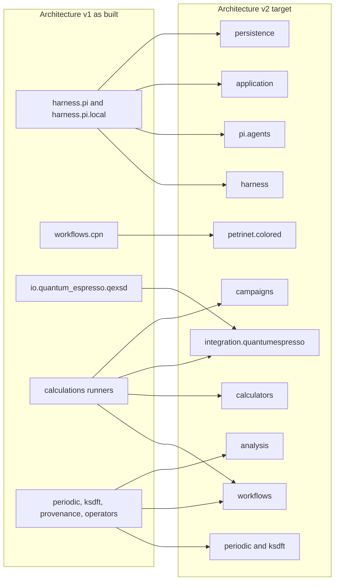
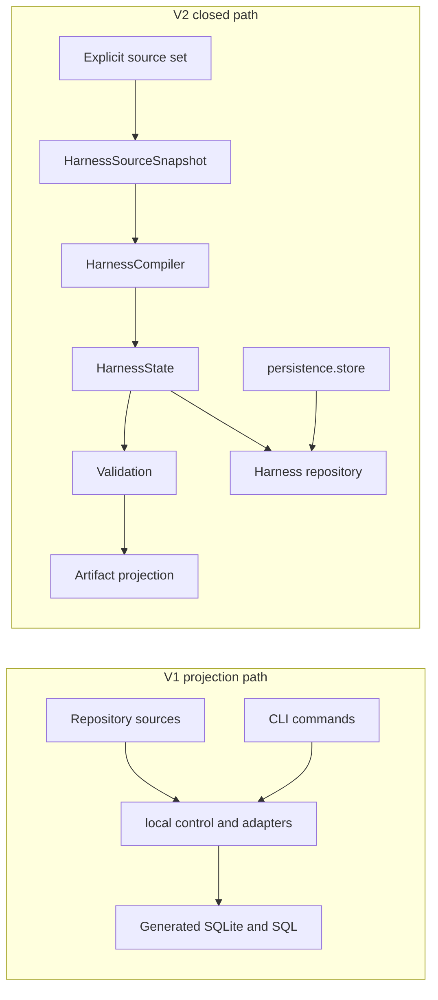
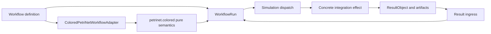

# Package and module crosswalk

## Purpose

This crosswalk expands the package-level structure in the [migration
index](index.md) into explicit Architecture v1 module-family to Architecture v2
ownership transitions. The baseline is the implemented v1 snapshot at
`0dda56e2c11261280660139fe80dab0d395b4234`; later accepted migration progress is
reported by the index rather than rewritten into the snapshot.

Rows identify responsibility destinations, not automatic source moves. V2
usually selects package owners while deferring exact internal modules and public
wire exports. A target module name appears here only where the v2 architecture
selects it explicitly.

## Whole-system crosswalk

The diagram deliberately shows splits. V2 does not preserve the v1 tendency for
one Harness namespace, one provenance package, or one calculation runner to
combine domain records, orchestration, concrete effects, persistence, and
composition.

## Development Harness crosswalk

### Task, selection, decisions, and review

| V1 as-built module family | V2 owner or contract | Transition |
|---|---|---|
| `harness.pi.chains` | Generic in-memory compatibility types only | Independent chain topology, selection authority, adapters, and filesystem readers are retired |
| `harness.pi.task_state` | Harness bounded inspection over canonical Task and selection state | Replace chain-centric inspection without creating a second Task graph |
| `harness.pi.wire.tasks` | Harness Task and selection serializers/deserializers | Preserve accepted Task wire behavior; add only separately accepted selection and registry contracts |
| `harness.pi.checkpoints` | Harness development decisions under the root v2 human-decision contract | Transform losslessly; unresolved, ambiguous, and conflicting records remain unresolved |
| `harness.pi.wire.checkpoints` | Development-decision wire adaptation | Retire only after exact request, options, response, outcome, status, and predecessor identities are preserved |
| `harness.pi.human_review` | Harness review preparation, observations, findings, and decision recording | Keep review evidence distinct from operation authorization and acceptance |
| `harness.pi.wire.human_review`, `.wire.dispatch` | Harness review/decision transport and exact operation-dispatch boundaries | Split by domain owner; do not turn dispatch transport into authority |

### Identity, resources, ownership, and conformance

| V1 as-built module family | V2 owner or contract | Transition |
|---|---|---|
| `harness.pi.identity` | Harness-owned identities plus root v2 identity/version/failure semantics | Retain domain-specific nominal types; introduce no shared runtime contracts package or universal identity bucket |
| `harness.pi.checksums` | Exact resource/artifact identity owners | Retain checksum mechanics under the record that owns the identified bytes |
| `harness.pi.wire.canonical_json` | Domain serializers | Retain canonical JSON mechanics only where an accepted wire contract requires them |
| `harness.pi.resources.*` | Harness configuration, resource resolution, capability declarations, and projection inputs | Retain and narrow; resource presence and capability never authorize an operation |
| `harness.pi.profiles` | Harness configuration and adapter-profile inputs | Split repository validation profiles from governed Pi operator profiles |
| `harness.pi.ownership` | Harness ownership validation and subagent assignment input | Retain structural validation without claiming runtime confinement |
| `harness.pi.evidence.python_conformance.*` | Harness coding-standards conformance | Rename and narrow through explicit adapter profiles; current implementation has retired the old `evidence` facade |

### Compiler, persistence, projections, and commands

| V1 as-built module family | V2 owner or contract | Transition |
|---|---|---|
| `harness.pi.local.control.generation`, `.inputs`, `.verification` | `HarnessRepositoryLoader`, `HarnessSourceSnapshot`, `HarnessCompiler`, validators, projector, synchronizer, and comparator | Replace private multi-reader construction with one closed source-to-state path |
| `harness.pi.dbcontrol.*` | Harness domain repositories/projections plus shared `persistence.store` composition | Split domain meaning from opaque revision storage; generated SQLite remains non-authoritative |
| `harness.pi.local.dbcontrol.*` | Transitional Harness projection and persistence mechanics | Retire after v2 repository and projection consumers cut over |
| `harness.pi.local.task_model`, `.task_adapters`, `.control_record_adapters` | Canonical Harness Task/registry/selection contracts and temporary migration adapters | Preserve Task meaning; retire adapters after all consumers use owning contracts |
| `harness.pi.local.evidence_adapters`, `.ownership_adapters`, `.resource_adapters`, `.adapters` | Exact Harness compiler adapters or application composition | Split by represented domain; no permanent generic adapter bucket |
| `harness.pi.local.context`, `.models`, `.validation`, `.checkpoint_validation` | Harness source loading, normalized state, validation, and application composition | Split behavior explicitly; do not create universal context or model modules |
| `python/src/cli/*`, `harness.pi.local._commands.*` | Sole importable `ksdft2effmass.harness.cli` dispatcher and thin adapters over deterministic domain ActionObjects | Retire both former command layers; keep only subcommand selection, argument parsing, request construction, rendering, and exit mapping in `harness.cli`; domain policy and mutation remain with exact ActionObject owners |

### Harness interaction change

Compilation, validation, projection, persistence, authority resolution, and
operation execution remain separate. A generated artifact, valid state, selected
Task, or available capability cannot authorize itself.

## Agent and subagent crosswalk

| V1 surface | V2 owner or contract | Transition |
|---|---|---|
| `.pi/agents/*.md` | Repository role catalog | Retain reusable role behavior and exact descriptor identities |
| `.pi/settings.json` overrides | Repository-declared role enablement | Retain exact settings identity; absent historical descriptors do not become live roles |
| `AgentDescriptorView` | Narrow ownership-validation input | Retain without expanding it into complete descriptor or runtime state |
| Installed Pi agent inventory | Pi runtime observation | Reconcile at launch; never import into `HarnessState` |
| Prompt-text assignment | Exact direct- or managed-work assignment | Make goal, baseline, paths, operations, checks, output, and stop conditions explicit |
| Pi missions, runs, status, receipts, and worktrees | Pi runtime and recovery state | Retain outside Harness lifecycle and authority |
| General developer tools | Authorized conversational developer role | Retain for bounded development work |
| No governed operator adapter | `ksdft2effmass.pi.agents` | Introduce closed request/result adaptation only after domain operations and isolation contracts exist |
| No fixed action composition | `PiAgentActionComposition` | Introduce immutable content-identified composition; prohibit operator mutation and reload |

Conversational roles, Harness capabilities, and governed Pi actions are three
different catalogs. No translation among them grants authority.

## Colored-Petri-net and Workflow crosswalk

### Generic semantics

| V1 module | V2 owner | Transition |
|---|---|---|
| `workflows.cpn.model` | `petrinet.colored` definitions | Rename/move after full-name API compatibility is accepted |
| `workflows.cpn.tokens` | `petrinet.colored` token/color values | Rename/move while preserving immutable generic semantics |
| `workflows.cpn.markings` | `petrinet.colored` markings | Rename/move with deterministic ordering and equality contracts |
| `workflows.cpn.expressions` | `petrinet.colored` inscriptions and guards | Rename/move without scientific or effect policy |
| `workflows.cpn.validation` | `petrinet.colored` structural validation | Rename/move; validation grants no firing or operation authority |
| `workflows.cpn.execution` | `petrinet.colored` enablement, deterministic selection, and pure firing | Rename/move; effect dispatch remains Workflow-owned |
| `workflows.cpn.errors` | Closed generic Petri-net results/failures | Replace exception details only under explicit compatibility policy |

V2 requires `workflows → petrinet.colored` and forbids the reverse edge.

### Scientific orchestration

| V1 responsibility | V2 owner | Transition |
|---|---|---|
| No public scientific `Task` or `Workflow` | `workflows` | Introduce immutable scientific composition contracts |
| No scientific-run aggregate | `WorkflowRun` | Introduce replayable aggregate and exact lifecycle records |
| Shell sequencing and development Task state used around calculations | Workflow control and calculator integration | Replace without fabricating historical WorkflowRun state |
| Calculation-specific retries and restart handling | Workflow attempt, dispatch, reconciliation, and result-ingress owners | Introduce explicit effect and indeterminate-outcome semantics |
| Scientific review represented in development lifecycle | `ScientificAnalysis`/`ScientificFinding` and external human-reviewed conclusions | Replace; no `ScientificDisposition` or Workflow acceptance state |

## Calculator and Quantum ESPRESSO crosswalk

| V1 module or repository path | V2 owner | Transition |
|---|---|---|
| `io.quantum_espresso.qexsd.parsing` | `integration.quantumespresso` native parser | Rename/move |
| `io.quantum_espresso.qexsd.records` | Integration-native syntax records; neutral outputs in `periodic` and `ksdft` | Split |
| `io.quantum_espresso.qexsd.construction` | Integration observation adapter composed with neutral record owners | Rename/move and narrow |
| Calculation-specific exact input records | `calculators` | Extract project-facing immutable calculator contracts |
| Executable and process request/observation meaning | `calculators` | Extract consumer-owned contracts and protocols |
| QE serialization, staging, workspace, invocation, capture, discovery, and failure mapping | `integration.quantumespresso` | Extract concrete anti-corruption Actions |
| Ordering, attempts, restart, result ingress, and replay | `workflows` | Replace ad hoc shell and development-Task coordination |
| Tutorial and production definitions | `campaigns` | Extract project-specific definitions without generic Workflow policy |
| Runtime dependency injection | `application` | Construct exact executors, stores, repositories, workflows, and definitions |

The dependency direction is
`application → integration.quantumespresso → calculators → workflows`, with
additional accepted integration imports of exact Workflow, periodic, and Kohn–
Sham contracts. `calculators` and `workflows` never import the concrete
integration.

## Observation, provenance, operator, and analysis crosswalk

### Neutral observations

| V1 module | V2 owner | Transition |
|---|---|---|
| `periodic.models` | `periodic` | Retain; exact internal v2 module remains deferred |
| `ksdft.models` | `ksdft` | Retain; exact internal v2 module remains deferred |
| `ksdft.pw.records`, `.serialization` | Neutral portions in `ksdft`; calculator/native/run portions in `calculators`, `integration.quantumespresso`, and `workflows` | Split only after field-by-field ownership review |

### Provenance

| V1 module | V2 owner | Transition |
|---|---|---|
| `provenance.records`, `.serialization` | Workflow artifact/provenance model and applicable domain identity owners | Split by aggregate ownership; adapt explicitly rather than aliasing equal-looking identities |
| `provenance.external_tools` | Calculator executable configuration and integration tool identity | Split declaration from observation |
| `provenance.tool_observations` | Concrete integration observations or retained external evidence | Split by producer and consumer |
| `provenance.external_execution` | Calculator process contracts, integration effects, and Workflow attempt/result lineage | Split request meaning, effect, and aggregate history |
| `provenance.actions` | Integration adaptation, Workflow correlation, or another exact domain owner | Split; no generic action bucket |

### Represented operators and analysis

| V1 module | V2 owner | Transition |
|---|---|---|
| `operators.records`, `.serialization` | No selected replacement | Retain v1 owner until a separate public-contract decision |
| `operators.hermiticity` | Potential future analysis owner, not selected | Unresolved |
| `operators.compatibility` | Potential record-compatibility or analysis owner, not selected | Unresolved |
| `operators.difference` | Potential future analysis owner, not selected | Unresolved |
| `operators.residuals` | Potential future analysis owner, not selected | Unresolved |
| `operators.comparison` | Potential future analysis composition, not selected | Unresolved |
| Calculation-specific deterministic algorithms | `analysis` | Introduce only with explicit units, tolerances, numerical policy, and evidence class |

The operator gap is intentional and fail-closed. “Analytical behavior” is not
sufficient reason to move represented-operator data or algorithms into
`analysis`. The eventual decision must preserve basis, gauge, energy-reference,
unit, geometry, and state-space prerequisites.

## Packages introduced without one-to-one v1 sources

| V2 package | V1 inputs | New responsibility |
|---|---|---|
| `persistence` | Harness SQLite/projection experience only | Opaque immutable revisions, compare-and-swap, idempotency, and standard-library SQLite realization |
| `workflows` | Generic CPN semantics, direct execution observations, Task history, and provenance records | Scientific composition, run aggregate, effects, ingress, replay, and domain persistence |
| `calculators` | Calculation inputs and direct runner records | Project-facing SimulationTask/Simulation and executor protocols |
| `integration.quantumespresso` | QEXSD I/O and QE runners | Concrete QE anti-corruption Actions |
| `campaigns` | Tutorial and production definitions | Project composition inputs |
| `analysis` | Existing calculation-specific algorithms and later authorized operator analysis | Deterministic scientific policy and results |
| `application` | Existing command/repository composition | Explicit dependency construction only |
| `pi.agents` | Role identities and accepted deterministic domain operations | Closed Pi transport and action composition |

## Cross-boundary compatibility gates

| Boundary | Required evidence before migration |
|---|---|
| Harness source and compiler | One closed source snapshot, deterministic state, validation, projection, and drift comparison |
| Task and decision records | Lossless identity, relationship, response, status, and predecessor preservation |
| Role and runtime identity | Descriptor/settings identity and missing/disabled/ambiguous/stale resolution rejection |
| CPN API | Shared expected results for generic values, validation, enablement, deterministic selection, and pure firing |
| Workflow introduction | Replay, effect separation, dispatch/reconciliation, ingress, persistence, and failure behavior |
| Calculator/integration split | Exact input/output identity, protocol direction, process outcomes, artifact discovery, and native adaptation |
| Provenance split | Producer, attempt, artifact, correlation, and aggregate ownership remain explicit |
| Observation retention | Units, coordinates, reciprocal scaling, energy reference, indexing, and unavailable metadata remain explicit |
| Operator disposition | Public API, wire, fixtures, numerical behavior, and alignment prerequisites remain intact |
| Governed Pi adapter | Closed schemas, composition identity, authority binding, bounded invocation, isolation, and rollback |

Compatibility is one-directional during migration: new code may consume accepted
new owners, but no new domain code may depend on a transitional v1 adapter. A v1
route is retired only after all current consumers migrate and replacement
behavior passes its accepted gates.

## No-recalculation and evidence boundary

Existing QE inputs, pseudopotentials, outputs, and convergence artifacts retain
their actual identities, provenance, and limitations. This crosswalk does not
require a rerun, conversion, registration, fabricated WorkflowRun, or evidence
reclassification. Shared labels or settings do not establish equivalence between
v1 and v2 representations.

Software checks establish only their declared contracts. Numerical verification,
scientific validation, uncertainty quantification, protected-execution
authority, and human acceptance remain separate.

## Status

This crosswalk documents ownership transfer only. It authorizes no source move,
new package, dependency change, compatibility alias, scientific execution,
protected action, successor activation, publication, release, or human
acceptance.
