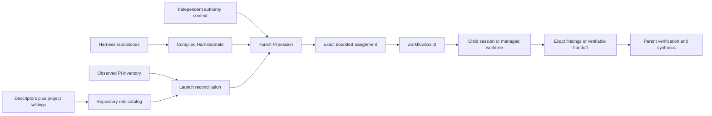

# Pi harness subagent migration

## Purpose

This page defines the incremental changes that morph the [implemented Architecture v1 Pi harness subagent model](../../v1/ksdft2effmass/harness/pi/subagents/index.md) into the normative [Architecture v2 Pi harness subagent boundary](../../v2/ksdft2effmass/harness/subagents.md).

Architecture v1 remains implemented until replacement behavior exists and passes the applicable compatibility checks. Listing an increment does not activate it, authorize source implementation, or give a Pi run Harness Task authority.

## Starting point

Architecture v1 currently provides:

- project role descriptors under `.pi/agents/`, with enabled and disabled state completed by `.pi/settings.json`;
- parent launches through the installed `subagent` interface and `workflowScript`;
- prompt-text assignments and runtime launch parameters rather than a project-local serialized assignment;
- procedural parent reconstruction of Task, chain, checkpoint, ownership, branch, and working-tree state;
- Harness `.pi/chains/*.chain.json` records in a namespace also visible to Pi compatibility-chain discovery;
- ownership manifests when concurrent writing, verification separation, Task policy, or path risk requires them;
- fresh and forked contexts, asynchronous execution, and managed worktrees supplied by Pi;
- prompt-governed handoffs and findings verified by the parent; and
- Pi runtime artifacts used for observation and recovery, never as Harness authority;
- the generic `AgentDescriptorView` schema, fixture, Python DataObject, and ownership validator under `harness/pi/` and `python/src/ksdft2effmass/harness/pi/`, where the view intentionally contains only agent identity and writer/read-only acceptance role; and
- project-local control generation that stores `agent_definition` and `agent_skill_route` rows in `harness/state/harness-control.sqlite3` and its projections.

Public immutable `PiHarnessConfiguration` represents the narrow project-settings subset consumed by the Harness, and `PiHarnessConfigurationDeserializer` owns JSON-byte conversion. Public `PiHarnessAgentDefinitionResolver` composes selected `.pi/agents/*.md` descriptors and configuration into immutable `PiHarnessAgentDefinition` before database ingestion. The resulting projection-ready values represent the three retained task-specific H2/H4 descriptors as disabled and leave Pi responsible for runtime discovery.

Throughout migration, Harness source records and independently resolved authority continue to determine selection, activation, prerequisites, checkpoints, protected actions, acceptance, and closure. Historical v1 records retain their original meaning and are not rewritten to look like v2 records. Pi continues to own child execution and runtime mechanics; this repository does not reimplement them.

Migration keeps four concerns distinct:

- the repository-declared role catalog comes from selected project descriptors and project settings;
- `AgentDescriptorView` is the narrower identity-and-acceptance view used by ownership validation;
- Pi's resolved executable inventory is a runtime observation checked at launch, not part of `HarnessState`; and
- the prospective `HarnessCapabilityCatalog` and `PiAgentActionComposition` describe deterministic development operations, not which conversational agent sessions happen to be running.

## Incremental changes

### 1. Keep the v1 repository role projection settings-aware

Project-local control generation consumes selected descriptors and public normalized `PiHarnessConfiguration`, and the maintained SQLite, SQL, and related projections represent disabled H2/H4 roles as disabled. Preserve that behavior while migration proceeds. JSON interpretation and descriptor/configuration enablement policy remain outside database ingestion. This deterministic slice does not invoke Pi, change prompts or settings policy, or import runtime observations into Harness state.

### 2. Stabilize role identities

Represent logical repository role identity, descriptor content identity, project-settings identity, and Pi's package-qualified runtime name separately. Do not infer equivalence through prefix stripping. Preserve `AgentDescriptorView` as the narrow identity-and-acceptance input used by ownership validation rather than expanding it into a complete Pi descriptor model.

### 3. Finish reusable-descriptor normalization

The durable descriptors have already undergone role-simplification work. Remove remaining mutable Task selection, owned paths, or one-run instructions only when found; retain stable behavior, capability ceilings, skills, acceptance roles, output expectations, and stop boundaries. Disabled historical descriptors may remain until their references can be preserved without live discovery.

### 4. Add launch-time runtime reconciliation

Before delegation, compare the selected enabled repository role and exact descriptor/settings identities with Pi's observed resolved inventory. Missing, disabled, ambiguous, or identity-mismatched resolution blocks launch. The observation is runtime evidence only: it does not enter `HarnessState`, enable a role, grant Task authority, or become a second role registry.

### 5. Make parent assignment construction explicit

After the prospective v2 Harness compiler and independent authority resolver exist under their owning migration work, make the parent consume compiled `HarnessState`, the exact authority result, selected role identity, ownership, workspace, and baseline before delegation. The resulting assignment contains the goal, permitted paths and operations, success criteria, validation, output, and stop conditions. No parallel public Task-context object is introduced.

### 6. Separate Harness chains from Pi orchestration

Give Harness `.pi/chains/*.chain.json` an unambiguous development-control namespace or exclude them from Pi workflow discovery. Preserve `workflowScript` as the sole public orchestration language. Existing chains and runs retain their original meaning.

### 7. Tighten delegated mutation and review

Require reviewer findings to identify an exact read-only subject and writer handoffs to identify the assignment, workspace, base and resulting state, changed paths, validation, applicable recovery artifacts, and unresolved risks. The parent verifies those facts before integration.

Ordinary single-writer work requires no manufactured manifest. Concurrent writers require non-overlapping ownership and distinct managed worktrees. The ownership validator establishes structural agreement, Pi records runtime isolation, and the parent detects violations; the Harness validator does not confine the Pi runtime.

### 8. Separate governed operations from conversational roles

Use the prospective `HarnessCapabilityCatalog` for deterministic development operations and `PiAgentActionComposition` for the closed operations exposed to a governed operator profile. Do not translate `agent_definition`, descriptor tool lists, skill routes, or currently running sessions into operation authority. A role may request an accepted operation only through its independently authorized deterministic owner.

### 9. Separate lifecycle and define runtime retention

Keep Pi lifecycle outside Harness lifecycle. Runs, missions, receipts, reviews, handoffs, and completion states remain observations or evidence and provide no Harness authority. Stop using opaque v1 status variants, generated Task-status prose, and persisted implementation/review phases as v2 lifecycle inputs.

Define which Pi statuses, events, outputs, transcripts, sessions, missions, receipts, patches, and worktrees are retained, sanitized, expired, or preserved for recovery. Do not invent missing historical metadata or destructively clean up uncertain state.

### 10. Retire the v1 projection and complete cutover

After all consumers migrate, either retain `agent_definition` as an explicitly repository-role-only compatibility projection or remove it; it must not survive as a shadow executable-agent or operation registry. Retire obsolete task-specific descriptors, redundant settings overrides, status prose, and process-phase projections only after retained references remain interpretable.

The v2 boundary becomes authoritative for new subagent work after role identity, settings-aware compilation, runtime reconciliation, assignment construction, orchestration, ownership, handoff, operation composition, lifecycle separation, and recovery behavior pass their accepted compatibility checks. A failed cutover returns to the last accepted composition without rewriting historical or authoritative records.

## Target boundary

The resulting responsibility changes are:

| V1 concern | V2 disposition |
|---|---|
| Reusable descriptors and project settings | Compile one repository-declared role catalog with explicit identities |
| `AgentDescriptorView` | Retain as the narrow ownership-validation view |
| Pi executable inventory | Observe and reconcile at launch; never import into `HarnessState` |
| Parent reconstruction | Consume compiled Harness state, independent authority, and reconciled role identity |
| `workflowScript` | Retain as the sole public orchestration language |
| Harness chains | Retain as development-control input or history, outside Pi workflow discovery |
| Ownership manifests | Retain only when proportional ownership rules require them |
| Writer and reviewer output | Require exact subjects and verifiable handoffs for new work |
| Harness capabilities and Pi action composition | Model deterministic operations, not agent availability |
| Pi missions, runs, status, and artifacts | Retain as runtime evidence and recovery state only |
| V1 `agent_definition` | Retain only as a repository-role compatibility projection or retire |
| Opaque statuses, generated Task prose, and persisted process phases | Preserve historically but remove from v2 authority and lifecycle contracts |

## Deferred decisions

- Compatibility-safe descriptor consolidation, renaming, and retirement order.
- The exact namespace or discovery mechanism separating Harness chains from Pi workflows.
- Mission and run-artifact retention and sanitization policy.
- Whether and where Pi run identities appear in durable development evidence.

A deferred decision blocks only the increment that depends on it.
