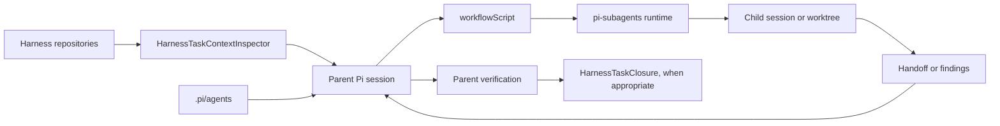

# Pi harness subagent crosswalk

## Scope

This crosswalk maps the [implemented Architecture v1 Pi harness subagent model](../../v1/harness/subagents/index.md) to the normative [Architecture v2 Pi harness subagent model](../../v2/harness/subagents/index.md). It does not claim that Pi runtime implementation belongs to this repository or that a subagent run provides Harness Task authority.

## Responsibility crosswalk

| V1 surface | V2 responsibility | Disposition |
|---|---|---|
| `.pi/agents/*.md` | Canonical project Pi subagent role descriptors | Retain and simplify |
| Descriptor frontmatter | Role identity, tool allowlist, inheritance, selected skills, and acceptance role | Retain as a Pi-owned contract |
| Descriptor prompt body | Stable role behavior, output expectations, and stop boundaries | Retain; remove mutable Task-specific details |
| Parent Pi session | Task-context reconstruction, delegation, synthesis, and final verification | Retain and make explicit |
| `subagent(...)` | Pi execution, management, status, and control interface | Retain |
| `workflowScript` | Sole public child orchestration language | Retain |
| Harness `.pi/chains/*.chain.json` | Authoritative development-control chain records | Retain as Harness authority; do not reinterpret as Pi subagent workflow definitions despite runtime namespace discovery |
| Child Pi session | Delegated runtime conversation and tool context | Retain as Pi runtime state |
| Fresh context | Independent review, validation, and bounded inspection | Retain |
| Forked context | Work intentionally requiring filtered persisted parent history | Retain and narrow |
| Asynchronous run | Default subagent execution posture | Retain |
| Managed worktree | Isolated mutation workspace and recovery boundary | Retain |
| Ownership manifest | Concurrent writers, explicit verification separation, required Task policy, or conflicting/high-risk path ownership | Retain only when required |
| Writer output | Provisional implementation result | Narrow to a verifiable handoff |
| Reviewer output | Read-only findings over an exact subject | Retain; parent dispositions remain authoritative |
| Mission | Durable Pi objective and recovery context | Retain; never use as Harness Task state |
| Receipt | Evidence or link for an external outcome | Retain as evidence only |
| Pi runtime status | Child execution lifecycle | Retain; never import as Harness Task lifecycle |
| Status, event, output, transcript, and handoff artifacts | Runtime observation and recovery | Retain under an explicit retention policy |
| Generated Task-status prose | Legacy projection | Move or retire through the documentation cutover |
| Opaque V1 Task `status` | Historical migration input | Do not promote into V2 |
| Persisted implementation, verification, or review phases | Process ceremony | Remove from the Task data model |
| V1 active status | Exact `DevelopmentTaskSelection` | Replace |
| V1 terminal status variants | One `HarnessTaskClosure` per ended selection | Replace |
| Agent manual inference from many control files | `HarnessTaskContextInspector` | Replace with one source-aware read operation |

## Target flow

## Descriptor disposition

Existing project descriptors fall into reusable architecture, implementation, documentation, test, and integration-review families. Architecture v2 retains reusable role behavior and removes obsolete task-specific roles after their historical Tasks no longer require them. Descriptor deletion or consolidation must preserve any durable run and handoff references that identify the original role.

## Runtime-state disposition

Pi runs, child sessions, missions, status events, and artifacts remain under Pi runtime ownership. The harness may retain immutable references to them when required as evidence or for recovery. Their lifecycle never selects work, satisfies prerequisites, resolves checkpoints, closes Tasks, or provides human acceptance.

## Cutover conditions

The subagent boundary is migrated when:

1. project agent descriptors have validated role and tool boundaries;
2. the parent can obtain one source-aware `HarnessTaskContext` without interpreting opaque status text;
3. new subagent orchestration uses `workflowScript`, while Harness `.pi/chains` remain development-control records only;
4. concurrent writers use validated non-overlapping ownership and isolated worktrees;
5. writer handoffs and reviewer findings identify exact subjects and revisions;
6. parent verification precedes integration and Task closure; and
7. Pi runtime artifacts have an explicit retention and sanitization policy.

## Historical preservation

Existing runs, chain records, generated Task projections, and opaque status values remain historical evidence. Migration does not rewrite them to look like V2 selections, closures, missions, or verified handoffs when those records did not exist at execution time.

## Unresolved issues

- Descriptor consolidation and retirement order.
- Exact `HarnessTaskContextInspector` result contract.
- Mission and run-artifact retention policy.
- Namespace separation preventing Harness `.pi/chains` from being interpreted as Pi subagent workflow definitions.
- Whether Pi run identities appear in Task closure evidence references.
