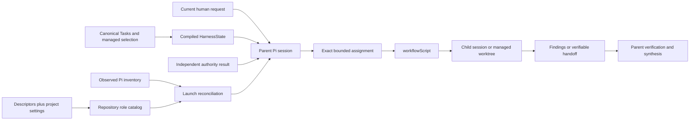

# Pi harness subagent migration

## Purpose

This page defines the incremental migration from the [implemented Architecture
v1 Pi harness subagent model](../../v1/ksdft2effmass/harness/pi/subagents/index.md)
to the normative [Architecture v2 Pi harness subagent
boundary](../../v2/ksdft2effmass/harness/subagents.md). It owns repository role
discovery, parent assignment, child execution, worktree ownership, handoff,
review, runtime evidence, recovery, and subagent cutover.

The [agent-system migration](agents.md) separately owns governed operator
capabilities, deterministic Pi actions, process isolation, candidate
composition, promotion, and rollback. A conversational subagent role is not a
governed operation, and a governed action composition is not a role catalog.

Architecture v1 remains implemented until replacement behavior exists and passes
its applicable compatibility checks. Listing an increment does not activate it,
authorize source implementation, or give a Pi run development or protected-
action authority.

## Implemented starting point

Architecture v1 currently provides:

- thirteen project role descriptors under `.pi/agents/`, with ten enabled roles
  and three present task-specific H2/H4 descriptors disabled through
  `.pi/settings.json`;
- additional settings overrides for retired descriptors that are no longer
  present;
- parent launches through the installed `subagent` interface and
  `workflowScript` after listing executable, non-disabled roles;
- prompt-text assignments and runtime launch parameters rather than a project-
  local serialized assignment;
- direct-work mode for ordinary bounded human requests, with relevant files,
  branch, and working tree inspected without reconstructing unrelated managed
  state;
- managed-work mode using canonical `harness/tasks/*.json`, minimal current
  selection in `harness/task-selection.json`, and applicable checkpoint,
  ownership, workspace, and handoff records;
- transitional `.pi/chains/*.chain.json` compatibility records in a namespace
  also visible to Pi chain discovery;
- ownership manifests only when an explicitly managed Task, concurrent writers,
  required writer/reviewer separation, or path risk requires them;
- fresh and forked contexts, asynchronous execution, supervision, missions, and
  managed worktrees supplied by Pi;
- prompt-governed assignments, handoffs, and findings verified by the parent;
- Pi runtime artifacts used for observation and recovery, never as development
  authority;
- the narrow `AgentDescriptorView` schema, fixture, DataObject, and ownership
  validator under `harness/pi/` and
  `python/src/ksdft2effmass/harness/pi/`; and
- settings-aware project-local control generation of `agent_definition` and
  `agent_skill_route` compatibility projections.

Public immutable `PiHarnessConfiguration` represents only the project-settings
subset consumed by the Harness. `PiHarnessConfigurationDeserializer` owns its
JSON-byte conversion. `PiHarnessAgentDefinitionResolver` combines one selected
descriptor with normalized configuration to produce immutable
`PiHarnessAgentDefinition` before database ingestion.

The current descriptor prompts are stricter than repository-wide direct-work
policy: enabled writer and reviewer descriptors require managed Task authority,
and writer descriptors require validated ownership. They are therefore managed-
work roles rather than general direct-work roles. This is an implemented
limitation to migrate, not authority to weaken a descriptor at launch.

## Invariants preserved throughout migration

- A current human request is the highest ordinary development authority.
- `harness/task-selection.json` represents minimal current managed selection; it
  grants no authority and contains no Task content or Pi lifecycle.
- Canonical Task records own managed Task content, hierarchy, prerequisites, and
  lifecycle facts.
- An unresolved checkpoint remains pending until a current human response is
  durably resolved through its owning procedure.
- A descriptor defines reusable role behavior and a capability ceiling. It does
  not activate work, assign paths, authorize protected execution, or accept a
  result.
- `AgentDescriptorView` remains the narrow identity-and-acceptance input used by
  ownership validation.
- Pi's executable inventory is a runtime observation checked at launch, not part
  of `HarnessState` and not a second repository role registry.
- A run, mission, receipt, gate, review, or handoff is evidence or recovery state,
  never Task selection, protected-action authority, or human acceptance.
- `workflowScript` remains the sole public subagent orchestration language; the
  project does not introduce another child workflow graph.
- Historical v1 records retain their original meaning and are not rewritten to
  look like v2 assignments, runs, receipts, or lifecycle events.

## Concern separation

| Concern | Implemented or prospective owner | Must not become |
|---|---|---|
| Repository role catalog | Selected descriptors plus project settings | Pi runtime inventory or operation registry |
| Ownership-validation role view | `AgentDescriptorView` | Complete descriptor model |
| Managed Task selection | `DevelopmentTaskSelection` | Assignment, authority result, or Pi run state |
| Executable role observation | Pi discovery at launch | Persisted Harness authority |
| Parent assignment | Parent orchestration over current authority and workspace | Public parallel Task-context aggregate |
| Child lifecycle | Pi runtime | Harness lifecycle |
| Deterministic development operations | `HarnessCapabilityCatalog` and domain ActionObjects | Agent availability catalog |
| Governed Pi exposure | `PiAgentActionComposition` | Mutable tool or role registry |

## Migration progress

| Increment | Current disposition | Remaining boundary |
|---|---|---|
| 1. Settings-aware v1 role projection | Implemented | Preserve compatibility while consumers migrate |
| 2. Stable role identities | Partial | Project-settings source identity and explicit logical-role identity are not complete |
| 3. Reusable-descriptor normalization | Partial | Enabled prompts remain managed-work-only and duplicate policy |
| 4. Launch-time runtime reconciliation | Not implemented | No typed comparison with observed Pi inventory |
| 5. Explicit parent assignment construction | Procedural only | No compiled v2 assignment input path or closed assignment result |
| 6. Harness-chain separation | Transitional only | Chains remain visible to Pi compatibility discovery |
| 7. Delegated mutation and review | Partial | Outputs are prompt-governed; no common assignment or handoff contract |
| 8. Governed-operation separation | Prospective | No v2 capability catalog or Pi action composition exists |
| 9. Runtime retention and lifecycle separation | Partial | Authority separation is documented; retention policy is incomplete |
| 10. V1 projection retirement and cutover | Not started | Consumers still depend on compatibility projections |

“Partial” records implemented behavior only. It does not imply that the
remaining public contract or implementation is authorized.

## Incremental changes

### 1. Preserve settings-aware v1 role projection

Project-local control generation continues to consume selected descriptors and
public normalized `PiHarnessConfiguration`. Maintained SQLite, SQL, and related
projections represent the present H2/H4 descriptors as disabled. JSON
interpretation and descriptor/configuration enablement policy remain outside
database ingestion.

Compatibility checks cover descriptor parsing, exact disabled runtime names,
absent historical overrides, selected skills, acceptance role, source identity,
and generated projection agreement. This increment invokes no Pi runtime and
changes no prompt or setting.

### 2. Stabilize repository and runtime role identities

Represent separately:

- logical repository role identity;
- descriptor repository path and exact content identity;
- project-settings path and exact content identity;
- descriptor-local name and optional package;
- exact package-qualified Pi runtime name; and
- repository-declared enabled state.

Do not strip repeated prefixes, infer renamed roles, or treat absent descriptor
overrides as live roles. Identity comparison is exact. Preserve
`AgentDescriptorView` rather than expanding it into a complete descriptor or
runtime model.

Completion requires deterministic valid and invalid fixtures for duplicate
logical identities, duplicate runtime names, missing descriptors, disabled
roles, repeated package prefixes, changed descriptor bytes, changed settings
bytes, unsupported acceptance roles, and ambiguous resolution.

### 3. Normalize reusable descriptors

Inspect each retained descriptor as an immutable resource. Keep stable role
behavior, capability ceilings, selected skills, acceptance role, expected
output, and stop boundaries. Remove mutable Task selection, owned paths, one-run
instructions, and obsolete phase coupling only through a compatibility-reviewed
resource change.

Decide explicitly whether direct-work-capable developer/reviewer descriptors are
needed or whether project descriptors remain managed-work-only. Do not silently
reinterpret the current stricter prompts. Disabled historical descriptors and
settings overrides may remain until references can be preserved without live
discovery.

Completion evidence identifies every retained, renamed, consolidated, disabled,
or retired descriptor and verifies settings, ownership fixtures, generated
catalog projections, documentation, and runtime-name compatibility.

### 4. Add launch-time runtime reconciliation

Before project-role delegation, compare the selected enabled repository role and
its exact descriptor/settings identities with Pi's observed resolved inventory.
Missing, disabled, duplicated, ambiguous, stale, or identity-mismatched
resolution blocks launch.

The observation records enough information to explain the decision, including
Pi version and resolved runtime identity where supported. It remains ephemeral
runtime evidence unless a separately defined evidence contract retains its
identity. It does not enter `HarnessState`, enable a descriptor, assign a Task,
or authorize an operation.

Software verification uses controlled inventory fixtures or an injected
observation boundary. It does not depend on whichever agents happen to be
running during a test.

### 5. Make parent assignment construction explicit

The parent first classifies work as direct or managed.

For direct work, assignment inputs include the current human request, repository
root, exact subject or permitted paths, baseline state, success criteria,
validation, output, and stop conditions. No managed Task or ownership record is
manufactured.

For managed work, assignment inputs additionally include the canonical Task,
minimal current selection, independent authority result, applicable checkpoint,
ownership, workspace, and baseline identities. Selection, role availability,
and assignment remain separate from affirmative authority.

The resulting assignment identifies:

- goal and exact subject;
- base revision or uncommitted baseline;
- permitted paths and operations;
- writer or read-only mode;
- required checks and evidence class;
- expected output or handoff;
- protected and human-owned boundaries; and
- fail-closed stop conditions.

No parallel public `HarnessTaskContext`, child lifecycle, or universal assignment
framework is introduced. The parent may construct the assignment through a
private or application-level composition until a public contract is justified.

### 6. Separate Harness control history from Pi orchestration

Prevent `.pi/chains/*.chain.json` development-control records from being treated
as executable Pi compatibility chains. Select either an unambiguous repository
namespace or an explicit discovery exclusion through a separately accepted
compatibility decision.

Canonical Task records and `harness/task-selection.json` remain independent of
that relocation or exclusion. Existing chain history, references, and run
artifacts remain interpretable. `workflowScript` remains the only public child
orchestration language.

Completion includes discovery tests showing that development chains cannot be
launched as subagent workflows and migration checks showing that retained
historical references still resolve.

### 7. Tighten delegated mutation and review

A mutation-capable child reports:

- assignment and role identities;
- workspace and repository root;
- base and resulting revision or uncommitted state;
- owned and changed paths;
- commands and observed results;
- applicable patch and recovery artifacts; and
- unresolved findings and risks.

A reviewer reports its exact read-only subject, subject identity, files and
evidence inspected, findings with severity and location, authority limitations,
and residual risks. Reviewer output cannot authorize integration or acceptance.

Ordinary direct work requires no manufactured manifest, formal handoff, or
independent review. Concurrent writers require non-overlapping ownership and
distinct worktrees. A formal durable handoff is retained only when managed-task
policy or later integration requires it. The parent verifies actual diffs,
workspace state, checks, and ownership before integration.

### 8. Separate governed operations from conversational roles

Use the prospective `HarnessCapabilityCatalog` for deterministic development
operations and `PiAgentActionComposition` for the closed operations exposed to a
governed operator profile. Do not translate `agent_definition`, descriptor tool
lists, skill routes, ownership roles, or currently running sessions into
operation authority.

A developer role may author provisional candidate code under an assignment. A
governed operator may request an accepted action through its deterministic
owner. Neither fact implies the other. The [agent-system migration](agents.md)
owns adapter, isolation, promotion, and rollback details.

### 9. Separate lifecycle and define runtime retention

Keep Pi queued, running, paused, complete, stopped, failed, rejected, and
attention states outside development Task lifecycle. Define, by artifact class,
which status files, events, outputs, transcripts, sessions, missions, receipts,
patches, worktrees, and handoff manifests are:

- ephemeral;
- retained for bounded recovery;
- retained as referenced evidence;
- sanitized before retention;
- expired after an identified condition; or
- preserved pending explicit destructive-action authority.

The policy defines repository roots, external locations, content identities,
size and output bounds, credential and restricted-data exclusions, cleanup
authority, and recovery behavior. It does not invent missing historical metadata
or destructively clean uncertain state.

### 10. Retire v1 projections and complete cutover

After all consumers migrate, either retain `agent_definition` as an explicitly
repository-role-only compatibility projection or remove it. It must not survive
as a shadow executable-agent, assignment, capability, or operation registry.
Retire obsolete task-specific descriptors, redundant settings overrides, chain
discovery exposure, opaque status prose, and persisted process-phase projections
only after retained references remain interpretable.

The v2 boundary becomes authoritative for new subagent work only after role
identity, settings-aware compilation, runtime reconciliation, direct/managed
assignment construction, orchestration separation, ownership, handoff, review,
operation separation, lifecycle retention, and recovery behavior pass their
accepted compatibility gates. A failed cutover returns to the last accepted
composition without rewriting history or discarding recoverable work.

## Target boundary

Direct work does not require `HarnessState` to contain a selected Task. Managed
work does. In both modes, the parent uses only applicable authority and the
reconciled role identity; neither the diagram nor compiled state grants
permission by itself.

## Resulting responsibility changes

| V1 concern | V2 disposition |
|---|---|
| Reusable descriptors and project settings | Compile one repository-declared role catalog with explicit identities |
| `AgentDescriptorView` | Retain as the narrow ownership-validation view |
| Current managed selection | Consume canonical minimal selection without treating it as authority or assignment |
| Pi executable inventory | Observe and reconcile at launch; never import into `HarnessState` |
| Parent procedural reconstruction | Construct an exact assignment from only applicable direct or managed inputs |
| `workflowScript` | Retain as the sole public orchestration language |
| Harness chains | Preserve as compatibility history outside Pi workflow discovery |
| Ownership manifests | Retain only when proportional ownership rules require them |
| Writer and reviewer output | Bind to exact assignments, subjects, workspaces, and resulting state |
| Harness capabilities and Pi action composition | Model deterministic operations, not agent availability |
| Pi missions, runs, status, and artifacts | Retain as runtime evidence and recovery state only |
| V1 `agent_definition` | Retain only as a repository-role compatibility projection or retire |
| Opaque statuses and persisted process phases | Preserve historically but remove from v2 authority and lifecycle contracts |

## Compatibility and verification matrix

| Boundary | Required checks before cutover |
|---|---|
| Role resources | Descriptor/settings byte identities, schema interpretation, disabled state, logical/runtime-name uniqueness |
| Runtime discovery | Missing, disabled, ambiguous, stale, and mismatched inventory rejection |
| Assignment | Direct/managed separation, exact baseline, path and operation bounds, stop conditions |
| Ownership | Non-overlap, writer/reviewer separation where required, one writer per worktree |
| Context | Fresh/fork filtering, project-context inheritance, no parent-only orchestration leakage |
| Orchestration | `workflowScript` equivalence for single, sequential, and bounded parallel launches |
| Handoff | Assignment, workspace, base/result, changed paths, checks, patch/recovery identity |
| Review | Exact subject, read-only behavior, finding identity, no acceptance inference |
| Lifecycle | Pi status cannot mutate Task selection, checkpoint, acceptance, or scientific state |
| Retention | Sanitization, size bounds, expiry, recovery, and protected cleanup behavior |
| Chain separation | Development records are not executable Pi chains; historical references remain interpretable |
| Projection retirement | No live consumer depends on removed agent or process-phase projections |

Software checks establish only their declared contracts. They do not establish
scientific validation, human acceptance, protected-action authority, or runtime
security outside the tested Pi and operating-system boundary.

## Failure and recovery behavior

Migration fails closed when role resolution, authority, assignment, ownership,
baseline, workspace, subject identity, or retained recovery state is missing,
ambiguous, stale, or conflicting. A failed launch creates no Task activation. A
completed child creates no acceptance. A missed steering acknowledgement creates
no permission to restart. A preserved dirty worktree is inspected before cleanup
or integration.

Recovery identifies the current human request, applicable managed selection and
authority, Git state, Pi run or mission state, child output, handoff or patch,
actual changed files, and observed checks. Destructive cleanup, history rewrite,
external transmission, protected execution, publication, and release remain
separately authorized.

## Deferred decisions

- Compatibility-safe descriptor consolidation, direct-work role support,
  renaming, and retirement order.
- The exact namespace or discovery exclusion separating Harness chains from Pi
  workflows.
- Whether assignment and handoff values remain private/application-level or earn
  public serialized contracts.
- Mission, transcript, run, receipt, patch, and worktree retention and
  sanitization policy.
- Whether and where Pi run identities appear in durable development evidence.
- The exact Pi inventory observation API and supported Pi version contract.
- Final retention or removal of the repository-role-only `agent_definition`
  compatibility projection.

A deferred decision blocks only the increment that depends on it. Material
public-contract, dependency, isolation, retention, or destructive-action choices
remain human-owned.

## Status

The v1 boundary remains implemented. The settings-aware projection increment is
implemented; identity stabilization, descriptor normalization, launch
reconciliation, explicit assignment construction, chain separation, complete
handoff/retention contracts, governed-operation separation, and final cutover
remain partial or prospective as identified above. This page authorizes no
source implementation, descriptor mutation, Pi launch, dependency change,
protected execution, automatic successor activation, publication, or release.
