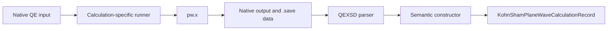

# Calculators in v1

## Implemented status

V1 has no `ksdft2effmass.calculators` package and no reusable calculator executor protocol. Quantum ESPRESSO is the only calculator with implemented format adaptation and retained direct-execution evidence.

| Calculator | Implemented package or path | Capability |
|---|---|---|
| Quantum ESPRESSO | `ksdft2effmass.io.quantum_espresso.qexsd` | Parse supported QEXSD and construct backend-neutral periodic, Kohn–Sham, and plane-wave records |
| Quantum ESPRESSO direct execution | `calculations/` runners | Invoke `pw.x` under calculation-specific preflight and retention contracts |

## Boundary

Input generation and process execution are not public Python object models in V1. QEXSD output parsing and semantic construction are implemented Python boundaries.

## Pages

- [Quantum ESPRESSO](quantum-espresso.md)
