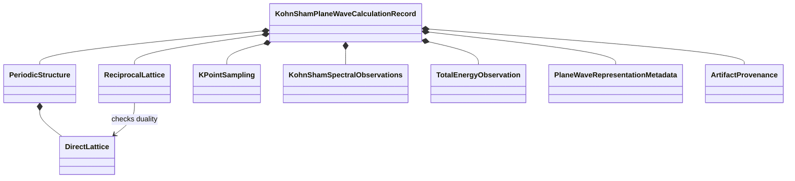
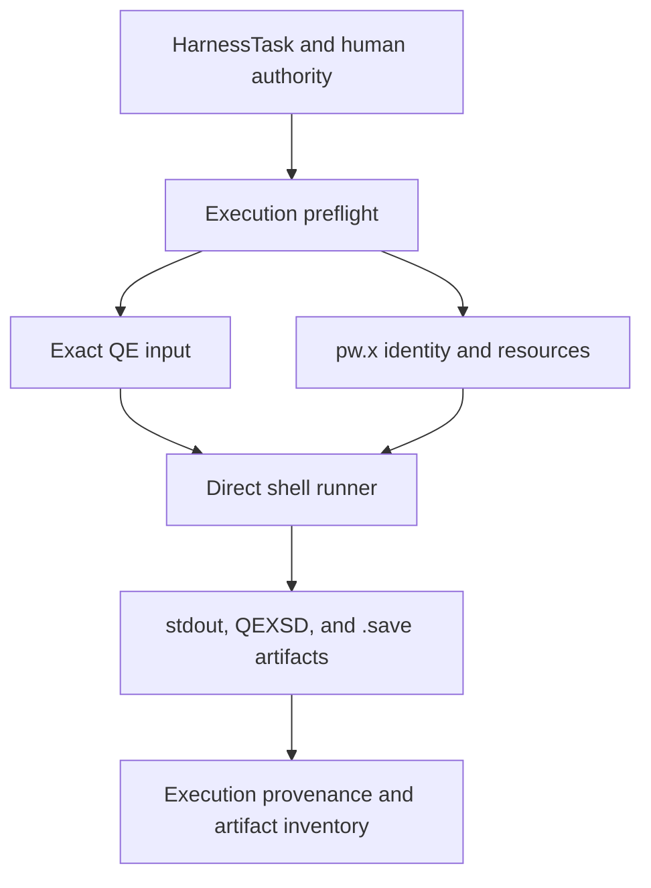

# Quantum ESPRESSO object design in v1

## Scope

V1 implements a bounded Quantum ESPRESSO output boundary for the observed QEXSD 23.03.10 format and direct `pw.x` execution through calculation-specific shell runners. It does not implement a public Quantum ESPRESSO simulation object, input mapper, input serializer, executor, output-stream parser, `.save` parser, or general execution-result object.

The implemented Python package is:

```text
ksdft2effmass.io.quantum_espresso.qexsd
├── QexsdSource
├── QexsdDocument
├── ParseQexsdDocument
└── ConstructQexsdKohnShamPlaneWaveRecord
```

## Object flow

```mermaid
flowchart LR
    bytes["QEXSD bytes and identity"]
    source["QexsdSource"]
    parser["ParseQexsdDocument"]
    document["QexsdDocument"]
    constructor["ConstructQexsdKohnShamPlaneWaveRecord"]
    record["KohnShamPlaneWaveCalculationRecord"]

    bytes --> source
    source --> parser
    parser --> document
    document --> constructor
    constructor --> record
```

The parser is mechanical. The constructor owns the supported QEXSD-to-domain interpretation. Neither object executes Quantum ESPRESSO.

## DataObjects

### `QexsdSource`

`QexsdSource` is the immutable source-byte boundary.

| Field | Meaning |
|---|---|
| `canonical_path` | Canonical absolute POSIX path of the observed external source |
| `sha256` | Lowercase SHA-256 identity of the exact bytes |
| `byte_count` | Exact byte count |
| `content` | Defensively owned QEXSD bytes |

Construction verifies path form, byte count, and SHA-256 agreement. The object does not open a path or discover a QE run.

### `QexsdDocument`

`QexsdDocument` is a mechanically faithful immutable record of parsed QEXSD values in source order. It retains:

- source path, digest, and byte count;
- XML namespace, QEXSD version, producer, and producer version;
- declared unit-system label;
- `alat`, direct and reciprocal source coefficients, and source labels;
- species and ordered atom declarations;
- k points, weights, sampled count, and source label;
- eigenvalues, optional occupations, band count, and source label;
- total energy and source label;
- FFT, smooth FFT, and box grids; and
- exit status.

Labels identify native source locations. `QexsdDocument` does not assign physical units, convert coordinates, apply reciprocal scaling, normalize weights, select an energy zero, or infer unavailable spin metadata.

## ActionObjects

### `ParseQexsdDocument`

```text
QexsdSource → QexsdDocument
```

The parser accepts only the observed root namespace `http://www.quantum-espresso.org/ns/qes/qes-1.0` and QEXSD version `23.03.10`. It rejects document-type declarations, malformed XML, unsupported roots or versions, missing or duplicated singleton sections, inconsistent counts, invalid numeric values, invalid references, malformed grids, and invalid exit status.

The parser:

- receives explicit verified bytes;
- performs no file discovery or file I/O;
- preserves native values and source order;
- exposes no mutable XML nodes; and
- performs no scientific interpretation.

### `ConstructQexsdKohnShamPlaneWaveRecord`

```text
QexsdDocument → KohnShamPlaneWaveCalculationRecord
```

The constructor owns the bounded semantic mapping for QEXSD declaring `Hartree atomic units`:

- direct cell vectors and Cartesian atomic positions are interpreted in bohr;
- reciprocal coefficients and k points are interpreted as Cartesian coefficients scaled by $2\pi/a_{\mathrm{lat}}$;
- reciprocal vectors are checked against the direct lattice using the declared absolute duality tolerance $10^{-12}$;
- eigenvalues and total energy are represented in hartree;
- a k-point weight sum exactly equal to two is represented as `SUM_TO_TWO`;
- spin-resolved arrays are marked unavailable;
- energy reference is marked not represented; and
- FFT-grid values are retained as plane-wave representation metadata.

It returns separate domain-owned objects composed as a `KohnShamPlaneWaveCalculationRecord` rather than a QE-specific scientific aggregate.

## Constructed domain graph



| Owner | Constructed meaning |
|---|---|
| `ksdft2effmass.periodic` | Direct and reciprocal lattices, species, sites, periodic structure, k-point sampling, units, and coordinate conventions |
| `ksdft2effmass.ksdft` | Eigenvalue and occupation observations, energy units, availability, and total energy |
| `ksdft2effmass.ksdft.pw` | Plane-wave representation metadata, source provenance, complete calculation record, and JSON serialization |

The periodic and Kohn–Sham packages import no QEXSD or Quantum ESPRESSO types. The dependency direction is from the concrete QEXSD constructor into the neutral domain owners.

## Direct execution model

V1 direct execution is represented by calculation-owned files rather than public Python objects:



Preflight and compact records bind, as applicable:

- repository revision;
- exact native input bytes;
- QE executable and version identity;
- pseudopotential identity;
- process count and resource ceiling;
- working and artifact roots;
- completion marker and exit status;
- warnings and resource observations; and
- retained, external, or reconstructible artifact roles.

Large wavefunctions, charge densities, restart trees, and scratch data remain outside Git. Compact manifests, checksums, inputs, provenance, and observations remain in the repository.

## Retained execution evidence

The repository retains these historical facts:

- one accepted QE 7.2 silicon Davidson SCF tutorial execution;
- one accepted QE 7.2 silicon Davidson bands tutorial execution using an identity-verified copy of the accepted SCF state; and
- eighteen completed direct convergence invocations: nine SCFs and nine linked NSCF diagnostics.

The QEXSD construction path was exercised against the retained accepted SCF artifact. This establishes bounded software and represented-record behavior for that source. It does not establish production convergence, basis completeness, scientific validation, transferability to other QE versions or calculations, or uncertainty quantification.

## Error boundaries

| Boundary | Failure meaning |
|---|---|
| `QexsdSource` construction | Source path or byte identity is invalid |
| `ParseQexsdDocument` | Native XML or supported-format structure is invalid |
| Semantic construction | Declared units or QEXSD values cannot satisfy the supported domain mapping |
| Direct runner | Process invocation or operation-specific completion contract failed |
| Artifact verification | Retained content disagrees with its manifest or checksum |

These failures are not interchangeable. Parser rejection is not process failure; process success is not numerical acceptance; semantic construction is not scientific validation.

## Missing V1 objects

V1 does not implement:

- `QuantumEspressoSimulation` or another typed QE simulation payload;
- `QuantumEspressoExecutableConfiguration`;
- `QuantumEspressoInputMapper` or `QuantumEspressoInputSerializer`;
- `QuantumEspressoSimulationExecutor`;
- `QuantumEspressoExecutionResult` as a general ResultObject;
- stdout or stderr normalization objects;
- a general `.save` parser or wavefunction model;
- an artifact publisher shared across QE calculations;
- a mutable calculator registry; or
- CPN-driven QE dispatch and persisted `ScientificWorkflowRun` correlation.

These absences define the implemented V1 boundary. They are not placeholders that this page authorizes for implementation.
