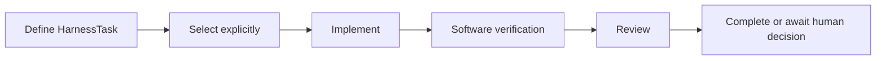

# Development harness model in v1

## Core records

`HarnessTask` is the canonical development work record. Task definitions are stored as version-3 JSON under `harness/tasks/`. Generated Markdown siblings are inspection views and are not control inputs.

A Task records:

- identity, title, status, and status detail;
- parent, prerequisite, external-prerequisite, and supersession relationships;
- explicit-activation requirement;
- objective, authority references, authorized scope, completion criteria, and exclusions; and
- intake and optional archived-source identity.

Chains under `.pi/chains/` provide membership, retained activation facts, and active selection. The selected chain and Task record must agree.

## Supporting domains

| Domain | Implemented records or behavior |
|---|---|
| Human decisions | Versioned checkpoint JSON and decision-record actions |
| Agents | Durable role definitions; no independent activation authority |
| Skills | Reusable procedures selected under applicable Task authority |
| Resources | Generic and project-local manifests, dependencies, profiles, and content identities |
| Ownership | Explicit path assignments when concurrent or delegated mutation requires them |
| Evidence | Claim identities, owners, test nodes, aliases, and migration mappings |
| Review | Human-review packets, findings, and separately recorded decisions |

## Operation model

The exact route is proportional to risk. Routine deterministic corrections need not manufacture unnecessary stages. Protected actions and human-owned decisions remain explicit.

## Boundaries

The development harness may coordinate calculation preparation and protected execution records in V1, but it does not provide an independent scientific-run aggregate. A Task status is therefore not equivalent to a calculator result, numerical-verification conclusion, or scientific disposition.

Generic objects receive explicit roots and inputs. Project-local composition selects repository-specific paths and policy. Neither layer gains authority from ambient current-directory discovery.
