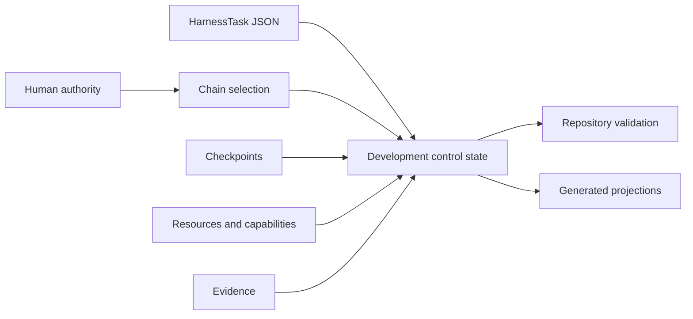

# Development harness in v1

## Purpose

The V1 development harness selects and governs repository work. It combines canonical Task records, chain selection, human checkpoints, resources, capabilities, evidence, validation, and generated control views.

## Implemented objects

| Object or action | Responsibility |
|---|---|
| `HarnessTask` | Immutable development work definition |
| Task serializer and deserializer | Version-3 Task JSON wire contract |
| `HarnessTaskGraphValidator` | Task relationship and graph validation |
| `TaskStateInspector` | Bounded inspection of selected Task state |
| `HarnessControlMigrator` | Complete control projection publication |
| `HarnessControlVerifier` | Read-only source-aware reconstruction and comparison |
| `HarnessValidator` | Composition of repository-conformance checks |

Generic contracts are implemented under `ksdft2effmass.harness.pi`; project-local composition is implemented under `ksdft2effmass.harness.pi.local`.

## Lifecycle

A `HarnessTask` carries identity, status, parent and prerequisite relationships, explicit activation, objective, authority paths, scope, completion criteria, exclusions, intake, and optional archived-source identity. Status values are project records rather than one closed universal state machine.

Chains select active work. Task JSON defines Task content. Unresolved checkpoints represent human decision boundaries. Generated state must agree with those sources but cannot replace them.

## Detailed pages

- [Development harness model](development-harness.md)
- [Pi harness subagents](subagents/index.md)
- [Compiler architecture](compiler-architecture.md)
- [Control plane](control-plane.md)
- [Persistence](persistence.md)
- [Projections](projections.md)
