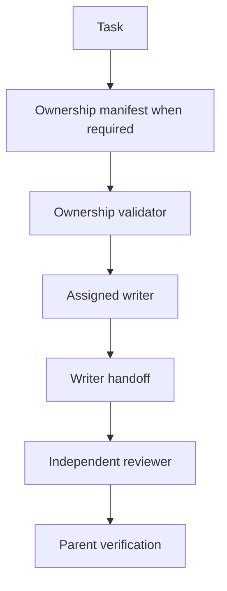

# Pi subagent delegation and ownership in v1

## Ownership preflight

V1 uses structured manifests under `.pi/task-ownership/` when an accepted Task requires one, multiple agents write concurrently, implementation and independent verification must be separated, or conflicting or high-risk path ownership exists.

The canonical validation command is:

```bash
python/.venv/bin/python python/src/cli/validate_task_ownership.py \
  --repository-root <ABSOLUTE_REPOSITORY_ROOT> \
  --task <TASK_ID>
```

A passing validator establishes only structural ownership agreement. It does not activate the Task, validate implementation, establish evidence claims, or provide acceptance.

## Manifest contracts

Two manifest versions are retained:

- version 1 is a compatibility contract with older P1-specific object and filename rules;
- version 2 declares role-labelled writers, independent reviewers, non-overlapping repository-relative scopes, and a completion validator.

Version-2 agent entries identify agent and writer/read-only role. Structured `owned_paths`, not descriptor prose, authorizes mutation paths. An optional evidence-branch profile supports explicitly authorized multi-branch verification work with one consolidated review and at most one correction cycle.

## Delegation patterns



Ordinary bounded work need not create a manifest. When one is required, it is a fail-closed launch prerequisite rather than retrospective evidence.

## Workspace ownership

Concurrent writers must use non-overlapping scopes and separate workspaces. The Pi runtime can create managed worktrees, but the ownership manifest and managed-worktree record are independent: the manifest states project authority, while Pi records runtime isolation and recovery details.

## Known limitations

- The validator cannot prevent a technically possible direct invocation that bypasses preflight.
- Ownership manifests and Pi run identities are not automatically correlated.
- Several retained manifests describe completed simplification work rather than current assignments.
- Integration of isolated writer handoffs remains a parent responsibility.
