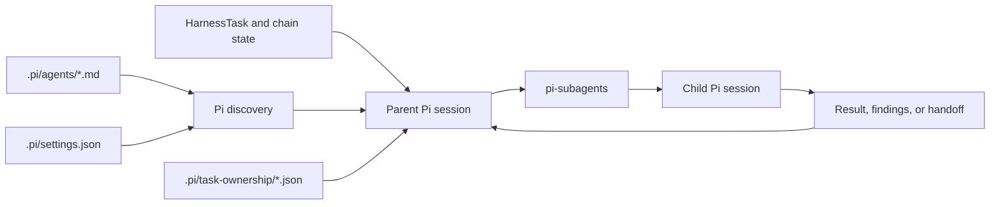

# Pi harness subagents in v1

## Implemented boundary

V1 uses project Pi subagent descriptors under `.pi/agents/` together with the installed `pi-subagents` extension. The repository owns project role text, project settings, Task-ownership manifests, and project instructions. Pi owns descriptor discovery, child-session creation, workflow execution, runtime control, managed worktrees, and run artifacts.

There is no project Python object model for subagents. Agent descriptors and settings are textual Pi resources consumed directly by the extension.

## Implemented pages

- [Agent descriptors](agent-descriptors.md)
- [Parent orchestration](parent-orchestration.md)
- [Delegation and ownership](delegation-and-ownership.md)
- [Execution and isolation](execution-and-isolation.md)
- [Handoffs and review](handoffs-and-review.md)
- [Runtime state and artifacts](runtime-state-and-artifacts.md)

## Current separation

- A descriptor defines a reusable role; it does not activate or assign a Task.
- Harness Task and chain records define development authority.
- Ownership manifests authorize concurrent or separated writer/reviewer paths when required.
- The parent selects and launches children through Pi.
- Child output is reviewed or integrated by the parent.
- Human decisions and protected execution remain outside subagent authority.

## Known limitations

- Several descriptors are specific to closed H2 or H4 work and are disabled through project settings.
- Some enabled descriptor names repeat the package prefix in their resolved runtime names.
- Assignment prompts do not have a project-local schema.
- Pi runtime state and Harness Task state are separate by policy rather than a shared typed interface.
- There is no implemented `HarnessTaskContextInspector` result tailored for Pi delegation.
