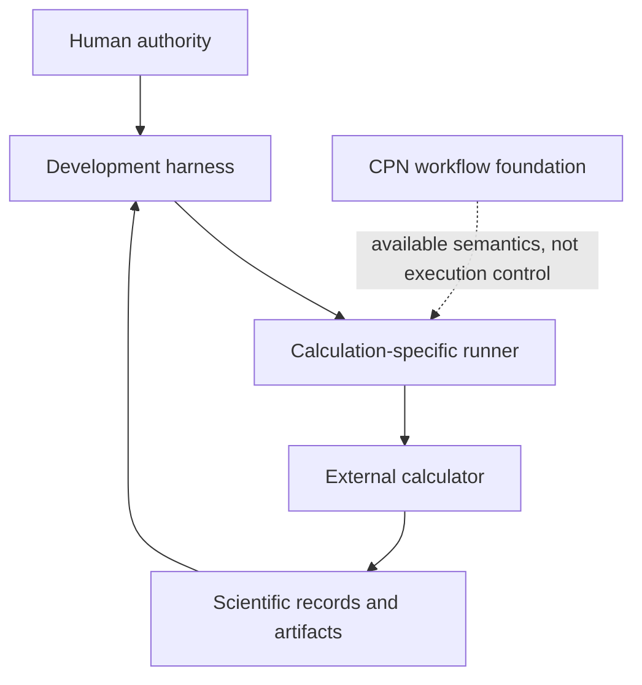

# Architecture v1

## Status

Architecture v1 describes the implemented system at repository boundary `0dda56e2c11261280660139fe80dab0d395b4234`. It is descriptive and does not create runtime authority.

V1 includes an implemented development harness, backend-neutral Colored Petri Net (CPN) primitives, provenance and scientific record objects, Quantum ESPRESSO QEXSD extraction, and direct calculator runners. It has no public `Campaign`, `CampaignRun`, `Simulation`, calculator executor, or independent scientific-run persistence model.

## System overview

| Component | Subpackage or path | Implemented responsibility |
|---|---|---|
| Development harness | `ksdft2effmass.harness.pi` and `.local` | Governs development Tasks, decisions, resources, evidence, and generated control state. |
| Workflow foundation | `ksdft2effmass.workflows.cpn` | Provides deterministic CPN definitions, validation, enablement, and firing. |
| Calculator I/O | `ksdft2effmass.io.quantum_espresso` | Parses QEXSD and constructs backend-neutral records. |
| Scientific records | `ksdft2effmass.periodic`, `.ksdft`, and `.provenance` | Represent geometry, Kohn–Sham observations, artifacts, and execution provenance. |
| Direct execution | `calculations/` runners | Invokes calculators under calculation-specific contracts. |

## Pages

- [Principles](principles.md)
- [Development harness](harness/index.md) - [Development harness model](harness/development-harness.md) - [Compiler architecture](harness/compiler-architecture.md) - [Control plane](harness/control-plane.md) - [Persistence](harness/persistence.md) - [Projections](harness/projections.md)
- [Workflow foundation](workflow/index.md) - [Simulation model](workflow/simulation-model.md) - [Campaign and CPN model](workflow/campaign-and-cpn-model.md) - [Artifact and provenance model](workflow/artifact-and-provenance-model.md)
- [Calculators](calculators/index.md) - [Quantum ESPRESSO](calculators/quantum-espresso.md)
- [Separation of harness and workflow](separation-of-harness-and-workflow.md)
- [Repository layout](repository-layout.md)

Historical executions, limitations, and implemented boundaries are documented on their owning pages. Cross-version responsibility transfer and cutover belong only to the [migration document](../migration-v1-to-v2.md).
