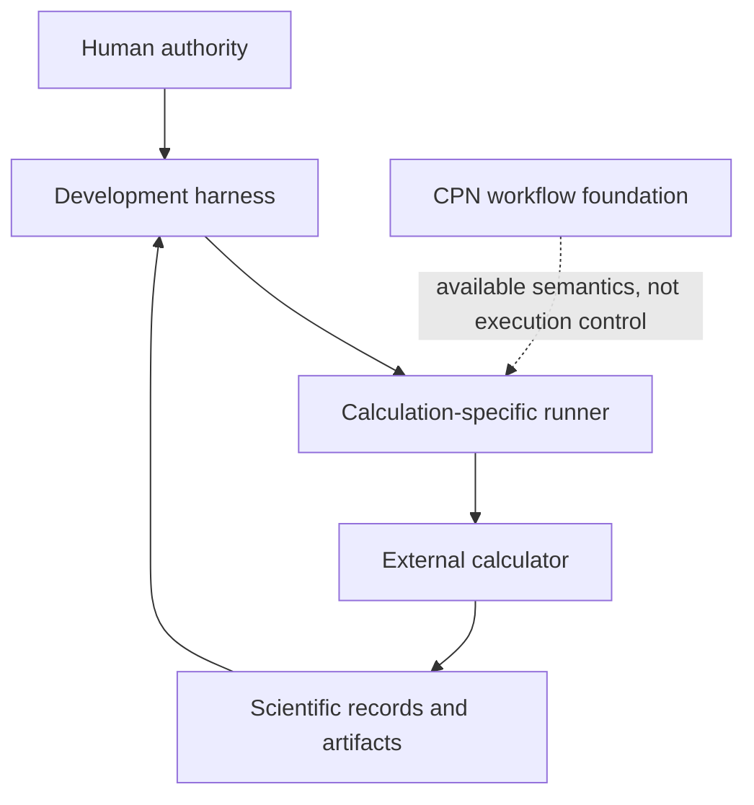

# Architecture v1

## Status

Architecture v1 describes the implemented system at repository boundary `0dda56e2c11261280660139fe80dab0d395b4234`. It is descriptive and does not create runtime authority.

V1 includes an implemented development harness, backend-neutral Colored Petri Net (CPN) primitives, provenance and scientific record objects, Quantum ESPRESSO QEXSD extraction, and direct calculator runners. It has no public `ScientificWorkflow`, `ScientificWorkflowRun`, `Simulation`, calculator executor, or independent scientific-run persistence model.

## System overview

| Component | Subpackage or path | Implemented responsibility |
|---|---|---|
| [Development harness](ksdft2effmass/harness/pi/index.md) | `ksdft2effmass.harness.pi` and `.local` | Governs development Tasks, decisions, resources, evidence, and generated control state. |
| [Workflow foundation](ksdft2effmass/workflows/cpn/index.md) | `ksdft2effmass.workflows.cpn` | Provides deterministic CPN definitions, validation, enablement, and firing. |
| [Calculator I/O](ksdft2effmass/io/index.md) | `ksdft2effmass.io.quantum_espresso` | Parses QEXSD and constructs backend-neutral records. |
| [Scientific records](ksdft2effmass/index.md) | `ksdft2effmass.periodic`, `.ksdft`, `.provenance`, and `.operators` | Represent geometry, Kohn–Sham observations, artifacts, execution provenance, and finite operators. |
| [Direct execution](calculations/index.md) | `calculations/` runners | Invokes calculators under calculation-specific contracts. |

## Package-oriented architecture map

- [`ksdft2effmass`](ksdft2effmass/index.md)
  - [`harness.pi`](ksdft2effmass/harness/pi/index.md)
  - [`workflows.cpn`](ksdft2effmass/workflows/cpn/index.md)
  - [`io.quantum_espresso.qexsd`](ksdft2effmass/io/quantum_espresso/qexsd/index.md)
  - [`periodic`](ksdft2effmass/periodic/index.md)
  - [`ksdft` and `ksdft.pw`](ksdft2effmass/ksdft/index.md)
  - [`provenance`](ksdft2effmass/provenance/index.md)
  - [`operators`](ksdft2effmass/operators/index.md)
- [Repository-level calculations](calculations/index.md)

## Cross-cutting pages

- [Principles](principles.md)
- [Separation of harness and workflow](separation-of-harness-and-workflow.md)
- [Repository layout](repository-layout.md)

Historical executions, limitations, and implemented boundaries are documented on their owning pages. Cross-version responsibility transfer and cutover belong only to the [migration document](../migration/v1-to-v2/index.md).
