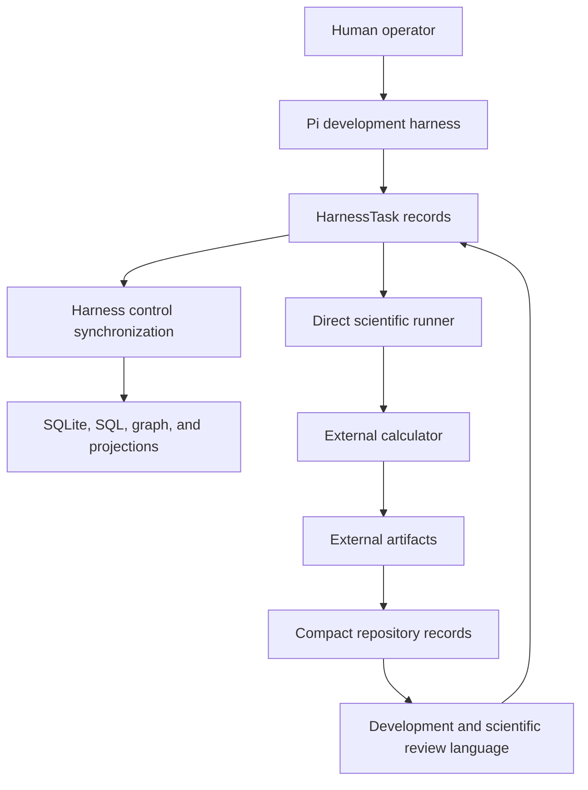
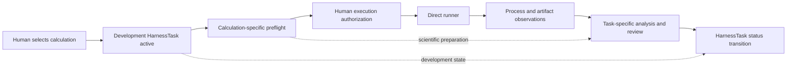

# Architecture v1

## Status

Architecture v1 is the implemented repository, development-harness, scientific
record, and workflow-foundation architecture at the documentation boundary
`0dda56e2c11261280660139fe80dab0d395b4234`. This page is descriptive and is not
a new source of runtime authority.

The following labels are used throughout:

- **Implemented behavior** — executable source or maintained deterministic
  tooling exists in the repository.
- **Generated state** — maintained output reconstructed from authoritative
  sources; it is not an independent authority.
- **Documented intention** — accepted or proposed behavior that is not yet an
  implemented runtime path.
- **Known limitation** — a demonstrated boundary or missing separation.
- **Historical execution** — an external effect that occurred and is retained by
  compact repository evidence.

Architecture v1 includes an implemented development harness, an implemented
backend-neutral Colored Petri Net (CPN) contract, provenance and scientific
record objects, and Quantum ESPRESSO QEXSD extraction. It does **not** include a
public `Campaign`, `CampaignRun`, `Simulation`, calculator executor, or general
scientific-execution receipt architecture.

## Purpose and historical context

The repository was built to develop research software while preserving exact
scientific inputs, human decisions, evidence classes, and protected-execution
boundaries. The Pi-oriented development harness became the operational mechanism
for selecting work, recording authorization, synchronizing control state, and
coordinating calculation preparation and review. Scientific executions were
therefore coordinated through development `HarnessTask` state and direct runners.

The CPN contract was later implemented as a calculator-independent workflow
foundation, but the accepted tutorial and convergence executions were not routed
through a persisted CPN scientific campaign. The v1 system consequently contains
both a strong generic CPN semantic core and a separate, direct scientific
execution practice.

## Repository layout

The table records actual ownership and consumers rather than inferring them from
names alone.

| Major path | Authority class | Principal owner and authorship | Operational classification | Current consumers |
|---|---|---|---|---|
| `.pi/` | Development control and capability records | Handwritten chains, checkpoints, agents, skills, and evidence; some evidence inventories are generated | Operational with retained historical decisions | Pi sessions, checkpoint and skill validators, task inspection, control synchronization |
| `.pi/chains/` | Active selection and chain history | Handwritten JSON chain records | Operational and historical | `TaskStateInspector`, control ingestion, human/agent reconstruction |
| `.pi/checkpoints/` | Unresolved and retained human decisions | Handwritten/deterministically updated JSON records under a schema | Operational when unresolved; historical when resolved | checkpoint resolution and validation |
| `harness/` | Project-local development-harness authority and resources | Handwritten Tasks, schemas, profiles, resources, reports, and intake; generated control outputs | Operational, historical, and transitional | project-local harness Python, Pi procedures, repository validation |
| `harness/tasks/` | Canonical v1 `HarnessTask` definitions | Handwritten JSON version-3 Task records | Operational, prospective, deferred, and historical according to each record | graph validation, control compilation, active selection, generated Task documentation |
| `harness/state/` | Generated control projection set | Generated SQLite, deterministic SQL, and projection manifest | Operational generated state, not source authority | source-aware verification, bounded inspection, deterministic queries |
| `harness/reports/` | Derived inventories and analyses | Handwritten or generated reports with declared claim boundaries | Historical or transitional evidence | cleanup decisions, migration planning, reviewers |
| `harness/intake/` | Human task intake | Handwritten request records | Historical or transitional | Task provenance and control reconstruction |
| `calculations/` | Compact calculation inputs and provenance | Handwritten inputs plus retained generated summaries, manifests, checksums, and observations | Operational fixtures and historical execution evidence | parsers, tutorial evidence, architecture tests, scientific review |
| `specification/` | Versioned public mathematical and wire contracts | Handwritten specifications, schemas, and fixtures | Operational authority | Python implementation, software-verification tests, documentation |
| `docs/harness/` | Development-harness documentation | Maintained narrative plus generated Task pages | Operational documentation and historical explanation | developers, Pi agents, Sphinx-selected pages |
| `docs/computational/` | Computational protocols and workflow dependencies | Maintained handwritten Markdown | Scientific planning and execution context | Task authority, operators, reviewers |
| `python/src/ksdft2effmass/harness/` | Implemented generic and project-local development harness | Handwritten Python | Operational implementation | maintained CLIs and software-verification tests |
| `python/src/ksdft2effmass/workflows/cpn/` | Implemented backend-neutral CPN contract | Handwritten Python | Operational library contract; not a deployed scientific campaign runner | CPN tests, public imports, future workflow composition |
| `python/src/ksdft2effmass/io/` | Calculator-format mechanics | Handwritten Python; currently QEXSD-focused | Operational parser and construction boundary | QEXSD tests and retained tutorial extraction |
| `python/src/ksdft2effmass/periodic/` | Backend-neutral periodic geometry | Handwritten Python | Operational scientific record layer | QEXSD semantic construction and public API consumers |
| `python/src/ksdft2effmass/ksdft/` | Representation-neutral Kohn–Sham observations | Handwritten Python | Operational scientific record layer | QEXSD construction and plane-wave records |
| `python/src/ksdft2effmass/ksdft/pw/` | Plane-wave calculation records and JSON serialization | Handwritten Python | Operational scientific representation layer | retained calculation records, tests, API documentation |

Additional implemented subsystems include `operators/` for represented finite
operators, `provenance/` for artifact and external-tool records, and `formal/`
for the maintained theorem catalog and bounded proof sources. They remain
independent of calculator process execution.

The formal subsystem uses one prover-neutral theorem-identity catalog and
isolated backend sources. Nine `PRF-05` finite-dimensional contracts are frozen;
`PRF-05.01` is checked by the pinned Lean 4/mathlib `v4.33.0` toolchain. Other
Lean targets and the Isabelle/HOL and Rocq backends are inactive. Formal
backends do not define Python runtime behavior, mutate scientific
specifications, or establish numerical or scientific validation. Proof status
is updated only after checker and semantic-review evidence are inspected.

## Development harness

**Implemented behavior.** The v1 Pi-agent development harness combines generic
contracts under `ksdft2effmass.harness.pi` with project-local composition under
`ksdft2effmass.harness.pi.local`.

The generic public package exposes immutable records and stateless actions for:

- artifact identities, checksums, resources, profiles, ownership, chains, and
  checkpoints;
- human-review packets and decisions;
- JSON wire serialization and deserialization;
- bounded Task-state inspection; and
- Python evidence conformance.

The project-local public package exposes:

- `HarnessTask`, its serializer/deserializer, and graph validator;
- repository roots and local validation records;
- adapters for Task, chain, checkpoint, agent, skill, resource, ownership, and
  evidence inputs;
- `HarnessControlMigrator` and `HarnessControlVerifier`; and
- `HarnessValidator` composition.

Pi agents and skills supply roles and procedures. They do not independently
activate Tasks or confer scientific acceptance. Ownership manifests are required
only when an active Task, concurrent mutation, or delegated mutation requires
that structure.

## Task and lifecycle model

`HarnessTask` is the v1 development lifecycle record. Canonical Task definitions
are JSON records in `harness/tasks/`; generated Markdown siblings are not
control inputs. A Task carries identity, title, free-form lifecycle status and
status detail, parent and prerequisite relationships, explicit-activation flag,
objective, authority paths, scope, completion criteria, exclusions, intake, and
optional archived-source identity.

The live catalog demonstrates lifecycle values including `active`, `inactive`,
`blocked`, `deferred`, `deferred_inactive`, `completed`, `superseded`, and
human-acceptance variants. These values are project records rather than one
closed universal state machine. Exactly one Task is active at this boundary:
`harness.architecture-v2.simulation-execution`; its implementation had not begun
when this snapshot was frozen. Automatic successor activation is false.

Chains under `.pi/chains/` hold chain membership, historical activation facts,
and active selection. Task records hold Task status. The generated SQLite
`task_state` projection must agree with both. Passing graph validation establishes
structural agreement only.

## Control authority

The v1 authority order is:

1. current unambiguous human instruction and durable human decisions;
2. accepted scientific specifications and public contracts;
3. repository policy;
4. applicable chain, Task, checkpoint, and ownership records;
5. procedural skills and role definitions; and
6. generated reports and historical evidence.

Task JSON is source authority for Task content. Chains select active work.
Unresolved checkpoint JSON records a human decision boundary. Generated SQLite,
SQL, graphs, Task Markdown, and manifests are projections and cannot silently
replace those sources. Git history preserves prior boundaries but does not
reactivate them.

## SQLite and generated projections

**Generated state.** `HarnessControlMigrator` is the sole maintained publisher
of the complete control artifact set. It resolves explicit canonical inputs,
builds a complete candidate in a temporary workspace, validates it, and
publishes:

- `harness/state/harness-control.sqlite3`;
- `harness/state/harness-control.sql`;
- `harness/state/projection-manifest.json`;
- `harness/task-graph.json`;
- generated Task JSON/Markdown and the Task index;
- resource-manifest projections; and
- the Python evidence module inventory.

`HarnessControlVerifier` reconstructs the same candidate without publishing. It
checks SQLite integrity and foreign keys, schema version, normalized table
content and semantic digest, deterministic SQL, projection manifest, and exact
owned projections. Raw SQLite hashes are diagnostic rather than the semantic
contract. Maintained WAL, SHM, journal, staging, and backup sidecars are not
valid projections.

## Agent, skill, resource, and evidence model

Agents are durable role descriptions under `.pi/agents/`; skills under `.pi/skills/`
and `.agents/skills/` are procedures. Generic resources live under `harness/pi/`
and project-local overlays under `harness/local/`. Resource manifests carry
stable logical IDs, paths, dependency closure, versions, and content identities.
The local layer may depend on generic resources; the reverse dependency is
forbidden.

Evidence is classified as software verification, numerical verification,
scientific validation, or uncertainty quantification. The Python conformance
subsystem parses maintained test modules into immutable facts and validates
naming, ownership, parameterization, documentation, migration, and repository
rules. Evidence declarations support claims but do not activate work or replace
human decisions.

## Scientific execution in v1

V1 uses development-harness structures to coordinate scientific work:

```text
calculation selection
→ HarnessTask activation
→ preflight and identity checks
→ human protected-execution authorization
→ direct runner construction
→ external execution
→ compact provenance and artifact inventory
→ review language and Task lifecycle transition
```

This is an implemented operational practice, not a separate scientific campaign
lifecycle. Calculation authorization, external side effects, output observation,
scientific interpretation, and human review are recorded across Task status,
chain history, computational documentation, and compact calculation records.
Development lifecycle and scientific execution lifecycle are therefore coupled.

## Calculator invocation and artifact handling

Quantum ESPRESSO was invoked through calculation-specific direct shell runners,
not a public calculator executor object. Preflight bound repository revision,
executable identity, pseudopotential identity, exact input bytes, processor
count, resource ceilings, run root, and retained-output policy. Runners called
`pw.x`, stopped on failure according to their local contract, and wrote native
outputs and restart data outside Git.

Compact repository records retain exact inputs, checksums, runner identities,
exit statuses, completion markers, warnings, resource observations, output
identities, manifests, and portable external-root descriptors. Large
wavefunctions, charge densities, `.save` trees, and restart data remain external.
Their retention is operation-specific: some are referenced fixtures, some are
reconstructible scratch, and none becomes authority merely by remaining on disk.
The `user_opt` store resolves approved non-repository artifacts beneath canonical
`~/opt` with containment and identity checks.

## Validation composition

`HarnessValidator` composes six ordered repository checks:

1. Python evidence;
2. resources;
3. Task graph;
4. checkpoints;
5. skills; and
6. control state.

This repository conformance is distinct from the source-aware control verifier
and from tests, lint, typing, or documentation builds. The v1 evidence boundaries
are:

| Boundary | V1 implementation or coordination |
|---|---|
| Software verification | Implemented through pytest evidence, validators, schemas, fixtures, Ruff, and mypy as selected by a Task |
| Repository conformance | Implemented by `HarnessValidator` and domain validators |
| Control-state verification | Implemented by `HarnessControlVerifier` against reconstructed source state |
| Calculator process success | Recorded by exit status and completion markers in execution-specific provenance |
| Numerical verification | Task-specific scientific criteria and analysis; not inferred from process success |
| Scientific validation | Separately authorized comparison with independent reference evidence; not supplied by harness checks |
| Human acceptance | Explicit human decision recorded through Task/checkpoint/control updates; never inferred from checks |

V1 can represent these distinctions in records and prose, but it does not yet
provide one general scientific lifecycle object that enforces them end to end.

## Public Python architecture

The implementation follows immutable DataObject/ResultObject and stateless
ActionObject boundaries where introduced.

- `ksdft2effmass.provenance` provides artifact references and locations, run
  manifests, lineage, tool declarations and observations, external execution
  request/result/failure records, verification/correlation actions, and strict
  JSON serialization. These are calculator-independent represented records; they
  do not execute processes.
- `ksdft2effmass.periodic` provides direct and reciprocal lattices, species,
  periodic sites and structures, k-point sampling, units, and coordinate
  conventions. It imports no QE-specific model.
- `ksdft2effmass.ksdft` provides representation-neutral spectral and total-energy
  observations.
- `ksdft2effmass.ksdft.pw` provides plane-wave representation metadata,
  provenance, calculation records, and JSON serialization.
- `ksdft2effmass.io.quantum_espresso.qexsd` provides `QexsdSource`,
  `QexsdDocument`, `ParseQexsdDocument`, and
  `ConstructQexsdKohnShamPlaneWaveRecord`. Parsing is mechanical; construction
  maps parsed values into periodic, Kohn–Sham, and plane-wave records.
- `ksdft2effmass.workflows.cpn` provides the CPN public contract described below.
- `ksdft2effmass.harness.pi` and `.local` provide the development control objects
  described above.

Maintained CLIs under `python/src/cli/` expose harness synchronization/checking,
Task inspection, checkpoint validation, evidence and resource conformance,
architecture-decision case validation, documentation projection, skill
capabilities, Task ownership, and Task schema projection. They are thin command
boundaries over library owners.

No implemented public class named `Campaign`, `CampaignRun`, `Simulation`,
`SimulationExecutor`, `SimulationExecutionResult`, or calculator-specific
simulation specification exists in v1.

## Existing CPN implementation

The backend-neutral package implements:

- definitions: colors, places, transitions, directed arcs, input/output
  inscriptions, token patterns, and `CpnNetDefinition`;
- markings: immutable place multisets, `CpnMarking`, token bindings, and
  transition bindings;
- tokens: typed `ContractValue`, `CpnToken`, explicit outcome scope, status, and
  terminality;
- guards and expressions: closed declarative value expressions, guard operators,
  token templates and assignments, and `CpnExpressionEvaluator`;
- validation: definition and marking validators with structured findings;
- execution semantics: deterministic `TransitionEnabler` and `TransitionFirer`,
  including read/consume arc modes and explicit firing results; and
- errors: structured contract, definition, marking, binding, guard, enablement,
  and firing errors.

Guards evaluate immutable represented values and perform no external I/O.
Enablement and firing implement multiset CPN semantics rather than a dependency
DAG. The public package exports no SNAKES runtime object, external executor,
scientific payload, identity generator, persistence repository, or concrete
campaign.

Versioned schemas and fixtures exist under `specification/workflow-cpn/v1/`.
SNAKES is an optional selected candidate dependency behind a future adapter, but
no SNAKES adapter is part of the current public package. Authoritative marking
persistence is deferred. Synthetic contract tests demonstrate definitions,
guards, enablement, firing, outcomes, retries/recovery representation, and JSON
contract behavior. They do not demonstrate a persisted scientific campaign,
calculator dispatch, or production workflow. Current scientific calculations
were not driven by this CPN implementation.

## Documentation architecture

Maintained narrative documentation is split among scientific specifications,
computational protocols, research records, user guides, API/concept pages, and
harness documentation. Generated Task Markdown under `docs/harness/tasks/`
reflects Task JSON and chain state. Some Markdown is collected by Sphinx/MyST;
other maintained Markdown is repository-first documentation.

This page is the sole maintained Architecture v1 snapshot. Generated Task
Markdown and other documentation projections remain non-authoritative.

## End-to-end operational flow



The as-implemented coupling is visible in the lifecycle:



The same Task lifecycle coordinates software work, protected execution state,
and scientific review language; no independent scientific run authority sits
between preflight and direct execution.

## Historical tutorial and convergence executions

The following are historical execution facts, not proposed behavior:

- The accepted silicon Davidson SCF tutorial executed once through QE 7.2. Its
  exact input, executable and pseudopotential identities, exit status, `JOB
  DONE.` marker, warning, compact result, artifact inventory, and extracted
  plane-wave record are retained under
  `calculations/bulk-silicon/qe-example01-si-scf-davidson/`.
- The accepted silicon Davidson bands tutorial executed once using an isolated,
  identity-verified copy of the accepted SCF state. Its exact input, preflight,
  provenance, result, and artifact inventory are retained under
  `calculations/bulk-silicon/qe-example01-si-bands-davidson/`.
- QEXSD bytes from the accepted SCF tutorial were mechanically parsed and
  transformed through separate periodic, Kohn–Sham, and plane-wave record
  owners. This is software and represented-record evidence, not production
  convergence or physical validation.
- Boundary commit `64de888ad54c1385941a0485433974342380094d` froze the direct
  production-convergence preflight. Commit
  `e9c6a1453a6a9dfac8c13256d7d146f6b6ec1716` retained 18 completed direct
  `pw.x` invocations: nine SCFs and nine linked NSCF diagnostics. Inputs,
  runner, executable, PseudoDojo identity, outputs, completion markers,
  resources, warnings, and external locations are retained under
  `calculations/bulk-silicon/production-convergence-preflight/`.

> The direct calculations are historical bootstrap executions coordinated
> through the v1 development harness. They may provide useful execution and
> analysis fixtures, but they were not produced by the proposed Architecture v2
> scientific execution harness.

No canonical Architecture v2 `CampaignRun` existed. The execution facts remain
unaltered; no production scientific result, numerical-verification acceptance,
or scientific-validation acceptance follows from their process completion.

## Strengths

- Explicit human authority and protected-execution boundaries.
- Exact versioned Task, checkpoint, resource, evidence, and artifact identities.
- Immutable public records and structured findings.
- Deterministic control reconstruction and source-aware verification.
- Distinct software, numerical, validation, UQ, and human-acceptance claim
  language.
- Backend-neutral periodic and Kohn–Sham record boundaries.
- A genuine multiset CPN semantic core independent of calculator details.
- Compact Git-tracked provenance while large scientific data remain external.

## Known coupling and limitations

- Development Task state coordinates scientific execution.
- Scientific campaign state lacks separate lifecycle authority.
- Direct runners encode sequencing outside CPN semantics.
- Scientific execution receipts are not first-class general objects.
- Execution, numerical verification, and scientific disposition boundaries are
  incomplete as one enforced workflow.
- Authority, generated state, evidence, and documentation remain coupled through
  control synchronization and multiple maintained surfaces.
- Calculator execution is not exposed through a public simulation abstraction.
- External scientific artifact retention remains partly operation-specific.
- V1 documentation historically mixed current and proposed architecture.
- The CPN contract has no authoritative marking persistence, calculator adapter,
  or demonstrated scientific campaign.
- Tool allowlists and procedural instructions are not operating-system
  confinement.

These are intrinsic limitations of the implemented system; this page does not
define their replacement.

## Superseded or removed surfaces

V1 retains Git history and generated references for prior harness phases, but
several runtime routes were already removed or narrowed: obsolete route/shadow
validators, legacy identifier-audit closures, duplicate control-construction
paths, and some historical control surfaces. The maintained public control path
is the explicit-root local harness composition, one control synchronizer, one
source-aware verifier, one repository validator, and the retained thin CLIs.

Historical A–H and P3–P11 planning sequences were superseded by later
simulation-first Task decomposition. Supersession records history and does not
prove implementation or activate replacements. Historical reports remain
evidence, not current runtime authority.

## Current migration boundary

Architecture v1 is the implemented system at this snapshot. It has no separate
scientific campaign lifecycle authority, general calculator execution service,
or canonical scientific run record. This page makes no cutover decision.
Responsibility transfer, implementation status, and cutover conditions are
maintained only in the [migration document](../migration-v1-to-v2.md).
