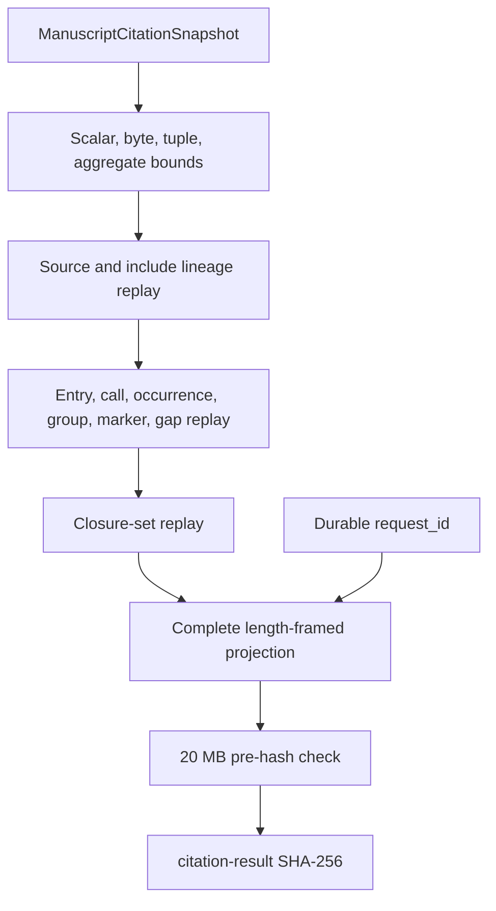

# Integrity schematic

```mermaid
flowchart TD
    snapshot[ManuscriptCitationSnapshot] --> bounds[Scalar, byte, tuple, aggregate bounds]
    bounds --> lineage[Source and include lineage replay]
    lineage --> records[Entry, call, occurrence, group, marker, gap replay]
    records --> closure[Closure-set replay]
    closure --> projection[Complete length-framed projection]
    request[Durable request_id] --> projection
    projection --> size[20 MB pre-hash check]
    size --> result[citation-result SHA-256]
```

Any mismatch raises `ValueError`; there is no repair, canonicalization of caller data,
or partial integrity status.
