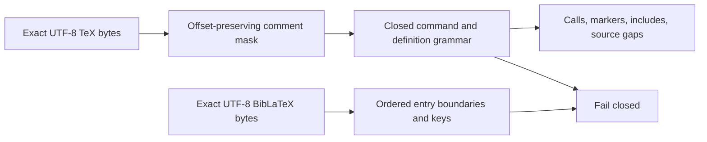

# Parsing schematic

Parsed records are internal observations. They retain keys, command metadata,
relative include tokens, and character spans only; the compiler converts spans to
UTF-8 byte locators against exact source identities.
