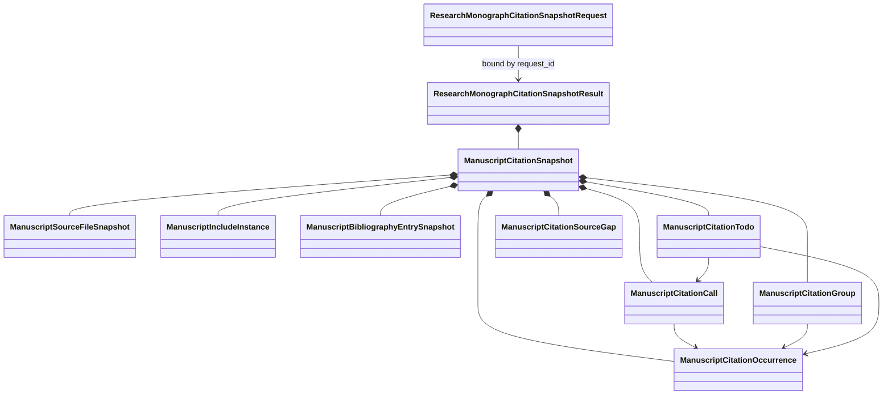

# Records schematic

```mermaid
classDiagram
    ResearchMonographCitationSnapshotRequest --> ResearchMonographCitationSnapshotResult : bound by request_id
    ResearchMonographCitationSnapshotResult *-- ManuscriptCitationSnapshot
    ManuscriptCitationSnapshot *-- ManuscriptSourceFileSnapshot
    ManuscriptCitationSnapshot *-- ManuscriptIncludeInstance
    ManuscriptCitationSnapshot *-- ManuscriptBibliographyEntrySnapshot
    ManuscriptCitationSnapshot *-- ManuscriptCitationCall
    ManuscriptCitationSnapshot *-- ManuscriptCitationOccurrence
    ManuscriptCitationSnapshot *-- ManuscriptCitationGroup
    ManuscriptCitationSnapshot *-- ManuscriptCitationTodo
    ManuscriptCitationSnapshot *-- ManuscriptCitationSourceGap
    ManuscriptCitationCall --> ManuscriptCitationOccurrence
    ManuscriptCitationGroup --> ManuscriptCitationOccurrence
    ManuscriptCitationTodo --> ManuscriptCitationCall
    ManuscriptCitationTodo --> ManuscriptCitationOccurrence
```

Tuple order and contiguous indexes are semantic. Opaque IDs are replayed from the
corresponding source lineage and record semantics; they are not caller-assigned names.
