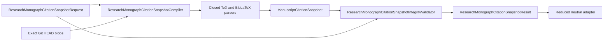

# Citation snapshot schematic

The absolute repository root is execution input only. The durable request identity
covers the fixed operation and relative contract paths. Exact HEAD admission binds
all consumed source bytes to the recorded revision. The snapshot identity covers
that source lineage; the result identity additionally covers the complete canonical
snapshot projection. Both the snapshot constructor and Result constructor replay the
same integrity policy, while the compiler uses it before returning the Result.

The reduced neutral adapter is downstream-owned. It may project only agreed fields;
it cannot repair or legitimize an invalid owner Result.
