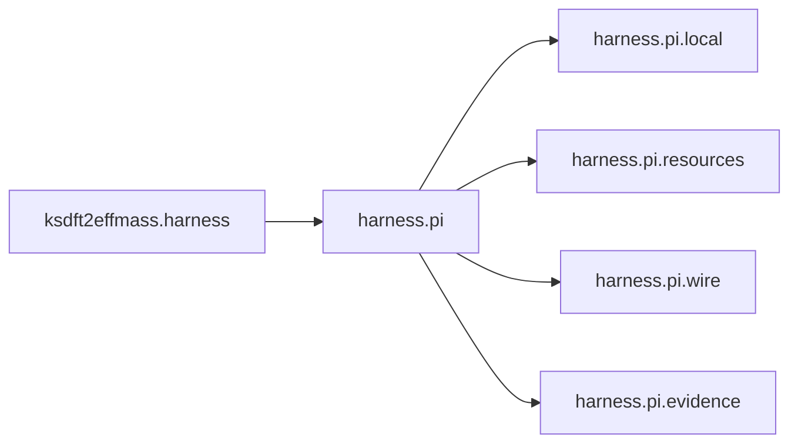

# `ksdft2effmass.harness` namespace in v1

Architecture v1 uses `ksdft2effmass.harness` as the namespace for the
development harness. The maintained implementation is organized beneath
[`ksdft2effmass.harness.pi`](pi/index.md).

The namespace is independent of scientific workflow state. V1 nevertheless
uses development Tasks to coordinate calculator preparation and review because
no independent `ScientificWorkflowRun` aggregate is implemented.
