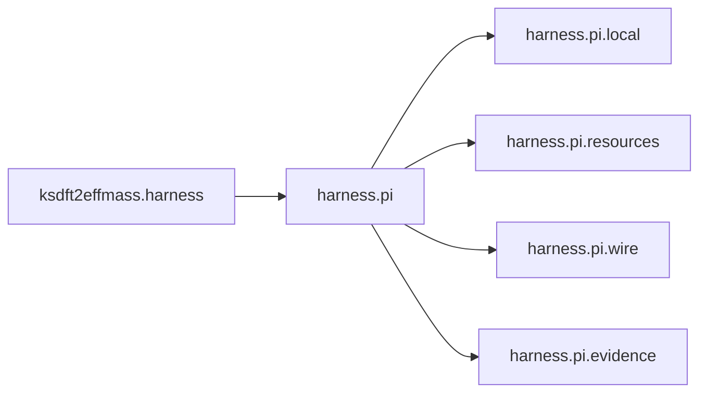

# `ksdft2effmass.harness` namespace in v1

Architecture v1 uses `ksdft2effmass.harness` as the namespace for the
development harness. The maintained implementation is organized beneath
[`ksdft2effmass.harness.pi`](pi/index.md), with reusable generic contracts and
project-local composition kept separate.

The generic layer owns immutable records, results, explicit-input actions, resources,
profiles, ownership, decisions, chains, checksums, and evidence structure. The local
layer owns repository adapters, the version-3 Task model, validation composition, and
control projection compatibility. Project-local code may depend on generic contracts;
the reverse direction is forbidden.

The namespace is independent of scientific workflow state. V1 nevertheless uses
development Tasks to coordinate calculator preparation and review because no
independent `ScientificWorkflowRun` aggregate is implemented.

## Documentation

- [Pi package architecture](pi/index.md)
- [Development model](pi/development-harness.md)
- [Resources and validation](pi/resources-and-validation.md)
- [Pi subagents](pi/subagents/index.md)
- [Consolidated v1 history](history.md)
