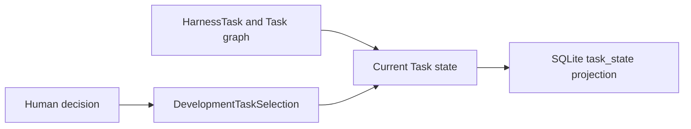

# Control plane in v1

This page records the v1 control plane and its current post-cutover disposition.
Canonical topology and lifecycle are represented by ``harness/tasks/*.json``
together with ``harness/task-graph.json``. ``harness/task-selection.json`` owns
minimal current selection state. Retired development chains are historical only;
no live reader uses them for membership, selection, ownership, or authority.

## Authority sources

| Source | Control responsibility |
|---|---|
| Current human instruction | Immediate authority within applicable project boundaries |
| Resolved checkpoint | Durable human decision |
| Specification | Accepted mathematical, scientific, schema, or wire contract |
| `AGENTS.md` | Repository policy |
| Task JSON and Task graph JSON | Canonical Task content, lifecycle status, membership, parent hierarchy, and prerequisites |
| Task selection JSON | Canonical minimal current selection and activation-receipt references |
| Unresolved checkpoint | Pending human decision boundary |
| Ownership record | Explicit writer and reviewer path assignment |
| Skill or agent | Procedure or role, not activation authority |

## Active selection

Selection may intentionally be empty. Generated state cannot activate a Task or
replace canonical Task, graph, or selection records.

## Operations

The maintained `harness_projection.py` CLI exposes synchronization and checking of derived projections. The former `harness_control.py` compatibility entry point is retired. Both actions resolve repository-root `harness/configuration.json` with its exact referenced `.pi/settings.json`; synchronization publishes a complete projection set and checking reconstructs the candidate read-only and reports drift. Superseded per-input configuration flags are unsupported.

Task inspection consumes one exact Task path, the exact selection path, and an
optional explicitly supplied operation-scoped ownership manifest. It establishes
bounded structural state only and performs no chain or generated-state discovery.

Control generation deserializes the supported `.pi/settings.json` subset into public immutable `PiHarnessConfiguration`, then `PiHarnessAgentDefinitionResolver` composes each selected descriptor into public immutable `PiHarnessAgentDefinition`. Database ingestion consumes those projection-ready definitions and owns neither JSON interpretation nor descriptor/configuration enablement policy. The rows represent repository-declared roles, not an executable-agent inventory, and cannot enable a Pi role. Runtime executability remains determined by Pi discovery over descriptors and settings.

## Human boundaries

Checkpoint resolution requires a current human answer to a durably represented unresolved checkpoint. Silence, elapsed time, passing checks, reviewer agreement, or terminal process status cannot resolve it.

## Scientific coupling

V1 uses the development control plane to coordinate scientific execution preflight and review. Protected execution still requires exact human authority, but no independent scientific control plane owns `ScientificWorkflowRun`, simulation request/result correlation, or scientific disposition.
