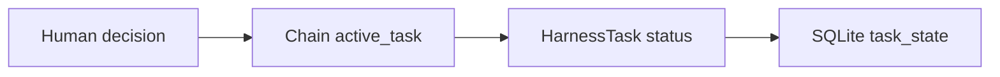

# Control plane in v1

## Authority sources

| Source | Control responsibility |
|---|---|
| Current human instruction | Immediate authority within applicable project boundaries |
| Resolved checkpoint | Durable human decision |
| Specification | Accepted mathematical, scientific, schema, or wire contract |
| `AGENTS.md` | Repository policy |
| Chain JSON | Chain membership and active Task selection |
| Task JSON | Task content and lifecycle status |
| Unresolved checkpoint | Pending human decision boundary |
| Ownership record | Explicit writer and reviewer path assignment |
| Skill or agent | Procedure or role, not activation authority |

## Active selection

All three surfaces must agree. Generated state cannot activate a Task, and Task status alone does not supersede chain selection.

## Operations

The maintained `harness_projection.py` CLI exposes synchronization and checking of derived projections. The former `harness_control.py` compatibility entry point is retired. Both actions resolve repository-root `harness/configuration.json` with its exact referenced `.pi/settings.json`; synchronization publishes a complete projection set and checking reconstructs the candidate read-only and reports drift. Superseded per-input configuration flags are unsupported.

Task inspection combines chain, Task, and generated-state observations for one exact selected Task. It establishes bounded structural state only.

Control generation deserializes the supported `.pi/settings.json` subset into public immutable `PiHarnessConfiguration`, then `PiHarnessAgentDefinitionResolver` composes each selected descriptor into public immutable `PiHarnessAgentDefinition`. Database ingestion consumes those projection-ready definitions and owns neither JSON interpretation nor descriptor/configuration enablement policy. The rows represent repository-declared roles, not an executable-agent inventory, and cannot enable a Pi role. Runtime executability remains determined by Pi discovery over descriptors and settings.

## Human boundaries

Checkpoint resolution requires a current human answer to a durably represented unresolved checkpoint. Silence, elapsed time, passing checks, reviewer agreement, or terminal process status cannot resolve it.

## Scientific coupling

V1 uses the development control plane to coordinate scientific execution preflight and review. Protected execution still requires exact human authority, but no independent scientific control plane owns `ScientificWorkflowRun`, simulation request/result correlation, or scientific disposition.
