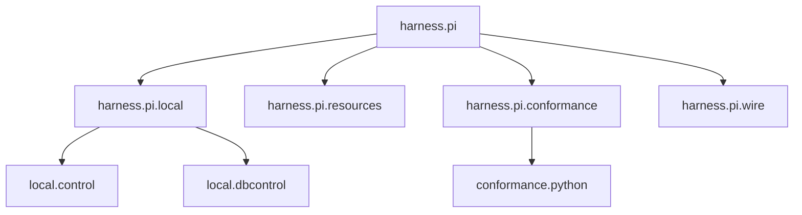

# `ksdft2effmass.harness.pi` package in v1

## Purpose

The implemented development harness selects and governs repository work. The completed chain cutover combines canonical Task and Task-graph records with separate minimal Task selection, human checkpoints, resources, capabilities, evidence, validation, and generated control views. Retired v1 chains remain non-operational history.

```mermaid
flowchart LR
    human["Human authority"] --> selection["DevelopmentTaskSelection"]
    tasks["HarnessTask JSON"] --> state["Development control state"]
    graph["Task graph JSON"] --> state
    selection --> state
    checkpoints["Checkpoints"] --> state
    resources["Resources and capabilities"] --> state
    evidence["Evidence"] --> state
    state --> validation["Repository validation"]
    state --> projections["Generated projections"]
```

## Implemented objects

| Object or action | Responsibility |
|---|---|
| `HarnessTask` | Immutable development work definition |
| Task serializer and deserializer | Version-3 Task JSON wire contract |
| `HarnessTaskGraphValidator` | Task relationship and graph validation |
| `HarnessTaskRegistry` | Derived immutable identity and relationship index over explicitly supplied Tasks |
| `DevelopmentTaskSelection` and serializer/deserializer | Minimal version-1 active-Task, activation-receipt-reference, and disabled-successor state |
| `TaskStateInspector` | Bounded transitional inspection of selected Task state |
| Private projection synchronization and checking | Complete publication and read-only source-aware comparison behind `harness_projection.py` |
| `HarnessValidator` | Composition of repository-conformance checks |
| `HumanReviewTarget`, `HumanReviewObservation`, `HumanReviewFinding`, `HumanReviewPacket`, `HumanReviewDecision`, `HumanReviewPreparer`, `HumanReviewDecisionRecorder` | Explicit packet preparation and decision representation without persistence or activation |

Generic contracts are implemented under `ksdft2effmass.harness.pi`; project-local composition is implemented under `ksdft2effmass.harness.pi.local`.

## Lifecycle

A `HarnessTask` carries identity, status, parent and prerequisite relationships, explicit activation, objective, authority paths, scope, completion criteria, exclusions, intake, and optional archived-source identity. Status values are project records rather than one closed universal state machine.

Canonical ``harness/tasks/*.json`` records and ``harness/task-graph.json``
together define Task content, lifecycle, membership, and parent/prerequisite
topology. ``HarnessTaskRegistry`` is derived from explicitly supplied Tasks. The
canonical ``harness/task-selection.json`` record owns only minimal current
selection facts. Retired chain records and adapters are non-operational history.
Generated SQLite state must agree with canonical Task, graph, and selection
records but cannot replace them. Unresolved checkpoints remain human decision
boundaries.

## Package structure



## Detailed pages

- [Development harness model](development-harness.md)
- [Control-plane authority and selection](control-plane.md)
- [Resources and validation](resources-and-validation.md)
- [Human-review objects](human-review.md)
- [Project-local control compilation](local/control/index.md)
- [Project-local generated persistence](local/dbcontrol/index.md)
- [Project-local projections](local/dbcontrol/projections.md)
- [Pi harness subagents](subagents/index.md)
