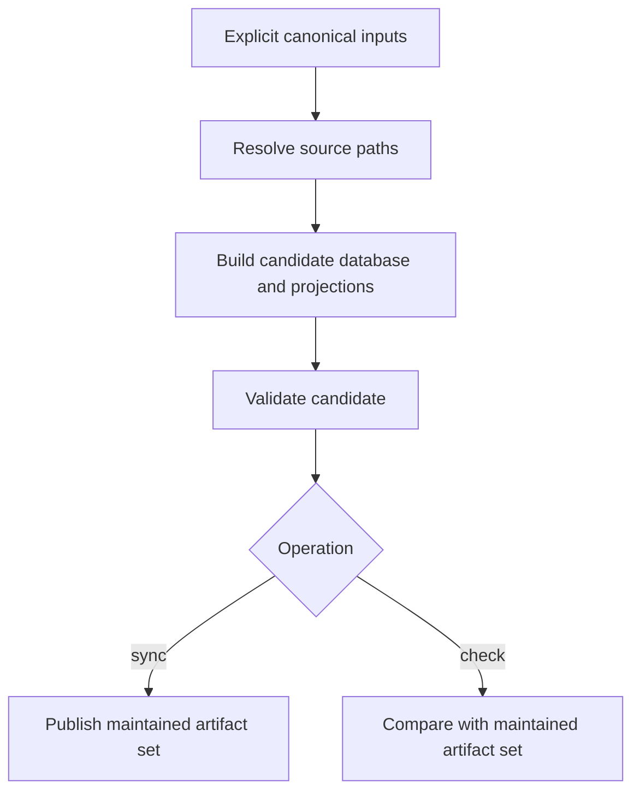

# `ksdft2effmass.harness.pi.local.control` package in v1

## Implemented compilation path

V1 does not expose the normalized `HarnessSourceSnapshot → HarnessState → HarnessArtifactSet` object model as public compiler objects. Compilation exists inside the control migration and verification implementation.

## Implemented owners

| Package or module owner | Responsibility |
|---|---|
| `HarnessControlMigrationRequest` | Explicit repository root and canonical evidence/resource inputs |
| `HarnessControlMigrator` | Candidate construction, validation, and publication orchestration |
| `HarnessControlVerifier` | Candidate reconstruction and read-only comparison |
| `local.control.inputs` | Canonical source selection and decoding |
| `local.control.generation` | Candidate SQLite and projection construction |
| `HarnessValidator` | Repository-level validation composition |
| Domain validators | Task, checkpoint, resource, skill, and evidence rules |

## State model

The effective normalized model is represented by candidate relational tables and in-memory generation records rather than one public immutable `HarnessState`. Source provenance is preserved through paths and identities, but not uniformly exposed as a field-level provenance object model.

## Validation composition

`HarnessValidator` runs six ordered checks:

1. Python evidence;
2. resources;
3. Task graph;
4. checkpoints;
5. skills; and
6. control state.

The source-aware verifier separately reconstructs generated control state and compares it with maintained projections. Repository conformance and projection agreement are related but distinct claims.

## Determinism

The implementation compares normalized table content and a semantic digest, deterministic SQL, manifest content, schema version, integrity, foreign keys, and projector-owned files. Raw SQLite byte identity is diagnostic rather than the semantic contract.

## Limitations

- Loading, normalization, validation, projection, publication, and comparison are behaviorally separated but not all represented by public objects.
- Candidate generation combines compilation and projection concerns.
- The migrator owns more orchestration than a narrow synchronizer.
- Generated Task Markdown is published under `docs/` in V1.
- There is no validator composition protocol over one public `HarnessState`.

These limitations describe the implemented architecture and do not redefine it.

Generated database ownership and projection publication are detailed under
[`ksdft2effmass.harness.pi.local.dbcontrol`](../dbcontrol/index.md).
