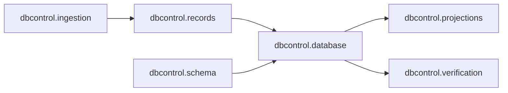

# `ksdft2effmass.harness.pi.local.dbcontrol` package in v1

## Authoritative records

V1 development authority is persisted primarily as version-controlled files:

| Record family | Persistence surface |
|---|---|
| Development Tasks | `harness/tasks/*.json` |
| Chain selection and history | `.pi/chains/*.json` |
| Human decisions | `.pi/checkpoints/*.json` |
| Resources and profiles | `harness/pi/` and `harness/local/` |
| Ownership | `.pi/task-ownership/` and applicable evidence records |
| Evidence | `.pi/evidence/`, tests, schemas, fixtures, and inventories |
| Scientific execution facts | Compact records under `calculations/` |

Git history preserves revisions but does not reactivate prior state.

## Generated SQLite

`harness/state/harness-control.sqlite3` is a generated read model, not primary persistence authority. It contains normalized Task, relationship, evidence, agent, skill, resource, decision, and projection records reconstructed from canonical sources.

Encoding, schema, ingestion, relational records, resources, migration,
projection, and verification are separate modules within the package.

Maintained SQLite is immutable after publication. WAL, SHM, journals, staging files, and backups are not valid maintained state.

## Scientific persistence

V1 has no general scientific persistence aggregate. Calculation-specific JSON, Markdown, checksums, manifests, and external-root descriptors retain:

- input, executable, and pseudopotential identities;
- process status and completion markers;
- resource observations and warnings;
- artifact identities and locations; and
- task-specific analysis or review outcomes.

These records are not retroactively a `ScientificWorkflowRun`. CPN markings are not persisted as scientific execution authority.

## Serialization

Public harness, provenance, periodic, Kohn–Sham, and plane-wave records use versioned serializers where implemented. Schema or round-trip success establishes wire behavior only, not provenance truth, scientific correctness, or acceptance.

Projection ownership is detailed on the [projection page](projections.md).

## Limitations

Development and scientific facts are distributed across Task, chain, checkpoint, calculation, and documentation surfaces. There is no transaction that atomically commits an independent scientific attempt, marking, execution result, analysis, and disposition.
