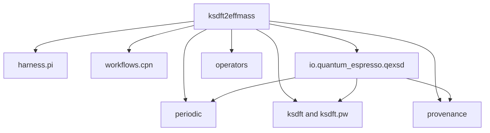

# `ksdft2effmass` package architecture in v1

## Package boundary

The Python reference implementation is rooted at
`python/src/ksdft2effmass/`. The root initializer exports no scientific objects;
public contracts are owned by their domain subpackages.

The diagram is a package-ownership view, not an import graph for every module.
The concrete QEXSD adapter depends on neutral periodic, Kohn--Sham, plane-wave,
and provenance owners. Those neutral packages do not import Quantum ESPRESSO
syntax. The CPN package imports no calculator implementation.

## Subpackages

- [`ksdft2effmass.harness`](harness/index.md) — development-harness namespace.
- [`ksdft2effmass.workflows`](workflows/index.md) — workflow namespace and
  implemented CPN foundation.
- [`ksdft2effmass.io`](io/index.md) — calculator-format parsing and translation.
- [`ksdft2effmass.periodic`](periodic/index.md) — backend-neutral periodic
  geometry.
- [`ksdft2effmass.ksdft`](ksdft/index.md) — representation-neutral Kohn--Sham
  observations and plane-wave records.
- [`ksdft2effmass.provenance`](provenance/index.md) — artifacts, lineage, tools,
  execution requests, results, and failures.
- [`ksdft2effmass.operators`](operators/index.md) — represented finite operators
  and comparison actions.

Repository-level direct calculator execution remains under
[`calculations/`](../calculations/index.md); it is not a Python subpackage in
architecture v1.

## Cross-cutting pages

Repository-wide principles, package placement, and the implemented separation
between development harness and workflow semantics remain at the v1 root:

- [Principles](../principles.md)
- [Repository layout](../repository-layout.md)
- [Separation of harness and workflow](../separation-of-harness-and-workflow.md)
