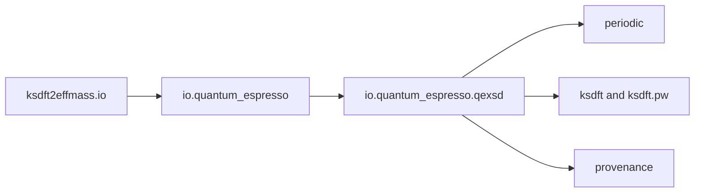

# `ksdft2effmass.io` package in v1

The I/O package owns concrete external-format parsing and translation. It does
not own backend-neutral scientific meaning.

- [Quantum ESPRESSO integration](quantum_espresso/index.md)
