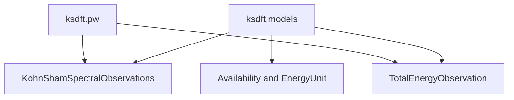

# `ksdft2effmass.ksdft` package in v1

## Responsibility

The package owns representation-neutral Kohn--Sham observations. The
`ksdft.models` module defines energy units, availability, spectral observations,
and total-energy observations.

The objects record represented observations. They do not identify Kohn--Sham
eigenvalues with a complete many-body excitation spectrum and do not establish
convergence or scientific validation.

## Subpackages

- [`ksdft2effmass.ksdft.pw`](pw/index.md) — plane-wave representation metadata,
  complete calculation records, and JSON serialization.
