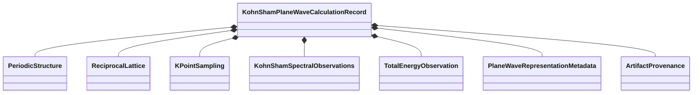

# `ksdft2effmass.ksdft.pw` package in v1

## Responsibility

The package composes neutral periodic and Kohn--Sham observations into a
plane-wave calculation record.

`ksdft.pw.records` owns the composed immutable records and metadata availability.
`ksdft.pw.serialization` owns strict JSON conversion. QEXSD construction is a
consumer of this package rather than its owner.

Serialization and successful construction establish represented software
behavior only. They do not establish basis completeness, numerical convergence,
or physical validation.
