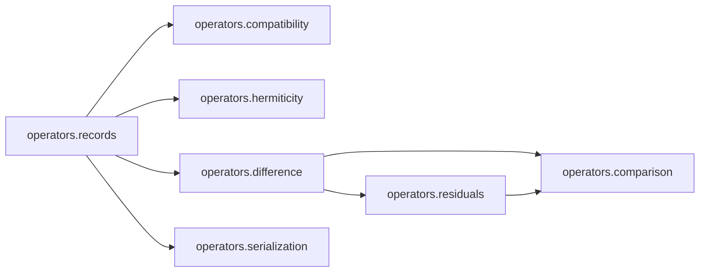

# `ksdft2effmass.operators` package in v1

## Responsibility

The package owns finite represented-operator records and the actions that
analyze or compare already identified representations.

| Module | Responsibility |
|---|---|
| `records` | State space, basis, geometry, energy reference, matrix, and provenance metadata |
| `hermiticity` | Hermiticity residual and tolerance analysis |
| `compatibility` | Exact represented-metadata compatibility auditing |
| `difference` | Signed subtraction of already compatible records |
| `residuals` | Maximum-entry, Frobenius, and spectral residual policy |
| `comparison` | Composition of differencing and residual analysis |
| `serialization` | Strict versioned JSON conversion |

## Boundary

The package does not align bases, gauges, geometries, units, spin conventions,
or energy zeros. It does not decide physical equivalence or identify a generic
difference as an impurity operator. Passing its tests is software or declared
numerical verification, not scientific validation.
