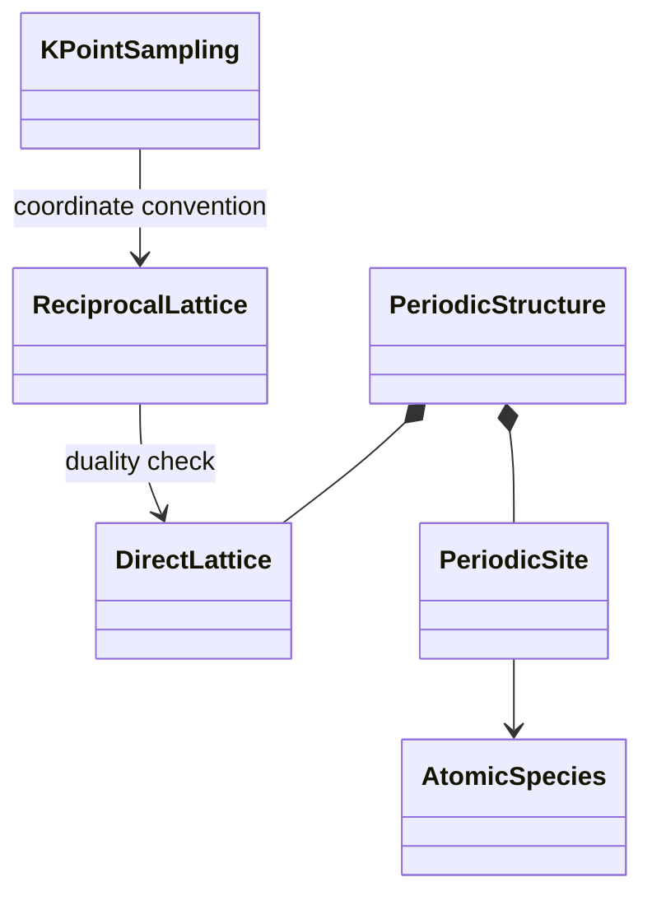

# `ksdft2effmass.periodic` package in v1

## Responsibility

The package owns backend-neutral immutable periodic geometry and reciprocal-
space sampling. Its public API is implemented by `periodic.models` and exported
through `periodic.__init__`.

The package owns length and inverse-length units, direct and reciprocal lattice
representations, species and sites, periodic structures, k-point sampling,
coordinate conventions, reciprocal-scale conventions, and weight
normalization.

## Boundary

`periodic` exports no QEXSD, Quantum ESPRESSO, Kohn--Sham spectrum, FFT-grid,
calculation-record, or serializer classes. Concrete adapters may construct its
objects, but the package does not depend on calculator syntax.
