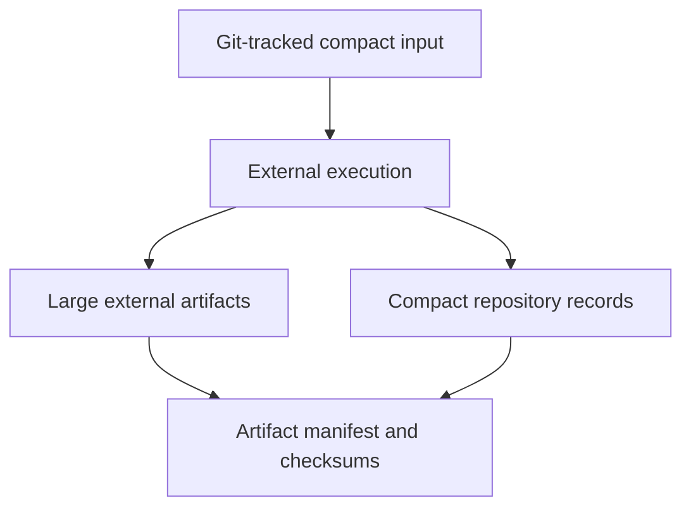

# `ksdft2effmass.provenance` package in v1

## Implemented records

`ksdft2effmass.provenance` provides calculator-independent represented records for:

- artifact identities, locations, roles, and manifests;
- lineage and correlation;
- external-tool declarations and observations;
- external execution requests, results, and failures;
- verification and correlation findings; and
- strict versioned JSON serialization.

These records describe execution and artifacts. They do not invoke processes, prove provenance truth, or accept scientific conclusions.

| Module | Responsibility |
|---|---|
| `records` | Artifact identities, locations, references, manifests, and lineage |
| `external_tools` | Declared tool identities, specifications, and capabilities |
| `tool_observations` | Installation and verification observations |
| `external_execution` | Immutable execution requests, results, failures, and status vocabularies |
| `actions` | Identity verification and execution correlation |
| `serialization` | Strict versioned JSON conversion |

## Artifact locations

Large wavefunctions, charge densities, restart trees, scratch files, and dense matrices remain outside Git. Compact repository records retain checksums, software versions, physical and numerical settings, execution observations, artifact roles, and approved external locations.

The `user_opt` store resolves approved non-repository artifacts beneath canonical `~/opt` using containment and identity checks.

## Calculator-specific retention

Direct runners determine which outputs are retained, reconstructible, or external. Some accepted tutorial and convergence artifacts are durable fixtures; other scratch data can be regenerated. Presence on disk does not itself make an artifact authoritative or accepted.

## Scientific record construction

QEXSD parsing is mechanical. `QexsdSource`, `QexsdDocument`, and `ParseQexsdDocument` represent source and parsed syntax. `ConstructQexsdKohnShamPlaneWaveRecord` maps parsed values into separate periodic, Kohn–Sham, plane-wave, and provenance owners.

This construction records represented observations from accepted tutorial bytes. It does not establish production convergence, basis completeness, or scientific validation.

## Limitation

Artifact and provenance objects are reusable, but their relationship to one scientific run is calculation-specific. V1 has no general `ScientificWorkflowRun` aggregate that owns simulation correlations, attempts, marking revisions, analyses, and dispositions.
